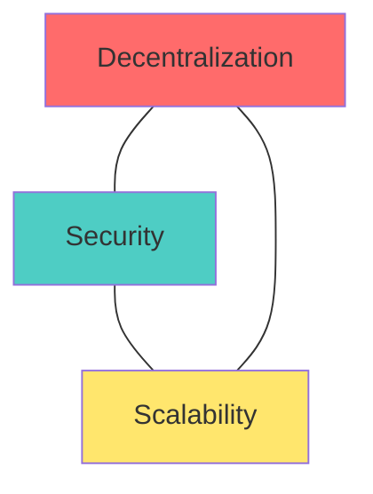

# The Tradeoffs

🟢 **Fundamentals**

---

## Every Design Choice Has a Cost

Web3 is not "better" or "worse" than Web2. It makes different tradeoffs.

Understanding these tradeoffs is critical to making informed engineering decisions.

---

## The Blockchain Trilemma

Proposed by Vitalik Buterin (Ethereum co-founder):

**You can only optimize for 2 out of 3:**



### Decentralization
- Many independent nodes
- No single point of control
- Censorship resistance

### Security
- Resistance to attacks
- Economic cost to compromise
- Reliable consensus

### Scalability
- High throughput (TPS)
- Low latency
- Low cost per transaction

**Examples:**
- **Bitcoin:** Decentralized + Secure, but not scalable (~7 TPS)
- **Ethereum:** Decentralized + Secure, but not scalable (~15-30 TPS)
- **Centralized database:** Secure + Scalable, but not decentralized (10,000+ TPS)

---

## Tradeoff 1: Performance vs Decentralization

### The Problem
More nodes = slower consensus.

**Why?**
1. Every node must receive transactions
2. Every node must validate transactions
3. Every node must store the full state
4. Consensus requires agreement among all nodes

**Comparison:**

| System | Nodes | TPS | Latency |
|--------|-------|-----|---------|
| **Visa** | Centralized | ~65,000 | Milliseconds |
| **PostgreSQL** | 1 master | 10,000+ | Milliseconds |
| **Ethereum** | ~8,000 | 15-30 | 12-15 seconds |
| **Bitcoin** | ~15,000 | 7 | ~10 minutes |
| **Solana** | ~2,000 | 2,000-4,000 | ~400ms |

**Key insight:** Solana is faster because it's less decentralized.

### The Tradeoff
- **More decentralization** → More nodes → Slower consensus
- **Less decentralization** → Fewer nodes → Faster consensus (but more trust)

---

## Tradeoff 2: Immutability vs Flexibility

### The Problem
Blockchains are append-only. Code is permanent.

**Web2:**
```
Code has bug → Deploy fix in 5 minutes
Bad data → Delete or update in seconds
```

**Web3:**
```
Code has bug → Funds can be stolen. Forever.
Bad data → Stays on chain. Forever.
```

### Real-World Impact

**Positive:**
- Trustworthy execution (code does what it says)
- Auditability (history can't be rewritten)

**Negative:**
- Bugs are permanent
- Upgrades are complex (or impossible)
- No "undo" button

**Example: The DAO Hack (2016)**
- Smart contract had a bug
- Attacker stole $60M
- Ethereum community was forced to hard fork (reverse the chain) to recover funds
- This violated "code is law" principle

### The Tradeoff
- **Immutability** → Trust in execution → No bug fixes
- **Flexibility** → Easy updates → Requires trust in admins

---

## Tradeoff 3: Transparency vs Privacy

### The Problem
Blockchains are public by default.

**Web2 (traditional database):**
```
Only authorized users can read your data
Company stores data privately
```

**Web3 (blockchain):**
```
Everyone can see your transactions
Everyone can see your balance
Everyone can track your activity
```

### Real-World Impact

**Positive:**
- Auditable (verify rules are followed)
- Transparent (no hidden behavior)
- Verifiable (anyone can check state)

**Negative:**
- Financial privacy is lost
- Competitors can see your activity
- Addresses can be linked to identities

**Example:**
If you're a business using Ethereum:
- Competitors can see your transactions
- Customers can see your margins
- Suppliers can see your cash flow

### The Tradeoff
- **Transparency** → Trust, but no privacy
- **Privacy** → Confidentiality, but requires trust

---

## Tradeoff 4: Cost vs Decentralization

### The Problem
Every node processes every transaction.

**Web2:**
```
Your backend processes only your users' requests
Cost scales linearly with usage
```

**Web3:**
```
Every node processes every transaction (including yours)
You pay per computation, per storage byte
```

### Cost Breakdown

**Ethereum gas costs (approximate, varies by network congestion):**
- Simple ETH transfer: $1-5
- Token swap (Uniswap): $10-50
- Deploy contract: $50-500+
- NFT mint: $10-100+

**Compare to Web2:**
- AWS Lambda API call: $0.0000002
- Database write: ~$0.0000001
- Stripe payment: 2.9% + $0.30 (predictable)

**Why so expensive?**
- Every node performs computation
- Every node stores data
- Miners/validators must be incentivized

### The Tradeoff
- **Decentralization** → Expensive (redundant computation)
- **Centralization** → Cheap (single point of computation)

---

## Tradeoff 5: Censorship Resistance vs Flexibility

### The Problem
You can't block bad actors easily.

**Web2:**
```
Spam? → Ban user
Illegal content? → Delete it
TOS violation? → Suspend account
```

**Web3:**
```
Spam? → Can't block (permissionless)
Illegal content? → On-chain forever
TOS violation? → No TOS to enforce
```

### Real-World Impact

**Positive:**
- No single entity can silence you
- No platform can freeze your funds
- Useful for dissidents, whistleblowers, activists

**Negative:**
- Scammers operate freely
- No recourse for victims
- Illegal content is permanent

**Example: Tornado Cash**
- Privacy tool for Ethereum
- Used by legitimate users (privacy) and criminals (money laundering)
- US Treasury sanctioned it
- Debate: Should privacy tools be banned because criminals use them?

### The Tradeoff
- **Censorship resistance** → Freedom, but also chaos
- **Moderation** → Safety, but also control

---

## Tradeoff 6: Self-Custody vs User Experience

### The Problem
Users control their keys, but keys can be lost.

**Web2:**
```
Forgot password? → Click "Reset password"
Account hacked? → Contact support
```

**Web3:**
```
Lost seed phrase? → Funds gone forever
Sent to wrong address? → Funds gone forever
Approved malicious contract? → Funds stolen forever
```

### Real-World Impact

**Positive:**
- You control your assets
- No one can freeze your account
- No KYC required

**Negative:**
- No customer support
- No password reset
- Mistakes are permanent

**Statistics:**
- ~20% of all Bitcoin is estimated to be lost forever (lost keys)
- Users regularly lose funds to phishing, scams, and errors

### The Tradeoff
- **Self-custody** → Freedom, but full responsibility
- **Custodial services** → Easier UX, but requires trust

---

## Tradeoff 7: Trustless vs Complexity

### The Problem
Removing trust requires more complexity.

**Web2:**
```
Trust the bank → Simple user experience
Trust Amazon → One-click checkout
```

**Web3:**
```
Don't trust anyone → Complex setup:
  - Manage private keys
  - Understand gas fees
  - Verify smart contracts
  - Monitor for exploits
```

### Real-World Impact

**Positive:**
- No need for trusted intermediaries
- Transparent rules

**Negative:**
- Steep learning curve
- Poor UX
- More attack vectors

**Example:**
Buying something online:
- **Web2:** Enter credit card, click "Buy" (2 steps)
- **Web3:** Install wallet, buy crypto, transfer to wallet, approve token contract, approve transaction, wait for confirmation (10+ steps)

### The Tradeoff
- **Trustless** → Secure, but complex
- **Trusted** → Simple, but requires faith in intermediaries

---

## Summary: The Tradeoff Matrix

| You Get | You Give Up |
|---------|-------------|
| Decentralization | Performance, cost efficiency |
| Immutability | Flexibility, bug fixes |
| Transparency | Privacy |
| Censorship resistance | Moderation, safety |
| Self-custody | User-friendly experience |
| Trustless execution | Simplicity |

---

## When Are These Tradeoffs Worth It?

### ✅ Web3 Makes Sense When:
- **No trusted intermediary exists**
  - Example: Coordinating strangers in different countries

- **Censorship resistance is critical**
  - Example: Activists under authoritarian regimes

- **Transparent execution is required**
  - Example: Public goods funding with provable fairness

- **The cost justifies the benefit**
  - Example: High-value, low-frequency transactions

### ❌ Web3 Does NOT Make Sense When:
- **A trusted intermediary works fine**
  - Example: Internal company tools

- **Performance matters**
  - Example: Real-time gaming, streaming

- **Privacy is critical**
  - Example: Healthcare records, personal data

- **User experience matters more than decentralization**
  - Example: Consumer apps

---

## Decision Framework

Ask yourself:

1. **What am I optimizing for?**
   - If speed → Use Web2
   - If transparency → Consider Web3

2. **What am I willing to sacrifice?**
   - Flexibility? Privacy? UX? Cost?

3. **Does decentralization solve a real problem here?**
   - If no → Use Web2

4. **Can users tolerate the tradeoffs?**
   - Slow confirmations, high fees, poor UX?

---

## Exercise

For each scenario, identify the tradeoff and decide if Web3 is appropriate:

### 1. A social media platform for activists in an authoritarian country
**Tradeoff:** Censorship resistance vs UX complexity  
**Decision:** Maybe. Censorship resistance matters, but activists need usability.

### 2. A high-frequency trading platform
**Tradeoff:** Decentralization vs performance  
**Decision:** No. HFT requires millisecond latency.

### 3. A voting system for a DAO (Decentralized Autonomous Organization)
**Tradeoff:** Transparency vs privacy  
**Decision:** Yes. Transparency is critical for governance.

### 4. A hospital's patient records system
**Tradeoff:** Transparency vs privacy  
**Decision:** No. Privacy is mandatory for health data.

### 5. A crowdfunding platform for controversial projects
**Tradeoff:** Censorship resistance vs moderation/safety  
**Decision:** Yes. Censorship resistance justifies the tradeoffs.

---

## Next Lesson

[→ When to Use Web3 (And When Not To)](05-when-to-use-web3.md)
