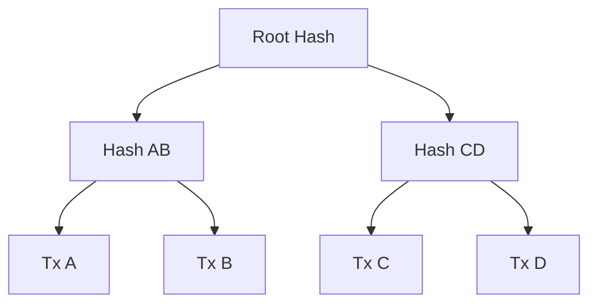

# Hash Functions

🟢 **Fundamentals**

---

## What is a Hash Function?

A **hash function** is a one-way function that takes an input of any size and produces a fixed-size output (the "hash" or "digest").

```
Input (any size) → Hash Function → Output (fixed size)
```

**Example (SHA-256):**
```
"Hello" → SHA-256 → 185f8db32271fe25f561a6fc938b2e264306ec304eda518007d1764826381969
"Hello!" → SHA-256 → 334d016f755cd6dc58c53a86e183882f8ec14f52fb05345887c8a5edd42c87b7
```

Notice: One character changes the entire hash.

---

## Key Properties

### 1. Deterministic
Same input always produces the same output.

```
hash("Alice") → always 4f8b5c...
hash("Alice") → always 4f8b5c...
```

### 2. Fast to Compute
Hashing should be quick (milliseconds for typical inputs).

### 3. One-Way (Preimage Resistance)
Easy to compute hash from input, but **computationally infeasible** to reverse.

```
"Hello" → hash → 185f8db...  ✅ Easy
185f8db... → ??? → "Hello"   ❌ Impossible (without brute force)
```

### 4. Collision Resistance
It's **computationally infeasible** to find two different inputs that produce the same hash.

```
Find X and Y where:
  X ≠ Y
  hash(X) = hash(Y)
```

This is nearly impossible for good hash functions (like SHA-256).

### 5. Avalanche Effect
Small change in input → large change in output.

```
"Hello"  → 185f8db32271fe25...
"hello"  → 2cf24dba5fb0a30e... (completely different)
```

---

## Common Hash Functions

### SHA-256 (Secure Hash Algorithm)
- Output: 256 bits (64 hexadecimal characters)
- Used in: Bitcoin, Ethereum (alongside Keccak256)
- Secure: No known practical attacks

### Keccak-256
- Output: 256 bits
- Used in: Ethereum (for addresses, transaction hashes)
- Winner of SHA-3 competition (but Ethereum uses the pre-standard version)

### Others
- **MD5:** Broken (collisions found). Don't use for security.
- **SHA-1:** Deprecated (collisions found). Don't use for security.
- **SHA-512:** Similar to SHA-256 but with 512-bit output.

---

## Hashing in Practice (TypeScript Example)

### Using Node.js's crypto module:

```typescript
import crypto from 'crypto';

function sha256(input: string): string {
  return crypto.createHash('sha256').update(input).digest('hex');
}

console.log(sha256("Hello"));
// Output: 185f8db32271fe25f561a6fc938b2e264306ec304eda518007d1764826381969

console.log(sha256("Hello!"));
// Output: 334d016f755cd6dc58c53a86e183882f8ec14f52fb05345887c8a5edd42c87b7
```

### Using ethers.js (Ethereum library):

```typescript
import { ethers } from 'ethers';

const hash = ethers.keccak256(ethers.toUtf8Bytes("Hello"));
console.log(hash);
// Output: 0x06b3dfaec148fb1bb2b066f10ec285e7c9bf402ab32aa78a5d38e34566810cd2
```

---

## How Web3 Uses Hash Functions

### 1. Content Addressing
Identify data by its hash (not by a filename or URL).

**Example:**
```
File: "mystuff.txt"
Hash: 2c26b46b68ffc68ff99b453c1d30413413422d706ecbf04db627f0e9d0a0c2e8

Retrieve file by hash (IPFS, etc.)
```

**Benefit:** If content changes, hash changes. You can detect tampering.

---

### 2. Linking Blocks in a Blockchain

Each block contains the hash of the previous block.

```
Block 0 (Genesis)
  Data: "Initial block"
  Hash: a1b2c3d4...

Block 1
  Data: "Transaction 1"
  Previous Hash: a1b2c3d4...
  Hash: e5f6g7h8...

Block 2
  Data: "Transaction 2"
  Previous Hash: e5f6g7h8...
  Hash: i9j0k1l2...
```

**Why this matters:**
- If you change data in Block 1, its hash changes
- Block 2's "Previous Hash" no longer matches
- The chain is broken → tampering is detected

This is why blockchains are "immutable."

---

### 3. Proof of Work (Mining)

In Bitcoin, miners must find a nonce such that:

```
hash(block_data + nonce) < target
```

**Example:**
```
Block data: "Transactions..."
Nonce: 12345
Hash: 000000a1b2c3d4... (starts with many zeros)
```

Finding a hash with leading zeros is computationally hard → requires brute-force guessing.

---

### 4. Merkle Trees (Efficient Verification)

Hash multiple items into a single root hash.



**Benefit:** You can prove a transaction is included without providing all transactions.

---

### 5. Addresses (From Public Keys)

Ethereum addresses are derived from public keys using Keccak-256.

```
Public Key → Keccak-256 → Take last 20 bytes → Address
```

**Example:**
```
Public Key: 0x04a1b2c3d4... (64 bytes)
Hash: Keccak-256(public key)
Address: 0x742d35Cc6634C0532925a3b844Bc9e7595f0bEb (last 20 bytes)
```

---

## Why Hash Functions Are Critical

### 1. Integrity
If data changes, hash changes. You can detect tampering.

### 2. Immutability (in blockchains)
Changing old data breaks the hash chain.

### 3. Proof of Work
Finding a hash below a target is computationally hard.

### 4. Efficient Verification
Merkle trees allow proving inclusion without revealing all data.

---

## What Hash Functions Do NOT Provide

### ❌ Confidentiality
Hashing doesn't encrypt data. The hash is public.

```
hash("my secret") = 2e6c... (public)
Anyone can try to guess "my secret" and verify by hashing.
```

### ❌ Authentication
A hash doesn't prove who created the data. (That's what signatures do.)

### ❌ Protection Against Brute-Force (for Small Inputs)
If the input space is small, attackers can brute-force.

**Example:**
```
hash("1234") = known
Attacker tries all 4-digit PINs and finds a match.
```

---

## Common Mistakes

### Mistake 1: Using Weak Hash Functions
❌ Don't use MD5 or SHA-1 for security.

### Mistake 2: Hashing Passwords Directly
❌ Don't do this:
```
hash(password) → store in database
```

Attackers can use rainbow tables (precomputed hashes).

✅ Use a password hashing function (bcrypt, scrypt, Argon2).

### Mistake 3: Assuming Hashes Are "Anonymous"
If the input is guessable, the hash is breakable.

---

## Exercise

### 1. Compute SHA-256 hashes

Hash these strings using SHA-256:
- "Hello"
- "Hello!"
- "hello"

Notice how small changes produce completely different hashes.

### 2. Understand the Avalanche Effect

Change one character in a string and observe how the hash changes entirely.

### 3. Simulate a Hash Chain

Create a simple blockchain in TypeScript:

```typescript
import crypto from 'crypto';

interface Block {
  data: string;
  previousHash: string;
  hash: string;
}

function sha256(input: string): string {
  return crypto.createHash('sha256').update(input).digest('hex');
}

function createBlock(data: string, previousHash: string): Block {
  const hash = sha256(data + previousHash);
  return { data, previousHash, hash };
}

// Create a chain
const block0 = createBlock("Genesis", "0");
const block1 = createBlock("Transaction 1", block0.hash);
const block2 = createBlock("Transaction 2", block1.hash);

console.log(block0);
console.log(block1);
console.log(block2);

// Try to tamper with block1's data
block1.data = "Tampered!";
// Does block2's previousHash still match block1's hash? No!
console.log("Chain valid?", block1.hash === block2.previousHash);
```

---

## Summary

**Hash functions:**
- Take any input → produce fixed-size output
- Are deterministic, fast, one-way, collision-resistant
- Used in Web3 for:
  - Content addressing
  - Linking blocks
  - Proof of Work
  - Merkle trees
  - Deriving addresses

**Key insight:** Hash functions enable immutability and tamper-detection in blockchains.

---

## Next Lesson

[→ Public-Private Key Cryptography](02-public-private-keys.md)
