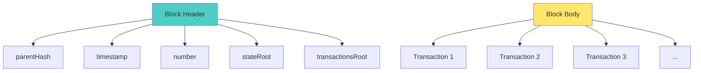

# Blocks: The Basics

🟢 **Fundamentals**

---

## What Is a Block?

A **block** is a container for data (usually transactions) with metadata about when and how it was created.

Think of it as a page in a ledger that records multiple entries at once.

---

## Anatomy of a Block

A block has two main parts:

### 1. Block Header (Metadata)
Contains information *about* the block.

### 2. Block Body (Data)
Contains the actual transactions or data.

---

## Block Header Fields

### Ethereum Block Header (Simplified)

```typescript
interface BlockHeader {
  parentHash: string;      // Hash of previous block
  timestamp: number;       // When block was created
  number: number;          // Block height (sequential)
  difficulty: BigInt;      // Mining difficulty (PoW only)
  gasLimit: BigInt;        // Max gas for all transactions
  gasUsed: BigInt;         // Actual gas used
  miner: string;           // Address that created block
  stateRoot: string;       // Root hash of state tree
  transactionsRoot: string;// Root hash of transactions
  receiptsRoot: string;    // Root hash of receipts
  nonce: BigInt;           // PoW nonce (PoW only)
}
```

Let's break this down:

---

### `parentHash`
Hash of the previous block. This creates the "chain."

```
Block N-1: hash = 0xabc123...
Block N:   parentHash = 0xabc123...
```

**Key insight:** Changing Block N-1 changes its hash, breaking the chain.

---

### `timestamp`
Unix timestamp when the block was created.

```
timestamp: 1705843200  // Fri Jan 21 2024 12:00:00 GMT
```

**Note:** Miners control timestamps (within limits). They're not perfectly accurate.

---

### `number`
Block height. The genesis block is 0, and each new block increments.

```
Genesis: 0
Block 1: 1
Block 2: 2
...
Current Ethereum block: ~19,000,000+
```

---

### `difficulty` (Proof of Work only)
How hard it was to mine this block.

Higher difficulty = more computation required.

(Ethereum switched to Proof of Stake in 2022, so this field is now mostly unused.)

---

### `gasLimit` and `gasUsed`
- **gasLimit:** Max computation allowed in this block
- **gasUsed:** How much was actually used

```
gasLimit: 30,000,000
gasUsed:  25,000,000  (83% full)
```

---

### `miner` (or `validator` in PoS)
Address of the entity that created the block.

```
miner: 0x123abc...
```

This account receives block rewards + transaction fees.

---

### `stateRoot`, `transactionsRoot`, `receiptsRoot`
Merkle tree roots (covered in lesson 03).

These allow efficient verification without storing all data.

---

### `nonce` (Proof of Work only)
A number miners adjust to find a valid hash.

```
hash(blockHeader + nonce) < target
```

Miners try billions of nonces until they find one that works.

---

## Block Body (Transactions)

The body contains a list of transactions:

```typescript
interface Transaction {
  from: string;      // Sender address
  to: string;        // Recipient address
  value: BigInt;     // Amount (in wei)
  data: string;      // Contract call data
  gas: BigInt;       // Gas limit
  gasPrice: BigInt;  // Gas price
  nonce: number;     // Sender's transaction count
  v, r, s: string;   // Signature components
}
```

A block can contain 100-300 transactions (depends on gas limit and transaction complexity).

---

## Example: Ethereum Block Structure

```typescript
{
  header: {
    parentHash: "0x1234abcd...",
    timestamp: 1705843200,
    number: 19000000,
    difficulty: 0n,  // PoS: difficulty is 0
    gasLimit: 30000000n,
    gasUsed: 25000000n,
    miner: "0x5A0b54D5dc17e0AadC383d2db43B0a0D3E029c4c",
    stateRoot: "0xabc123...",
    transactionsRoot: "0xdef456...",
    receiptsRoot: "0x789ghi...",
    nonce: 0n  // PoS: nonce is 0
  },
  transactions: [
    {
      from: "0x742d35...",
      to: "0xABCDEF...",
      value: 1000000000000000000n, // 1 ETH
      data: "0x",
      gas: 21000n,
      gasPrice: 50000000000n, // 50 gwei
      nonce: 5,
      v: "0x1b",
      r: "0xabc...",
      s: "0xdef..."
    },
    // ...more transactions
  ]
}
```

---

## Block Identification

Blocks can be identified by:
1. **Block hash** (unique, deterministic)
2. **Block number** (sequential)

### Block Hash
```
SHA-256(block header) → 0x1234abcd...
```

This is the "fingerprint" of the block.

### Block Number
```
Genesis: 0
Next:    1
Next:    2
...
```

**Important:** Block numbers are not unique during forks (temporary chain splits).

**Always use block hash for critical identification.**

---

## Block Size Limits

Blocks have size/gas limits to prevent spam.

### Ethereum
- **Gas limit:** ~30M gas per block
- **Block time:** ~12 seconds
- **TPS:** ~15-30 (depends on transaction types)

### Bitcoin
- **Block size:** 1-4 MB (depends on SegWit usage)
- **Block time:** ~10 minutes
- **TPS:** ~7

**Key insight:** Block limits constrain throughput.

---

## Visualizing a Block



---

## Why Blocks?

### Batching
Instead of processing transactions one at a time, we batch them.

**Benefits:**
- Efficiency (one consensus round for many transactions)
- Amortized costs

### Finality
Once a block is confirmed, all transactions in it are confirmed.

---

## Code Example: Fetching a Block

```typescript
import { ethers } from 'ethers';

// Connect to Ethereum
const provider = new ethers.JsonRpcProvider("https://eth.llamarpc.com");

// Fetch latest block
const block = await provider.getBlock("latest");

console.log("Block number:", block.number);
console.log("Timestamp:", new Date(block.timestamp * 1000));
console.log("Transactions:", block.transactions.length);
console.log("Gas used:", block.gasUsed.toString());
console.log("Miner:", block.miner);
```

---

## Exercise

### 1. Inspect a Real Block

Use Etherscan to inspect a real Ethereum block:
1. Go to https://etherscan.io
2. Enter a block number (e.g., 19000000)
3. Identify:
   - Parent hash
   - Timestamp
   - Number of transactions
   - Gas used
   - Miner/validator

### 2. Fetch a Block with Code

```typescript
import { ethers } from 'ethers';

const provider = new ethers.JsonRpcProvider("https://eth.llamarpc.com");

async function inspectBlock(blockNumber: number) {
  const block = await provider.getBlock(blockNumber);
  
  console.log("Block #:", block.number);
  console.log("Hash:", block.hash);
  console.log("Parent:", block.parentHash);
  console.log("Timestamp:", new Date(block.timestamp * 1000).toISOString());
  console.log("Txs:", block.transactions.length);
}

inspectBlock(19000000);
```

### 3. Calculate Block Time

Fetch 100 consecutive blocks and calculate average time between them.

---

## Summary

**Blocks:**
- Containers for transactions + metadata
- Have headers (metadata) and bodies (transactions)
- Identified by hash or number
- Linked via `parentHash`

**Key fields:**
- `parentHash`: Links to previous block
- `number`: Block height
- `transactionsRoot`: Merkle root of transactions
- `stateRoot`: Root of state tree

**Key insight:** Blocks batch transactions for efficiency and finality.

---

## Next Lesson

[→ The Chain: Linking Blocks](02-the-chain.md)
