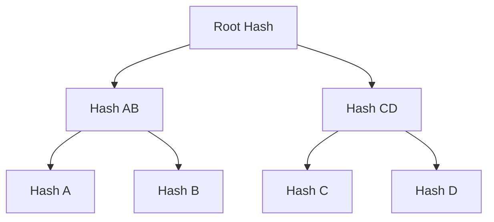

# Merkle Trees

🟡 **Intermediate**

---

## The Problem: Efficient Verification

Imagine you want to verify a transaction is in a block containing 1000 transactions.

**Naive approach:**
- Download all 1000 transactions
- Verify each one
- Check if your transaction is included

**Problem:** This is slow and bandwidth-intensive.

**Better approach:** Use a Merkle tree.

---

## What Is a Merkle Tree?

A **Merkle tree** (or hash tree) is a binary tree where:
- Leaf nodes = hashes of data items
- Internal nodes = hashes of their children
- Root node = single hash representing all data



---

## Building a Merkle Tree

### Example: 4 Transactions

```
Transactions:
- A: "Alice → Bob: 10 ETH"
- B: "Bob → Carol: 5 ETH"
- C: "Carol → Dave: 3 ETH"
- D: "Dave → Eve: 1 ETH"

Step 1: Hash each transaction
Hash_A = SHA-256(A) = 0xabc...
Hash_B = SHA-256(B) = 0xdef...
Hash_C = SHA-256(C) = 0x123...
Hash_D = SHA-256(D) = 0x456...

Step 2: Pair and hash
Hash_AB = SHA-256(Hash_A + Hash_B) = 0x789...
Hash_CD = SHA-256(Hash_C + Hash_D) = 0xghi...

Step 3: Hash the top level
Root = SHA-256(Hash_AB + Hash_CD) = 0xROOT...
```

**Result:** The root hash represents all 4 transactions.

---

## Code Example: Building a Merkle Tree

```typescript
import crypto from 'crypto';

function sha256(input: string): string {
  return crypto.createHash('sha256').update(input).digest('hex');
}

function buildMerkleTree(items: string[]): string {
  if (items.length === 0) return '';
  if (items.length === 1) return sha256(items[0]);
  
  // Hash all items to create leaves
  let level = items.map(item => sha256(item));
  
  // Build tree bottom-up
  while (level.length > 1) {
    const nextLevel: string[] = [];
    
    for (let i = 0; i < level.length; i += 2) {
      if (i + 1 < level.length) {
        // Pair exists
        nextLevel.push(sha256(level[i] + level[i + 1]));
      } else {
        // Odd number, duplicate last item
        nextLevel.push(sha256(level[i] + level[i]));
      }
    }
    
    level = nextLevel;
  }
  
  return level[0]; // Root hash
}

// Example
const transactions = [
  "Alice → Bob: 10 ETH",
  "Bob → Carol: 5 ETH",
  "Carol → Dave: 3 ETH",
  "Dave → Eve: 1 ETH"
];

const root = buildMerkleTree(transactions);
console.log("Merkle Root:", root);
```

---

## Merkle Proofs: Efficient Verification

A **Merkle proof** allows you to prove a transaction is in a block **without downloading all transactions**.

### Example: Prove Transaction A is included

```
Tree:
         Root
        /    \
     H_AB    H_CD
     / \      / \
   H_A H_B  H_C H_D

To prove H_A is included, provide:
- H_A (the transaction hash)
- H_B (sibling)
- H_CD (sibling of parent)

Verification:
1. Compute H_AB = hash(H_A + H_B)
2. Compute Root = hash(H_AB + H_CD)
3. Check: Does computed Root match block's root?
   - If yes → Transaction is included ✅
   - If no → Transaction is NOT included ❌
```

**Key insight:** You only need O(log n) hashes to prove inclusion.

**For 1000 transactions:**
- Naive: Download 1000 transactions (~500 KB)
- Merkle proof: Download ~10 hashes (~320 bytes)

**That's 1500x less data!**

---

## Code Example: Merkle Proof

```typescript
interface MerkleProof {
  leaf: string;
  siblings: string[];
}

function generateProof(items: string[], index: number): MerkleProof {
  const leaves = items.map(item => sha256(item));
  const siblings: string[] = [];
  let level = leaves;
  let idx = index;
  
  while (level.length > 1) {
    const nextLevel: string[] = [];
    
    for (let i = 0; i < level.length; i += 2) {
      if (i + 1 < level.length) {
        nextLevel.push(sha256(level[i] + level[i + 1]));
        
        // Record sibling of current index
        if (i === idx || i + 1 === idx) {
          siblings.push(i === idx ? level[i + 1] : level[i]);
        }
      } else {
        nextLevel.push(sha256(level[i] + level[i]));
      }
    }
    
    idx = Math.floor(idx / 2);
    level = nextLevel;
  }
  
  return { leaf: leaves[index], siblings };
}

function verifyProof(proof: MerkleProof, root: string): boolean {
  let hash = proof.leaf;
  
  for (const sibling of proof.siblings) {
    // Note: Order matters (left vs right sibling)
    hash = sha256(hash + sibling);
  }
  
  return hash === root;
}

// Example
const transactions = [
  "Alice → Bob: 10 ETH",
  "Bob → Carol: 5 ETH",
  "Carol → Dave: 3 ETH",
  "Dave → Eve: 1 ETH"
];

const root = buildMerkleTree(transactions);
const proof = generateProof(transactions, 0); // Prove first transaction

console.log("Proof:", proof);
console.log("Valid?", verifyProof(proof, root));
```

---

## Where Merkle Trees Are Used

### 1. Bitcoin: SPV (Simplified Payment Verification)
Light clients can verify transactions without downloading the full blockchain.

**SPV node:**
- Downloads only block headers (~80 bytes each)
- Requests Merkle proofs for specific transactions
- Verifies inclusion

**Result:** Can run on mobile devices or low-power hardware.

---

### 2. Ethereum: State, Transactions, Receipts
Ethereum uses 3 Merkle trees per block:
- **State root:** Current account balances and storage
- **Transactions root:** All transactions in block
- **Receipts root:** Logs and outcomes of transactions

---

### 3. IPFS/Git: Content Addressing
Merkle DAGs (Directed Acyclic Graphs) identify files by their content hash.

---

## Patricia Merkle Tries (Ethereum)

Ethereum uses a modified Merkle tree called a **Patricia Merkle Trie** (or Merkle Patricia Tree).

**Differences from standard Merkle tree:**
- Supports key-value lookups (not just membership proofs)
- More efficient for sparse data
- Allows proving non-existence

**Example use:**
```
Prove that address 0x123... has balance of 10 ETH
```

---

## Benefits of Merkle Trees

### 1. Efficient Verification
Prove inclusion with O(log n) hashes.

### 2. Tamper Detection
If any data changes, the root hash changes.

### 3. Light Clients
Mobile wallets don't need to download the full chain.

### 4. Sharding (Future)
Parts of the tree can be distributed across nodes.

---

## Limitations

### 1. Proof Size Grows Logarithmically
For a million transactions, you need ~20 hashes (~640 bytes).

### 2. Updating Is Expensive
Changing one leaf requires recomputing O(log n) hashes up to the root.

### 3. Ordering Matters
Different orderings produce different roots.

---

## Exercise

### 1. Build a Merkle Tree

Use the code above to build a tree for 8 transactions:

```typescript
const transactions = [
  "Tx1", "Tx2", "Tx3", "Tx4",
  "Tx5", "Tx6", "Tx7", "Tx8"
];

const root = buildMerkleTree(transactions);
console.log("Root:", root);
```

### 2. Generate and Verify a Proof

Prove that "Tx3" is included:

```typescript
const proof = generateProof(transactions, 2); // Index 2 = Tx3
console.log("Proof:", proof);
console.log("Valid?", verifyProof(proof, root));
```

### 3. Detect Tampering

Change one transaction and verify the root changes:

```typescript
transactions[2] = "Tampered!";
const newRoot = buildMerkleTree(transactions);
console.log("Root changed?", root !== newRoot);
```

---

## Summary

**Merkle trees:**
- Binary trees of hashes
- Root hash represents all data
- Enable efficient inclusion proofs
- Used in Bitcoin, Ethereum, IPFS, Git

**Key insights:**
- O(log n) proof size (vs O(n) for naive approach)
- Light clients can verify without full blockchain
- Any data change invalidates the root

---

## Next Lesson

[→ Immutability](04-immutability.md)
