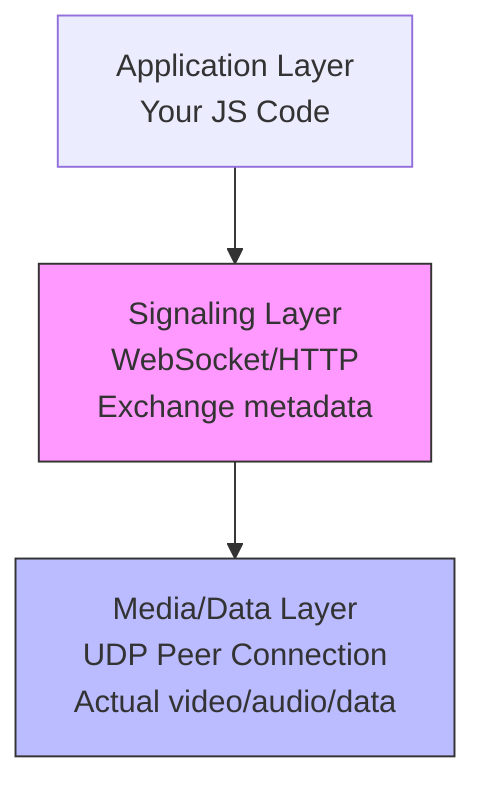
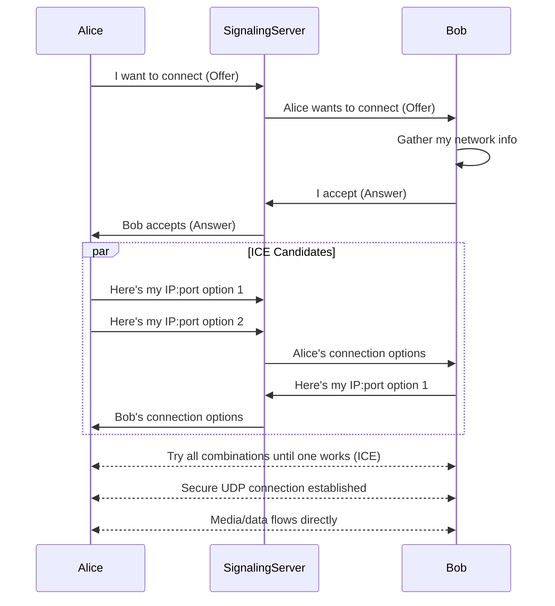

# 00 - WebRTC Mental Model

## The One-Sentence Definition

**WebRTC is a secure UDP-based real-time pipe negotiated over HTTP/WebSocket.**

That's it. Everything else is implementation detail serving this core concept.

---

## Why WebRTC Exists: The Browser Constraint

You know HTTP. You know WebSockets. You might even know raw TCP sockets from backend work.

But here's the problem: **browsers don't let you create raw UDP sockets.**

For very good reasons:
- **Security**: Arbitrary UDP access = spam/DDoS from JavaScript
- **Privacy**: Users shouldn't leak their real IP to every random website
- **Complexity**: NAT traversal, firewall handling = too much to expose directly

Yet real-time apps (video calls, file sharing, gaming) need:
- **Low latency** (sub-50ms)
- **High throughput** (megabits/sec)
- **Packet loss tolerance** (some frames can drop)

TCP is terrible at this. WebSockets run on TCP. So we're stuck.

**WebRTC is the browser's answer**: "You can use UDP, but only through this carefully designed API that handles security, NAT traversal, and encryption for you."

---

## WebRTC vs Other Protocols: A Comparison

| Protocol | Transport | Latency | Throughput | Packet Loss | Use Case |
|----------|-----------|---------|------------|-------------|----------|
| **HTTP** | TCP | 100-500ms | Good | Retransmits everything | REST APIs, file downloads |
| **WebSocket** | TCP | 50-200ms | Good | Retransmits everything | Chat, notifications, live updates |
| **WebRTC** | UDP | 10-100ms | Excellent | Tolerates losses | Video calls, gaming, file sharing |

### Why Not WebSockets for Video?

Let's say you're sending video at 30fps over WebSocket:
- Frame 1 gets lost → TCP retransmits it
- While waiting, frames 2, 3, 4 arrive but get **buffered** (TCP delivers in order)
- By the time frame 1 arrives, it's **200ms late** and useless
- User sees stuttering, lag

With UDP (WebRTC):
- Frame 1 lost → skip it, show frame 2
- User sees a brief glitch (barely noticeable)
- Latency stays low

**TCP guarantees delivery. UDP guarantees speed.** For real-time media, speed wins.

---

## The Mental Model: Three Distinct Layers

Think of WebRTC as three separate systems stacked on top of each other:

### Layer 1: Application (Your Code)
- UI logic: buttons, state management
- Business logic: user presence, room management
- Whatever your app does

### Layer 2: Signaling (WebSocket/HTTP)
- **Not part of WebRTC spec** (you choose the transport)
- Exchanges **control messages** between peers:
  - "I want to connect to you, here's my network info"
  - "I support these video codecs"
  - "My network changed, here's an update"
- Think of it as a **contract negotiation protocol**

### Layer 3: Media/Data (Peer Connection)
- **This is WebRTC proper**
- Direct peer-to-peer UDP streams
- Encrypted (always)
- No server in the middle (usually)
- Carries actual video, audio, or arbitrary data

**Key insight**: Layers 2 and 3 are **completely separate**. Signaling can fail while media flows happily. Media can fail while signaling stays connected.

---

## What WebRTC Actually Does

When you use WebRTC, the browser handles:

1. **Getting you a UDP pipe** despite NATs/firewalls (ICE protocol)
2. **Negotiating capabilities** (codecs, resolutions) between peers
3. **Encrypting everything** (DTLS/SRTP)
4. **Sending media as RTP packets** (with built-in error correction)
5. **Adapting to network conditions** (bitrate control, packet pacing)

You just call `new RTCPeerConnection()` and JavaScript APIs. The browser does the heavy lifting.

---

## The Connection Dance (High-Level)

Here's what happens when Alice wants to call Bob:

**Notice**: The signaling server is only involved in **setup**. Once the peer connection is established, media goes directly peer-to-peer (if possible).

---

## Why This Is Hard (And Why You Need This Guide)

WebRTC combines:
- **Networking** (NATs, STUN, TURN, ICE)
- **Media processing** (codecs, RTP, jitter buffers)
- **Cryptography** (DTLS, SRTP)
- **Distributed systems** (signaling, state synchronization)

Most resources either:
- Dump the 1000-page spec on you (useless)
- Give you magic copy-paste code (works until it doesn't)

This guide takes a **systems engineering approach**: understand WHY each piece exists, WHEN it fails, and HOW to fix it.

---

## What Breaks If You Don't Understand This

Real production failures from teams who "just used WebRTC":

| Misunderstanding | What Breaks |
|------------------|-------------|
| "Signaling is WebRTC" | You can't debug when signaling succeeds but media fails |
| "Peer-to-peer always works" | 10-15% of users behind symmetric NAT can't connect |
| "WebSocket is enough for video" | Stuttering, lag, users complain |
| "WebRTC handles everything" | No reconnection logic → call drops on network blip |
| "Just increase bandwidth" | CPU becomes bottleneck, mobile browsers crash |

---

## The Core Abstractions You'll Master

By the end of this guide, you'll internalize these abstractions:

### 1. **RTCPeerConnection**
The main object. Represents one peer-to-peer connection (for both media and data).

### 2. **Signaling**
The coordination layer. You implement this yourself (usually WebSocket).

### 3. **ICE (Interactive Connectivity Establishment)**
The NAT traversal protocol. Finds a path through firewalls.

### 4. **Media Tracks**
Audio and video sources. You add them to the peer connection.

### 5. **Data Channels**
WebSocket-like API over UDP. For file transfer, game state, etc.

### 6. **SDP (Session Description Protocol)**
The "contract" format. Describes codecs, ports, etc. Ugly but you rarely touch it directly.

### 7. **SFU (Selective Forwarding Unit)**
Server that routes media without transcoding. Critical for group calls.

---

## The Three Apps You'll Build (Conceptually)

### 1. P2P File Sharing
- **No media**, just data channels
- Two peers exchange a file directly
- Server only for signaling
- Teach you: data channels, chunking, flow control

### 2. 1-on-1 Audio/Video Call
- Media tracks (audio + video)
- Direct peer-to-peer
- Teach you: media flow, codecs, ICE failures

### 3. Group Call (SFU)
- Multiple peers, one SFU server
- Each peer sends once, receives N-1 streams
- Teach you: scalability, bandwidth math, real-world architecture

---

## What WebRTC Is NOT

To clear up common confusion:

❌ **Not a signaling protocol** → You provide this (WebSocket, HTTP long-polling, carrier pigeon)
❌ **Not always peer-to-peer** → Sometimes needs a TURN relay server (5-15% of connections)
❌ **Not a media server** → It's a browser API. Servers (SFUs) are separate
❌ **Not simpler than WebSocket** → It's more powerful, but with complexity cost
❌ **Not magic** → It's engineered NAT traversal + encrypted UDP

---

## Key Principles Moving Forward

As you learn WebRTC, remember:

1. **Signaling ≠ Media** → They're independent systems
2. **UDP ≠ Unreliable** → WebRTC can do reliable delivery when needed
3. **Peer-to-peer is a best-case** → Always plan for TURN relay fallback
4. **Encrypted by default** → You can't turn this off (good thing)
5. **State machines everywhere** → Connection states, ICE states, signaling states
6. **Everything can fail** → Network changes, firewalls, mobile backgrounding

---

## Next Steps

Now that you have the mental model, we'll build it up layer by layer:

- **Next**: [01-networking-primer.md](01-networking-primer.md) - Why two browsers can't "just connect"
- Then: Signaling, ICE/STUN/TURN, Peer Connection lifecycle
- Finally: Build real apps with production-grade error handling

By the end, you'll know WebRTC like you know HTTP: deeply, intuitively, and with the confidence to build and debug production systems.

---

## Quick Self-Check

You understand this chapter if you can explain:
- [ ] Why browsers don't allow raw UDP
- [ ] How WebRTC differs from WebSocket (and when to use each)
- [ ] What signaling is and why it's separate from media
- [ ] The three layers: Application, Signaling, Media
- [ ] Why TCP is bad for real-time video

If any of these are fuzzy, re-read the relevant section. The rest of the guide builds on this foundation.
