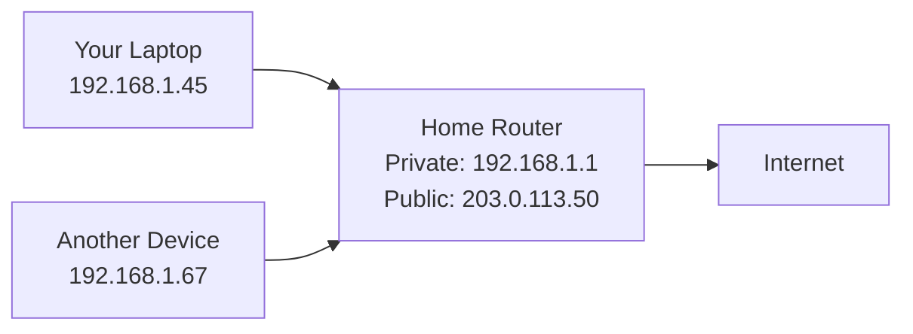
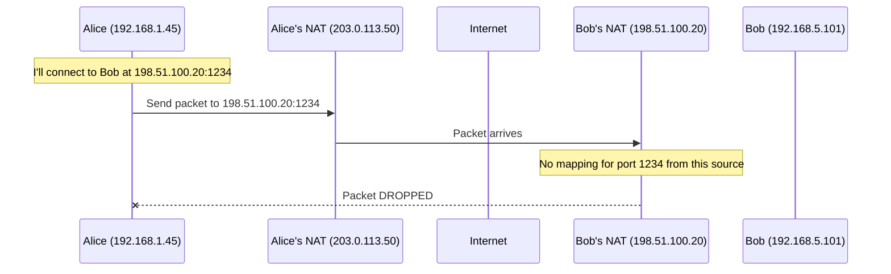
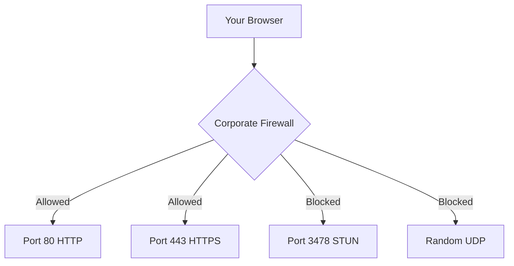
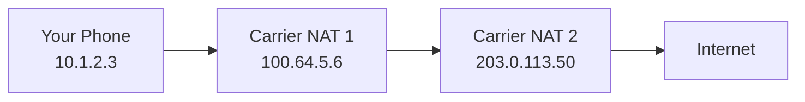
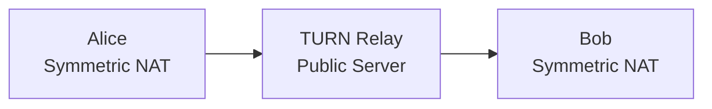
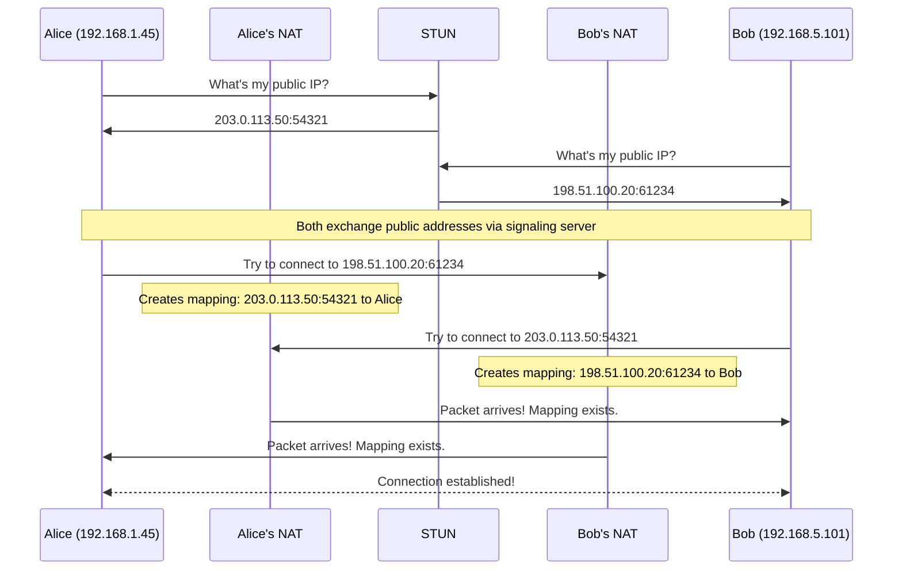

# 01 - Networking Primer: Why Two Browsers Can't "Just Connect"

## The Naive Assumption

You might think: "I have Alice's IP address. She has mine. We both have browsers. Just open a UDP socket between us."

**This will fail 80% of the time in the real world.**

Why? Because the internet is not a flat network. It's a maze of NATs, firewalls, and carrier-grade NAT (CGNAT) specifically designed to prevent exactly what you're trying to do.

---

## The Modern Internet: IP Address Scarcity

### The Problem: IPv4 Exhaustion

- **IPv4** has ~4.3 billion addresses
- **Reality**: ~30 billion internet-connected devices
- **Math doesn't work** → Solution: Network Address Translation (NAT)

### What Your Device Actually Has

When you check your IP:

```
$ ip addr
192.168.1.45  ← "Private" IP (not routable on internet)
```



**Your laptop does NOT have a public IP.** Your router does. All your home devices share one public IP via NAT.

---

## NAT: The Core Problem

### What NAT Does

Network Address Translation rewrites packet headers:

**Outgoing (Laptop → Internet)**:
```
Source: 192.168.1.45:54321 → Rewritten to → 203.0.113.50:54321
Dest:   1.2.3.4:80
```

**Incoming (Internet → Laptop)**:
```
Source: 1.2.3.4:80
Dest:   203.0.113.50:54321 → Rewritten to → 192.168.1.45:54321
```

The router maintains a **NAT mapping table**:

| Internal | External | Timeout |
|----------|----------|---------|
| 192.168.1.45:54321 | 203.0.113.50:54321 | 60s |
| 192.168.1.67:49201 | 203.0.113.50:49201 | 60s |

**Key insight**: The router only creates mappings for **outgoing** connections. It doesn't know where to route unsolicited incoming packets.

### Why This Breaks P2P

Let's say Alice tries to connect to Bob:



**Bob's NAT has no mapping for incoming packets from Alice.** It drops the packet.

This is by design: it's a firewall feature protecting Bob from unsolicited traffic.

---

## Types of NAT (Matters A LOT for WebRTC)

### 1. Full Cone NAT (Easiest)

Once a mapping is created, **anyone** can send packets through it:

```
Internal 192.168.1.45:5000 → External 203.0.113.50:5000
```

Any external host can now reach `203.0.113.50:5000` and it'll route to `192.168.1.45:5000`.

**WebRTC success rate**: ~95%

### 2. Restricted Cone NAT

Mapping exists, but only allows packets from IPs you've **previously sent to**:

```
192.168.1.45:5000 sends to 1.2.3.4:80
→ Creates mapping: 203.0.113.50:5000 ↔ 192.168.1.45:5000
→ Only 1.2.3.4 can send back (any port)
```

**WebRTC success rate**: ~85%

### 3. Port-Restricted Cone NAT

Mapping allows packets only from specific **IP:port** you sent to:

```
192.168.1.45:5000 sends to 1.2.3.4:80
→ Only 1.2.3.4:80 can reply
```

**WebRTC success rate**: ~70%

### 4. Symmetric NAT (Nightmare Mode)

Different mapping for **each destination**:

```
192.168.1.45:5000 → 1.2.3.4:80    creates mapping: 203.0.113.50:61001
192.168.1.45:5000 → 5.6.7.8:443   creates mapping: 203.0.113.50:61002
```

External hosts see different ports depending on who they are.

**Problem for WebRTC**: Alice tells Bob "reach me at `203.0.113.50:61001`" but Bob trying to connect gets assigned a different mapping by Alice's NAT.

**WebRTC success rate without TURN**: 0%

---

## Firewall Rules: The Second Layer of Defense

Even if NAT allows it, corporate/mobile firewalls may:
- **Block all UDP** (25% of corporate networks)
- **Allow only ports 80/443** (HTTPS only)
- **Deep packet inspection** (DPI) blocking non-HTTP traffic



**This is why TURN servers often listen on port 443.**

---

## Carrier-Grade NAT (CGNAT): The Mobile Problem

Mobile networks add **another layer of NAT**:



**Double NAT** means:
- Your phone's IP is behind TWO NATs
- Much harder to traverse
- TURN relay often required (10-15% of mobile connections)

---

## Why WebRTC Needs STUN and TURN

Given all the above, WebRTC uses:

### STUN (Session Traversal Utilities for NAT)
- Public server that tells you **your public IP:port**
- Helps with Full/Restricted Cone NAT
- Free and lightweight

```
You → STUN server: "What's my public address?"
STUN → You: "I see you as 203.0.113.50:54321"
```

### TURN (Traversal Using Relays around NAT)
- **Relay server** when direct connection fails
- All traffic flows through TURN (bandwidth $$$)
- Required for Symmetric NAT, aggressive firewalls



**TURN is your escape hatch.** 5-15% of connections need it.

---

## Real-World Connectivity Statistics

Based on production WebRTC deployments:

| Scenario | Success Rate | Method |
|----------|--------------|--------|
| Both peers on same LAN | 100% | Host candidate (direct) |
| Both peers with Full Cone NAT | 95% | Server reflexive (STUN) |
| One peer with Symmetric NAT | 70% | Relay (TURN) |
| Both peers with Symmetric NAT | 10% without TURN | Relay (TURN) required |
| Corporate firewall blocking UDP | 0% without TURN | TURN over TCP/TLS |

**Key insight**: You **must** provide TURN servers for production. Assuming direct connectivity = lost users.

---

## The Packet Flow: What Actually Happens

### Scenario: Alice (behind NAT) calls Bob (behind NAT)



**Magic moment**: Both peers try to connect **simultaneously**. This creates NAT mappings on both sides. Subsequent packets flow through.

This is called **UDP hole-punching** and is the core technique behind ICE.

---

## Why This Is Complex (And Why ICE Exists)

To establish connection, peers must:
1. Discover their public IPs (STUN)
2. Exchange addresses via signaling
3. Try all combinations:
   - Local network address (LAN)
   - Public address (STUN reflexive)
   - Relay address (TURN)
4. Do all of this **simultaneously** (hole punching)
5. Handle timeouts, retries, network changes

**ICE (Interactive Connectivity Establishment)** is the protocol that orchestrates this dance. We'll cover it in detail in [03-ice-stun-turn.md](03-ice-stun-turn.md).

---

## Common Misconceptions Debunked

### "Can't I just use the IP from `window.location.hostname`?"
No. That's the signaling server's IP, not your peer's IP.

### "Can't I query my router for my public IP?"
Even if you could (UPnP), your peer's NAT wouldn't accept your packets.

### "Why not just use IPv6?"
Great idea! But as of 2026, only ~40% of users have IPv6. NAT will be around for decades.

### "This is too complex, I'll just use WebSockets"
Then you'll have high latency, TCP head-of-line blocking, and sad users.

---

## What You Need to Remember

| Concept | Why It Matters |
|---------|----------------|
| **NAT** | Blocks unsolicited incoming UDP |
| **Symmetric NAT** | Changes port per destination → needs TURN |
| **STUN** | Discovers your public IP:port |
| **TURN** | Relays when direct connection fails |
| **UDP hole-punching** | Simultaneous connection attempts create mappings |
| **Firewalls** | May block all UDP → TURN over TCP needed |

---

## Next Steps

You now understand **why** WebRTC is complex. The internet wasn't designed for peer-to-peer connections.

**Next**: [02-signaling.md](02-signaling.md) - How peers exchange the information needed for ICE to work.

Without signaling, peers can't share their addresses. Without understanding NAT, signaling would seem like overkill. These concepts build on each other.

---

## Quick Self-Check

You understand this chapter if you can explain:
- [ ] What NAT is and why it exists
- [ ] Why an unsolicited UDP packet to your laptop gets dropped by your router
- [ ] The difference between Full Cone and Symmetric NAT
- [ ] Why TURN is sometimes necessary (and expensive)
- [ ] What UDP hole-punching is
- [ ] Why ~10% of connections can't be direct peer-to-peer

If you can sketch a diagram showing Alice NAT, Bob NAT, and packet flow during connection, you're ready to move on.
