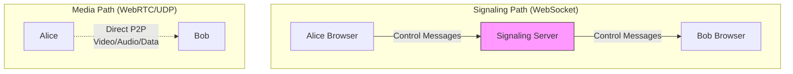
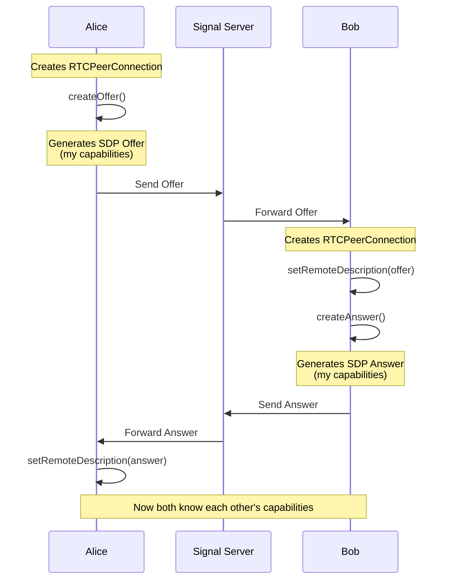
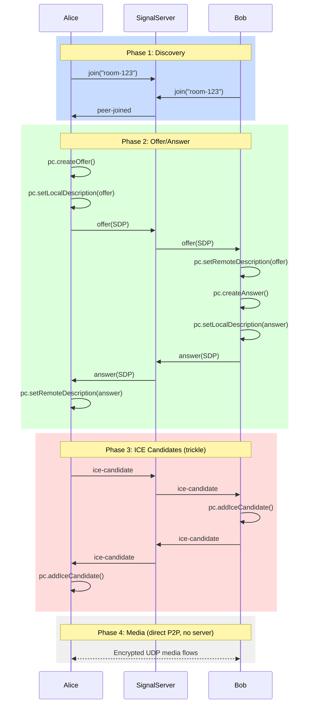
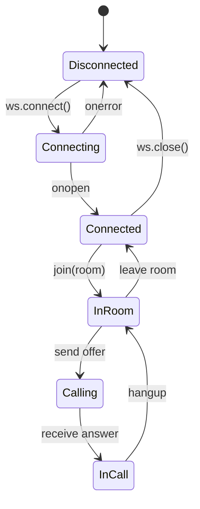
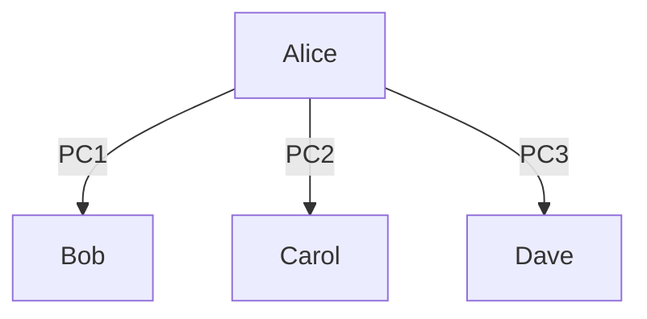
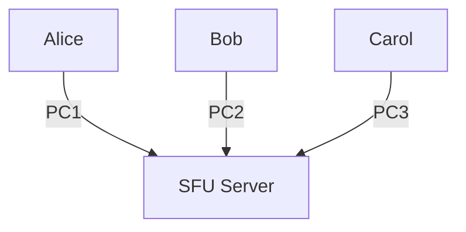

# 02 - Signaling: The Coordination Protocol

## The Core Confusion

**WebRTC does NOT define signaling.**

Read that again. The WebRTC spec intentionally leaves out how peers exchange the information needed to connect.

Why? Because signaling requirements vary:
- Dating app: centralized signaling server
- P2P file sharing: DHT or blockchain
- Gaming: dedicated game server
- Enterprise: existing XMPP/SIP infrastructure

**Signaling is YOUR problem to solve.** WebRTC just provides the payload format (SDP) and expects you to deliver it.

---

## What Signaling Actually Does

Signaling is the **out-of-band** communication channel that lets peers:

1. **Discover each other** ("Alice wants to call Bob")
2. **Exchange session metadata** (codecs, formats, encryption keys)
3. **Exchange network candidates** (IP addresses, ports)
4. **Handle connection lifecycle** (renegotiation, hangup)

Think of it like planning a meetup:
- **Signaling**: Texting to agree on location, time
- **Media connection**: Actually showing up and talking face-to-face

You don't text during the conversation (that would be silly). You texted to coordinate where to meet.

---

## Signaling vs Media: Separate Systems



**Key insights**:
- Signaling goes **through your server** (WebSocket, HTTP, etc.)
- Media goes **peer-to-peer** (usually) or via TURN
- They use **different protocols** (TCP vs UDP)
- They have **different lifecycles** (signaling can die; media keeps flowing)

---

## The Offer/Answer Model: Contract Negotiation

WebRTC uses **SDP (Session Description Protocol)** to describe a session:
- What media types (audio/video/data)
- What codecs (Opus, VP8, H.264)
- What transport (ICE candidates)
- Encryption keys

The exchange follows a strict pattern:



**Analogy**: 
- **Offer**: "I can speak English, Spanish. I have video. Here's my public key."
- **Answer**: "I can speak English. I have video too. Here's my public key."
- **Result**: Both agree to speak English and exchange encrypted video.

---

## SDP: The Ugly but Necessary Format

Here's what an SDP offer looks like (simplified):

```sdp
v=0
o=- 123456789 2 IN IP4 127.0.0.1
s=-
t=0 0

m=audio 9 UDP/TLS/RTP/SAVPF 111 103 104
c=IN IP4 0.0.0.0
a=rtcp:9 IN IP4 0.0.0.0
a=ice-ufrag:F7gI
a=ice-pwd:x9cml8YLKDKTNuQM0YZUW0W
a=fingerprint:sha-256 49:66:12:C4:...
a=rtpmap:111 opus/48000/2

m=video 9 UDP/TLS/RTP/SAVPF 96 97
a=rtpmap:96 VP8/90000
a=rtpmap:97 H264/90000
```

**What this says**:
- Line 1-4: Session metadata (ignore)
- `m=audio`: I want audio, supported codecs: 111, 103, 104
- `a=rtpmap:111 opus/48000/2`: Codec 111 is Opus at 48kHz stereo
- `a=ice-ufrag/pwd`: ICE credentials for NAT traversal
- `a=fingerprint`: My DTLS certificate fingerprint (security)
- `m=video`: I want video, supported codecs: VP8, H.264

**Good news**: You rarely parse this manually. The browser handles it. You just pass it around as an opaque blob.

---

## Implementing Signaling: WebSocket Example

### Server (Node.js)

```javascript
const WebSocket = require('ws');
const wss = new WebSocket.Server({ port: 8080 });

// Simple in-memory room management
const rooms = new Map();

wss.on('connection', (ws) => {
  let currentRoom = null;
  
  ws.on('message', (message) => {
    const data = JSON.parse(message);
    
    switch(data.type) {
      case 'join':
        currentRoom = data.room;
        if (!rooms.has(currentRoom)) {
          rooms.set(currentRoom, new Set());
        }
        rooms.get(currentRoom).add(ws);
        broadcast(currentRoom, { type: 'peer-joined' }, ws);
        break;
        
      case 'offer':
      case 'answer':
      case 'ice-candidate':
        // Forward to all other peers in room
        broadcast(currentRoom, data, ws);
        break;
    }
  });
  
  ws.on('close', () => {
    if (currentRoom && rooms.has(currentRoom)) {
      rooms.get(currentRoom).delete(ws);
      broadcast(currentRoom, { type: 'peer-left' });
    }
  });
});

function broadcast(room, message, excludeWs) {
  if (!rooms.has(room)) return;
  rooms.get(room).forEach(client => {
    if (client !== excludeWs && client.readyState === WebSocket.OPEN) {
      client.send(JSON.stringify(message));
    }
  });
}
```

### Client (Browser)

```javascript
class SignalingClient {
  constructor(serverUrl) {
    this.ws = new WebSocket(serverUrl);
    this.handlers = new Map();
    
    this.ws.onmessage = (event) => {
      const data = JSON.parse(event.data);
      const handler = this.handlers.get(data.type);
      if (handler) handler(data);
    };
  }
  
  on(type, handler) {
    this.handlers.set(type, handler);
  }
  
  send(type, payload) {
    this.ws.send(JSON.stringify({ type, ...payload }));
  }
  
  join(room) {
    this.send('join', { room });
  }
  
  sendOffer(offer) {
    this.send('offer', { sdp: offer });
  }
  
  sendAnswer(answer) {
    this.send('answer', { sdp: answer });
  }
  
  sendIceCandidate(candidate) {
    this.send('ice-candidate', { candidate });
  }
}
```

---

## The Complete Connection Flow with Signaling

Let's trace a full 1-on-1 call setup:



**Notice**: Signaling server is only involved in phases 1-3. Once media flows (phase 4), the server could die and the call continues.

---

## ICE Candidate Trickling (Important Optimization)

Early WebRTC implementations waited for ALL ICE candidates before sending the offer. This added 5-10 seconds of latency.

**Modern approach**: "Trickle ICE"

1. Create offer immediately (even without candidates)
2. Send offer via signaling
3. As ICE candidates are discovered, send them individually via signaling
4. Peer adds them with `addIceCandidate()`

```javascript
// Alice side
const pc = new RTCPeerConnection(config);

// Send candidates as they're discovered
pc.onicecandidate = (event) => {
  if (event.candidate) {
    signaling.sendIceCandidate(event.candidate);
  }
};

// Create and send offer immediately
const offer = await pc.createOffer();
await pc.setLocalDescription(offer);
signaling.sendOffer(offer);

// Bob side - receive candidates asynchronously
signaling.on('ice-candidate', async (data) => {
  await pc.addIceCandidate(data.candidate);
});
```

**Result**: Call setup drops from 10s → 2s. Much better UX.

---

## Signaling State Machine

Your signaling layer needs to handle these states:



**Common bug**: Not handling reconnection when signaling drops during a call. Media keeps flowing but you can't renegotiate (e.g., add screen share).

---

## Signaling Failures vs Media Failures

These are **independent** and require different handling:

| Scenario | What Breaks | What Still Works | Fix |
|----------|-------------|------------------|-----|
| Signaling server dies | Can't start new calls, can't renegotiate | Existing calls continue | Reconnect to signaling |
| Media connection fails | Audio/video stops | Signaling channel works | ICE restart |
| Both fail | Everything | Nothing | Full reconnection |

**Critical**: Monitor both separately. Don't assume "call is working" if signaling is up.

---

## Alternatives to WebSocket Signaling

### 1. HTTP Long-Polling
```javascript
// Poll for messages
async function pollMessages() {
  const response = await fetch('/messages?since=' + lastMessageId);
  const messages = await response.json();
  messages.forEach(handleMessage);
  pollMessages(); // Recurse
}
```
**Pros**: Simple, works through restrictive firewalls
**Cons**: Higher latency (1-2s), more server load

### 2. Server-Sent Events (SSE)
```javascript
const eventSource = new EventSource('/signaling-stream');
eventSource.onmessage = (event) => {
  const data = JSON.parse(event.data);
  handleSignalingMessage(data);
};
```
**Pros**: Native browser API, auto-reconnect
**Cons**: One-way only (need separate POST for sending)

### 3. Existing Infrastructure
- **XMPP**: Enterprise messaging (Jingle extension for WebRTC)
- **SIP**: Traditional VoIP systems
- **Your custom protocol**: Anything that delivers messages reliably

**Bottom line**: Pick what fits your stack. WebRTC doesn't care.

---

## Security Considerations

### 1. Authentication
```javascript
// Bad: Anyone can join any room
ws.send(JSON.stringify({ type: 'join', room: 'room-123' }));

// Good: Verify user owns access to room
ws.send(JSON.stringify({ 
  type: 'join', 
  room: 'room-123',
  token: authToken 
}));
```

### 2. Message Validation
```javascript
// Server-side: Validate all signaling messages
function validateOffer(offer) {
  if (!offer.sdp || typeof offer.sdp !== 'string') {
    throw new Error('Invalid SDP');
  }
  // Check SDP doesn't contain malicious payloads
}
```

### 3. Rate Limiting
```javascript
// Prevent signaling spam (DoS)
const rateLimiter = new Map(); // clientId -> timestamp[]
function checkRateLimit(clientId) {
  const now = Date.now();
  const requests = rateLimiter.get(clientId) || [];
  const recentRequests = requests.filter(t => now - t < 1000);
  if (recentRequests.length > 10) {
    throw new Error('Rate limit exceeded');
  }
  recentRequests.push(now);
  rateLimiter.set(clientId, recentRequests);
}
```

**Remember**: Signaling server sees all metadata (who's calling whom). This is a privacy consideration.

---

## Signaling for Group Calls

In group calls, you need multiple peer connections:



**Signaling complexity**: If Alice sends an offer, WHO is it for?

**Solution**: Include peer ID in signaling messages:

```javascript
signaling.send('offer', { 
  to: 'bob-peer-id',
  from: 'alice-peer-id',
  sdp: offer 
});
```

Or for SFU (simpler):



Alice only has ONE peer connection to SFU. Signaling is 1-to-1 with server.

---

## Common Mistakes

### Mistake 1: Not handling signaling reconnection
```javascript
// Bad
ws.onclose = () => console.log('Disconnected');

// Good
ws.onclose = () => {
  console.log('Signaling lost, reconnecting...');
  setTimeout(connectSignaling, 1000);
};
```

### Mistake 2: Sending ICE candidates before offer
```javascript
// Bad: Receiver doesn't have remote description yet
pc.onicecandidate = (e) => {
  signaling.send('ice-candidate', e.candidate);
};
pc.createOffer(); // Candidates fire immediately

// Good: Queue candidates until offer is sent
const candidateQueue = [];
pc.onicecandidate = (e) => {
  if (pc.remoteDescription) {
    signaling.send('ice-candidate', e.candidate);
  } else {
    candidateQueue.push(e.candidate);
  }
};
```

### Mistake 3: Not validating state transitions
```javascript
// Bad: Can receive offer in any state
signaling.on('offer', handleOffer);

// Good: Check current state
signaling.on('offer', (offer) => {
  if (pc.signalingState !== 'stable') {
    console.error('Cannot handle offer in state:', pc.signalingState);
    return;
  }
  handleOffer(offer);
});
```

---

## What You Must Understand

| Concept | Why It Matters |
|---------|----------------|
| **Signaling ≠ WebRTC** | You implement it, WebRTC just provides payload |
| **Offer/Answer** | Contract negotiation for capabilities |
| **SDP** | Opaque blob describing session (codecs, ICE, keys) |
| **Trickle ICE** | Send candidates as discovered (faster) |
| **Signaling can fail independently** | Monitor and handle reconnection |

---

## Next Steps

You now understand:
- WHY signaling exists (coordinate outside the media path)
- WHAT it carries (SDP offers/answers, ICE candidates)
- HOW to implement it (WebSocket, HTTP, etc.)

**Next**: [03-ice-stun-turn.md](03-ice-stun-turn.md) - Deep dive into ICE candidate discovery and NAT traversal.

Signaling lets you exchange "I'm reachable at X". ICE is the algorithm that tests all the Xs to find what works.

---

## Quick Self-Check

You understand this chapter if you can:
- [ ] Explain why WebRTC doesn't define signaling
- [ ] Draw the sequence diagram for offer/answer exchange
- [ ] Implement a basic WebSocket signaling server
- [ ] Explain SDP's purpose (without memorizing its format)
- [ ] Describe trickle ICE and why it's faster
- [ ] Name 3 alternative signaling transports
- [ ] Explain why signaling can fail while media still flows

If you can explain the phrase "signaling is out-of-band coordination for in-band media", you're ready to move on.
