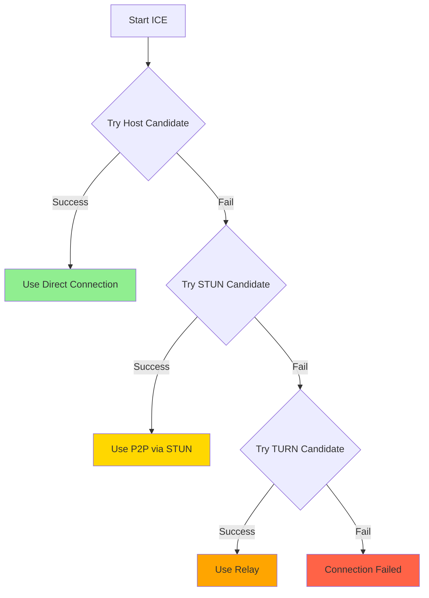
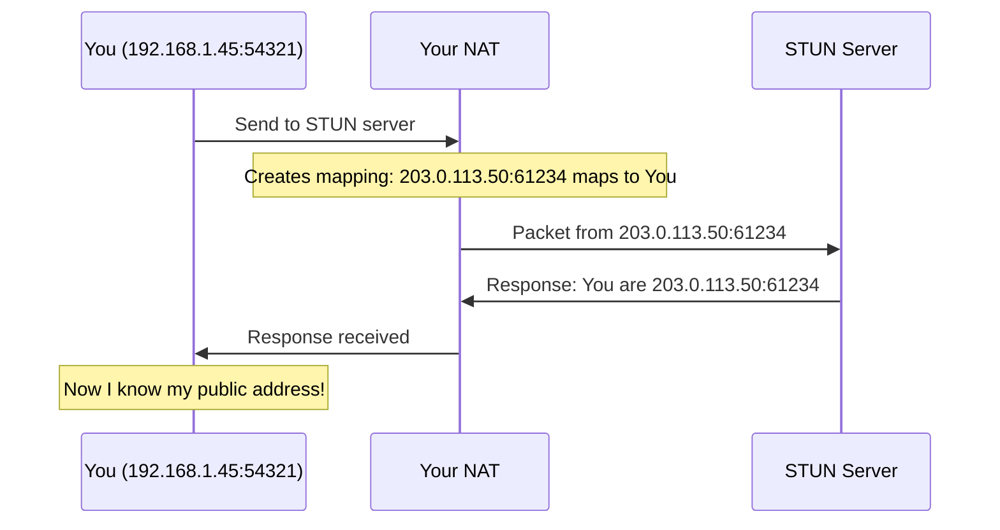
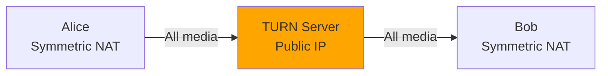
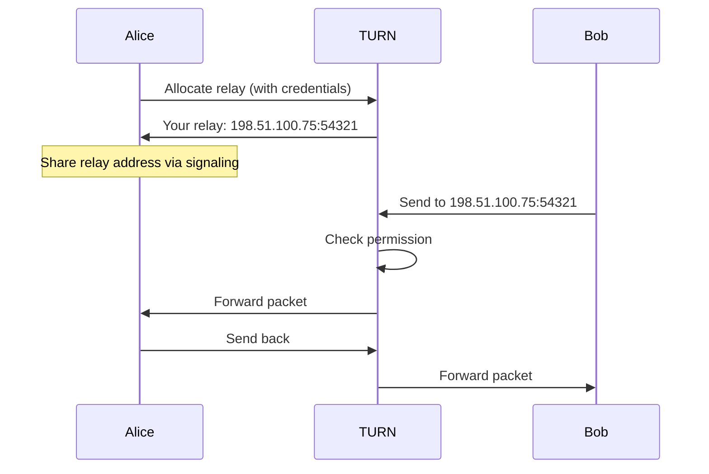
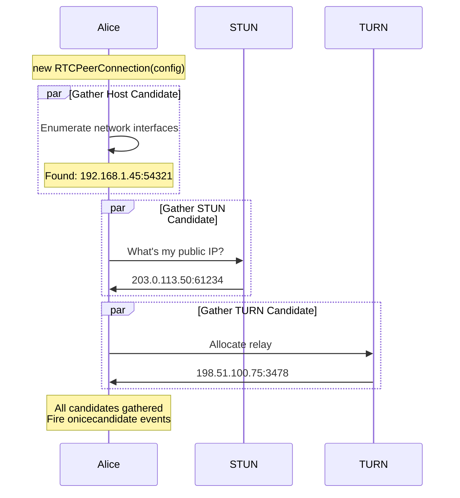
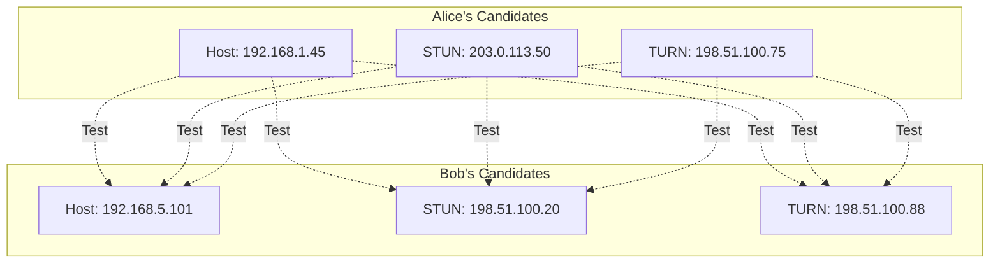
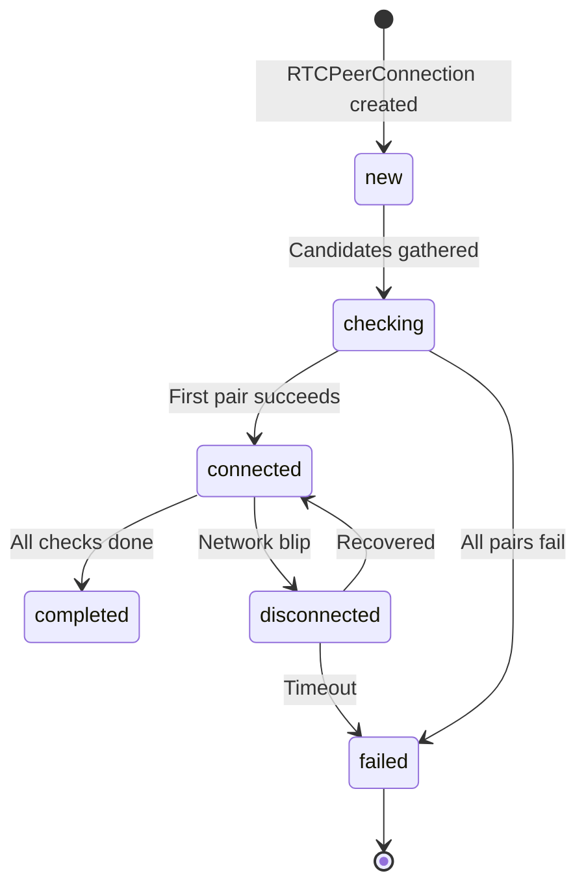

# 03 - ICE, STUN, TURN: The NAT Traversal Trinity

## The Problem ICE Solves

From [01-networking-primer.md](01-networking-primer.md), you know:
- Peers are behind NATs
- NATs block unsolicited incoming packets
- Different NAT types have different behaviors

**ICE (Interactive Connectivity Establishment)** is the algorithm that:
1. Discovers all possible ways to reach you
2. Tells your peer about them via signaling
3. Tests all combinations to find what works
4. Picks the best working path

Think of ICE as "trying every door until one opens."

---

## The Three Types of Candidates

When ICE runs, it discovers multiple "candidates" (possible network paths). There are three types:

### 1. Host Candidate (Local Network)
Your actual local IP address:
```
192.168.1.45:54321
```

**When it works**: Both peers on same LAN (office, home network)
**Latency**: <1ms
**Cost**: Free
**Success rate**: 100% on LAN, 0% across internet

### 2. Server Reflexive Candidate (via STUN)
Your public IP:port as seen by a STUN server:
```
203.0.113.50:54321
```

**When it works**: Full/Restricted Cone NAT (70-80% of users)
**Latency**: Direct peer-to-peer (~10-50ms)
**Cost**: STUN server is cheap (< $10/month)
**Success rate**: ~70-85%

### 3. Relay Candidate (via TURN)
TURN server's public IP:port that relays your traffic:
```
198.51.100.75:3478
```

**When it works**: Always (last resort)
**Latency**: Adds 10-100ms (depends on TURN server location)
**Cost**: Expensive (bandwidth costs $$$)
**Success rate**: 100%

---

## ICE Priority: Best Path Wins

ICE assigns priorities:

```
Host candidate (direct)        Priority: 126
Server reflexive (STUN)        Priority: 100
Relay (TURN)                   Priority: 0
```

**Algorithm**: Try all candidates, use highest priority that works.



**Real-world distribution**:
- Host: 5% (same LAN)
- STUN: 75-85% (most internet users)
- TURN: 10-20% (symmetric NAT, corporate firewalls)

---

## STUN: Session Traversal Utilities for NAT

### What STUN Does

STUN is a simple protocol: "Tell me my public IP:port"



### STUN Server Topology

STUN servers are:
- **Stateless** (just reflect your address back)
- **Cheap to run** (uses minimal bandwidth/CPU)
- **Public** (Google, Cloudflare provide free ones)

Example STUN servers:
```javascript
const config = {
  iceServers: [
    { urls: 'stun:stun.l.google.com:19302' },
    { urls: 'stun:stun1.l.google.com:19302' },
  ]
};
```

**Cost**: Virtually free. A single cheap VPS can handle millions of requests.

### When STUN Fails

STUN doesn't work with:
- **Symmetric NAT**: Different port per destination
- **Firewall blocking UDP**: No packets get through
- **Double NAT**: Multiple layers (carrier networks)

For these cases, you need TURN.

---

## TURN: Traversal Using Relays around NAT

### What TURN Does

TURN relays all your traffic when direct connection isn't possible:



### TURN Server Behavior

1. **Allocation**: Client requests a relay address
2. **Relaying**: All media flows through TURN
3. **Permissions**: TURN checks who can send to your allocation



### TURN Credentials (Important!)

TURN requires authentication (unlike STUN):

```javascript
const config = {
  iceServers: [
    { 
      urls: 'turn:turn.example.com:3478',
      username: 'user-12345',
      credential: 'temp-password'
    }
  ]
};
```

**Why auth?** To prevent abuse. Without it, anyone could use your TURN server to relay arbitrary traffic (expensive).

### Short-term vs Long-term Credentials

**Long-term credentials** (simple but insecure):
```javascript
{ 
  username: 'alice',
  credential: 'static-password'
}
```
**Problem**: Credentials in JavaScript = anyone can see and abuse your TURN server.

**Short-term credentials** (production approach):
```javascript
// Server generates time-limited credentials
const username = Math.floor(Date.now() / 1000) + 3600 + ':alice';
const secret = 'server-secret-key';
const credential = crypto.createHmac('sha1', secret)
  .update(username)
  .digest('base64');

// Client uses these (expire in 1 hour)
{ username, credential }
```

**Implementation**: Your signaling server generates credentials per-connection.

---

## The Complete ICE Process

Let's trace what happens when Alice calls Bob:

### Phase 1: Gathering Candidates



**Timeline**: 
- Host: Instant
- STUN: 50-200ms
- TURN: 100-500ms

### Phase 2: Exchanging Candidates

Via signaling (covered in [02-signaling.md](02-signaling.md)):

```javascript
// Alice sends candidates to Bob via signaling
pc.onicecandidate = (event) => {
  if (event.candidate) {
    signaling.send('ice-candidate', { 
      candidate: event.candidate 
    });
  }
};

// Bob receives and adds them
signaling.on('ice-candidate', async (data) => {
  await pc.addIceCandidate(data.candidate);
});
```

### Phase 3: Connectivity Checks

Both peers now have each other's candidates. Time to test them all!



**That's 9 candidate pairs to test!** (In reality, ICE optimizes this.)

ICE sends STUN binding requests on each pair:
```
Alice STUN 203.0.113.50 → Bob STUN 198.51.100.20
Bob replies if it got through
```

**Successful pair** = both sides can send/receive.

### Phase 4: Selecting Winner

```javascript
pc.oniceconnectionstatechange = () => {
  console.log('ICE state:', pc.iceConnectionState);
  // States: new → checking → connected → completed
};
```

Once a pair succeeds:
- ICE state → `connected`
- Media starts flowing
- Lower-priority candidates are abandoned

---

## ICE States: What They Mean



| State | What It Means | What To Do |
|-------|---------------|------------|
| `new` | Just created | Normal |
| `checking` | Testing candidate pairs | Show "Connecting..." |
| `connected` | At least one pair works | Start media! |
| `completed` | All checks done | Normal (same as connected) |
| `disconnected` | Packets not flowing | Show warning, may recover |
| `failed` | All candidates failed | Show error, offer retry |
| `closed` | Connection closed | Clean up |

**Common mistake**: Not handling `disconnected` state. Network hiccups are common (WiFi → mobile, tunnel, etc.). Give it 10-30s to recover.

---

## TURN Cost Analysis

TURN is expensive because it relays **all media**. Let's do the math:

### Bandwidth Calculation

**Video call (1-on-1)**:
- Video: 1 Mbps
- Audio: 50 Kbps
- Total: ~1.05 Mbps

**Per user needing TURN** (10-15% of users):
```
1.05 Mbps × 2 directions = 2.1 Mbps
```

**1000 concurrent calls with 15% TURN usage**:
```
1000 calls × 0.15 × 2.1 Mbps = 315 Mbps = 140 GB/hour
```

**AWS bandwidth pricing** (~$0.09/GB):
```
140 GB/hour × $0.09 = $12.60/hour = $9,072/month
```

**This is why**:
- Startups prefer mesh (P2P) for 1-on-1
- Enterprise uses dedicated TURN infrastructure
- Some apps exclude users behind symmetric NAT (bad UX)

### Reducing TURN Costs

1. **Optimize codec**: VP9 instead of VP8 saves ~30% bandwidth
2. **Adaptive bitrate**: Lower quality when bandwidth limited
3. **TURN filters**: Exclude relay candidates for known good networks
4. **Regional TURN**: Route to closest server (lower latency + cost)
5. **TCP fallback**: TURN over TCP for firewall traversal (slower but works)

---

## Configuring ICE Servers

### Minimal Config (Free STUN Only)
```javascript
const config = {
  iceServers: [
    { urls: 'stun:stun.l.google.com:19302' }
  ]
};
```
**Caveat**: 10-20% of users can't connect.

### Production Config (STUN + TURN)
```javascript
const config = {
  iceServers: [
    // STUN for most users
    { urls: 'stun:stun.example.com:3478' },
    
    // TURN for fallback
    { 
      urls: [
        'turn:turn.example.com:3478?transport=udp',
        'turn:turn.example.com:3478?transport=tcp',
        'turns:turn.example.com:5349?transport=tcp' // TLS
      ],
      username: dynamicUsername, // From your server
      credential: dynamicCredential
    }
  ],
  
  // ICE optimization
  iceTransportPolicy: 'all', // or 'relay' to force TURN
  iceCandidatePoolSize: 10 // Pre-gather candidates
};
```

### TURN Server Options

**Self-hosted** (using [coturn](https://github.com/coturn/coturn)):
```bash
# Install
apt-get install coturn

# Configure /etc/turnserver.conf
listening-port=3478
fingerprint
lt-cred-mech
realm=example.com
static-auth-secret=yourSecretKey

# Run
turnserver -v
```

**Managed services**:
- **Twilio NTS**: $0.0015/min/participant
- **Xirsys**: $20/month for 100GB
- **AWS/GCP VMs**: $30-100/month + bandwidth

---

## ICE Restart: The Recovery Mechanism

Network changes? No problem. ICE restart re-gathers candidates:

```javascript
// Detect network change (mobile → WiFi, VPN toggle, etc.)
pc.oniceconnectionstatechange = () => {
  if (pc.iceConnectionState === 'disconnected') {
    console.log('Connection lost, attempting ICE restart...');
    
    // Trigger ICE restart by creating new offer with iceRestart flag
    setTimeout(async () => {
      if (pc.iceConnectionState !== 'connected') {
        const offer = await pc.createOffer({ iceRestart: true });
        await pc.setLocalDescription(offer);
        signaling.send('offer', { sdp: offer });
      }
    }, 5000); // Give it 5s to recover naturally
  }
};
```

**When to use**: Network switches, long disconnection, TURN server failure.

---

## Advanced: Controlling ICE Behavior

### Force Relay (Privacy Mode)
```javascript
const config = {
  iceTransportPolicy: 'relay' // Only use TURN, hide real IP
};
```
**Use case**: Anonymous apps, VPNs, privacy-focused products.
**Cost**: All connections use TURN (expensive).

### Hide Local IPs
```javascript
const config = {
  iceServers: [...],
  iceTransportPolicy: 'all',
  bundlePolicy: 'max-bundle',
  rtcpMuxPolicy: 'require',
  
  // Chrome: Hide local IPs unless needed
  // (requires site to be HTTPS)
};
```

Set via browser policy (enterprise) or flags.

### Trickle ICE vs Full ICE

**Trickle** (default):
- Send offer immediately
- Send candidates as discovered
- Faster (1-2s setup)

**Full**:
- Wait for all candidates
- Send offer with all candidates embedded
- Slower (5-10s setup) but compatible with old systems

```javascript
// Force full ICE (wait for all candidates)
const candidates = [];
pc.onicecandidate = (event) => {
  if (event.candidate) {
    candidates.push(event.candidate);
  } else {
    // null candidate = gathering complete
    sendOfferWithAllCandidates(offer, candidates);
  }
};
```

---

## Debugging ICE Failures

### Symptom: iceConnectionState stuck in "checking"

**Likely causes**:
1. **Firewall blocking UDP** → Need TURN over TCP
2. **No TURN server** → Add TURN config
3. **Wrong TURN credentials** → Check server logs
4. **Symmetric NAT both sides** → Needs TURN

**Debug**:
```javascript
pc.onicegatheringstatechange = () => {
  console.log('Gathering state:', pc.iceGatheringState);
};

pc.onicecandidate = (event) => {
  if (event.candidate) {
    console.log('Candidate:', event.candidate.candidate);
    // Check types: host, srflx (STUN), relay (TURN)
  }
};
```

Check Chrome's `chrome://webrtc-internals`:
- See all candidates
- See connectivity checks
- See which pair wins

---

## Quick Reference: STUN vs TURN

| Feature | STUN | TURN |
|---------|------|------|
| **Purpose** | Discover public IP | Relay traffic |
| **Bandwidth** | Minimal (~1KB per request) | Full media (GBs) |
| **Cost** | Free/cheap | Expensive |
| **Latency** | None (P2P) | Adds 10-100ms |
| **Success rate** | 70-85% | 100% |
| **Auth required** | No | Yes |
| **When to use** | Always (first attempt) | Fallback only |

---

## What You Must Understand

| Concept | Why It Matters |
|---------|----------------|
| **ICE tries multiple paths** | Network diversity → resilience |
| **Host → STUN → TURN priority** | Cost optimization |
| **TURN is expensive** | Budget for 10-20% of traffic |
| **ICE restart for recovery** | Handle network changes gracefully |
| **Short-term credentials** | Prevent TURN abuse |

---

## Next Steps

You now understand NAT traversal: the hardest part of WebRTC.

**Next**: [04-peer-connection-core.md](04-peer-connection-core.md) - How RTCPeerConnection ties everything together.

ICE is one piece. Peer connection orchestrates ICE, signaling, media, and data channels into a cohesive system.

---

## Quick Self-Check

You understand this chapter if you can:
- [ ] Name the three candidate types and their priorities
- [ ] Explain when STUN is sufficient vs when TURN is needed
- [ ] Calculate rough TURN costs for your app
- [ ] Implement ICE restart on network change
- [ ] Configure production-ready ICE servers
- [ ] Debug ICE failures using browser tools
- [ ] Explain why symmetric NAT breaks direct P2P

If you can design an ICE server topology for a global app with 1M users, you're ready to move on.
