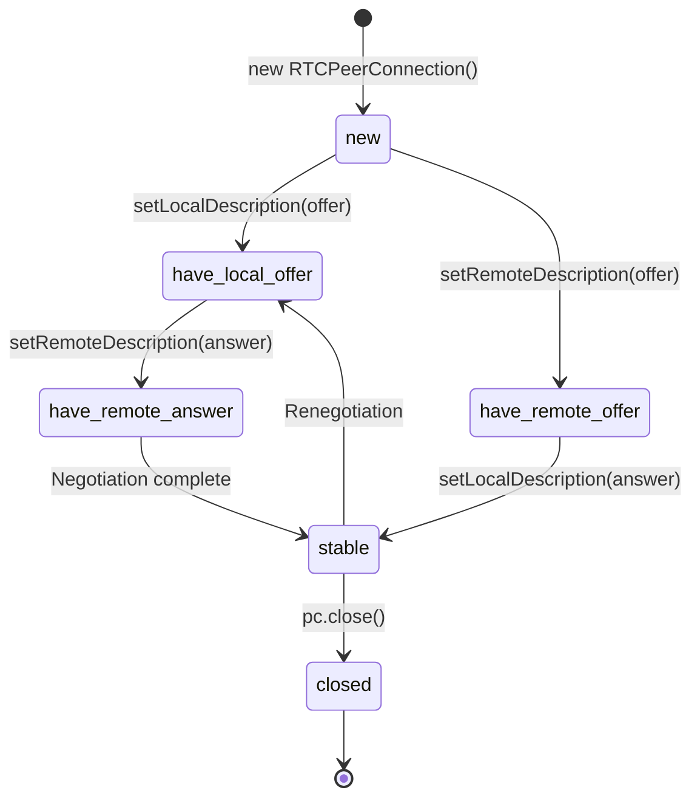
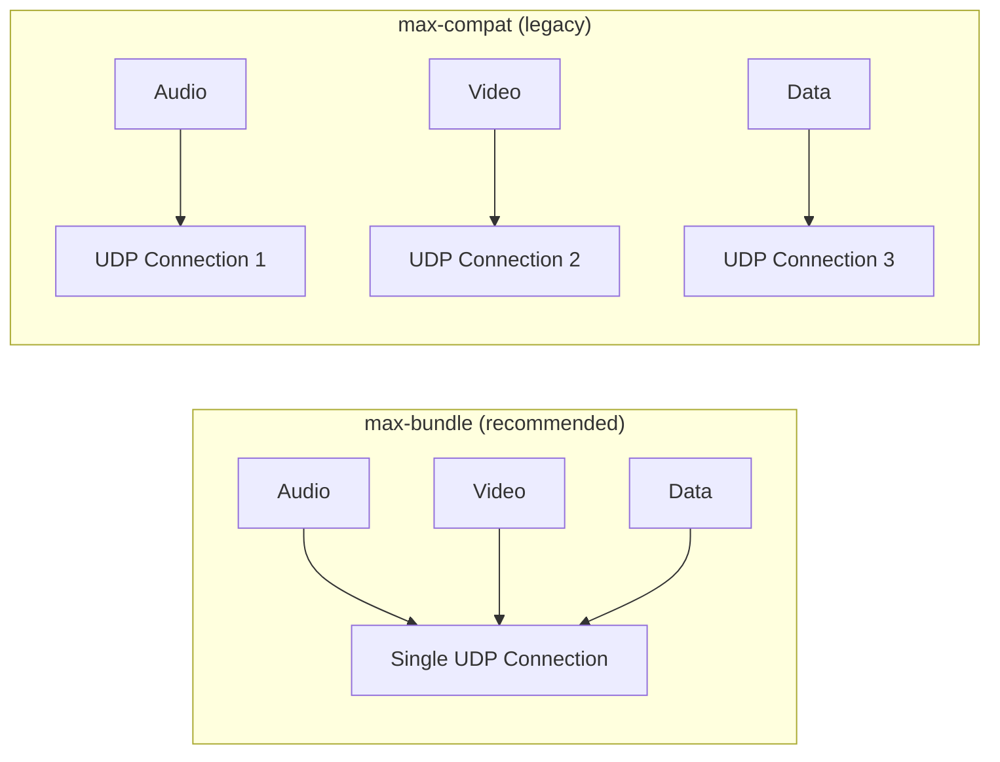

# 04 - RTCPeerConnection: The Core Orchestrator

## What PeerConnection Actually Is

`RTCPeerConnection` is the **main object** in WebRTC. It's not just an API—it's a state machine that orchestrates:

1. **ICE**: Candidate gathering, connectivity checks
2. **DTLS**: Encryption handshake
3. **SRTP**: Encrypted media transport
4. **SCTP**: Data channel transport
5. **RTP**: Media packet handling

Think of it as a **connection manager** that wraps multiple protocols into one JavaScript API.

```javascript
const pc = new RTCPeerConnection(config);
// This single object manages everything
```

---

## The Lifecycle: From Creation to Death



**Key insight**: Signaling state tracks WHERE you are in the offer/answer exchange. ICE state tracks WHETHER media is flowing.

---

## The Three State Machines

A peer connection has **three independent state machines**:

### 1. Signaling State

Tracks offer/answer negotiation:

```javascript
pc.onsignalingstatechange = () => {
  console.log('Signaling state:', pc.signalingState);
};
```

| State | Meaning |
|-------|---------|
| `stable` | No negotiation in progress (initial or completed) |
| `have-local-offer` | Sent offer, waiting for answer |
| `have-remote-offer` | Received offer, need to send answer |
| `have-local-pranswer` | Sent provisional answer (rare) |
| `have-remote-pranswer` | Received provisional answer (rare) |
| `closed` | Connection closed |

**Most common flow**:
```
stable → have-local-offer → stable
```

### 2. Ice Connection State

Tracks peer-to-peer connectivity:

```javascript
pc.oniceconnectionstatechange = () => {
  console.log('ICE state:', pc.iceConnectionState);
};
```

| State | Meaning | User Action |
|-------|---------|-------------|
| `new` | Just created | — |
| `checking` | Testing candidates | Show "Connecting..." |
| `connected` | At least one working | Start UI |
| `completed` | All checks done | — |
| `failed` | No candidates work | Show error |
| `disconnected` | Temporarily lost | Show warning |
| `closed` | Connection closed | Clean up |

**Critical**: `disconnected` ≠ `failed`. Network blips are normal. Wait 10-30s for recovery.

### 3. Connection State (Overall)

High-level aggregate of ICE + DTLS:

```javascript
pc.onconnectionstatechange = () => {
  console.log('Connection state:', pc.connectionState);
};
```

| State | Meaning |
|-------|---------|
| `new` | Initial |
| `connecting` | Setting up |
| `connected` | Ready! |
| `disconnected` | Temporarily offline |
| `failed` | Permanent failure |
| `closed` | Closed |

**Best practice**: Monitor `connectionState` for UI, `iceConnectionState` for debugging.

---

## Creating a PeerConnection: Configuration Deep Dive

```javascript
const pc = new RTCPeerConnection({
  // ICE servers (covered in 03-ice-stun-turn.md)
  iceServers: [
    { urls: 'stun:stun.example.com:3478' },
    { 
      urls: 'turn:turn.example.com:3478',
      username: '...',
      credential: '...'
    }
  ],
  
  // ICE transport policy
  iceTransportPolicy: 'all', // or 'relay' (TURN only)
  
  // Bundle policy (media multiplexing)
  bundlePolicy: 'max-bundle', // all media in one ICE connection
  
  // RTCP multiplexing
  rtcpMuxPolicy: 'require', // RTCP on same port as RTP
  
  // Certificate (for DTLS)
  certificates: [...], // Usually omit, browser generates
  
  // ICE candidate pool size (pre-gather)
  iceCandidatePoolSize: 0 // default, increase for faster setup
});
```

### Bundle Policy Explained



**max-bundle**:
- One ICE connection for everything
- Faster setup
- Lower bandwidth
- **Always use this** unless supporting ancient browsers

---

## The Offer/Answer Flow: Code View

### Alice (Caller) Side

```javascript
const pc = new RTCPeerConnection(config);

// Add media BEFORE creating offer
const stream = await navigator.mediaDevices.getUserMedia({ 
  video: true, 
  audio: true 
});
stream.getTracks().forEach(track => pc.addTrack(track, stream));

// Create offer
const offer = await pc.createOffer();

// Set local description (starts ICE gathering)
await pc.setLocalDescription(offer);

// Send offer via signaling
signaling.send('offer', { sdp: pc.localDescription });

// Wait for answer from Bob
signaling.on('answer', async (data) => {
  await pc.setRemoteDescription(data.sdp);
  // Now in stable state, ICE checks begin
});

// Handle ICE candidates
pc.onicecandidate = (event) => {
  if (event.candidate) {
    signaling.send('ice-candidate', { candidate: event.candidate });
  }
};
```

### Bob (Callee) Side

```javascript
const pc = new RTCPeerConnection(config);

// Wait for offer from Alice
signaling.on('offer', async (data) => {
  // Set remote description first
  await pc.setRemoteDescription(data.sdp);
  
  // Add media
  const stream = await navigator.mediaDevices.getUserMedia({ 
    video: true, 
    audio: true 
  });
  stream.getTracks().forEach(track => pc.addTrack(track, stream));
  
  // Create answer
  const answer = await pc.createAnswer();
  
  // Set local description
  await pc.setLocalDescription(answer);
  
  // Send answer via signaling
  signaling.send('answer', { sdp: pc.localDescription });
});

// Handle ICE candidates
pc.onicecandidate = (event) => {
  if (event.candidate) {
    signaling.send('ice-candidate', { candidate: event.candidate });
  }
};

signaling.on('ice-candidate', async (data) => {
  await pc.addIceCandidate(data.candidate);
});
```

---

## What Happens in setLocalDescription

When you call `setLocalDescription(offer)`:

1. **SDP is finalized**: Codecs, ports, ICE credentials generated
2. **ICE gathering starts**: Browser queries network interfaces, STUN, TURN
3. **DTLS certificate generated**: For encryption
4. **onicecandidate fires**: As candidates are discovered

```javascript
pc.onicegatheringstatechange = () => {
  console.log('ICE gathering:', pc.iceGatheringState);
  // States: new → gathering → complete
};
```

**Timeline**:
```
setLocalDescription()
  ↓ (immediate)
iceGatheringState = "gathering"
  ↓ (50-500ms)
onicecandidate fires × N
  ↓
iceGatheringState = "complete"
  ↓
onicecandidate(null) fires (signals end)
```

---

## What Happens in setRemoteDescription

When you call `setRemoteDescription(answer)`:

1. **Validates SDP**: Checks compatibility
2. **Selects common codecs**: Intersection of both offers
3. **Starts ICE checks**: Tests candidate pairs
4. **DTLS handshake begins**: Establish encryption

**This is where the connection actually forms.**

```javascript
pc.oniceconnectionstatechange = () => {
  if (pc.iceConnectionState === 'connected') {
    console.log('Connection established!');
    // Media should now be flowing
  }
};
```

---

## Receiving Media: The ontrack Event

```javascript
pc.ontrack = (event) => {
  console.log('Received track:', event.track.kind); // "audio" or "video"
  
  const remoteStream = event.streams[0];
  const videoElement = document.getElementById('remote-video');
  videoElement.srcObject = remoteStream;
};
```

**When this fires**:
- After `setRemoteDescription(answer)` (Bob side)
- After `setRemoteDescription(answer)` (Alice side, for Bob's tracks)

**Important**: `ontrack` fires once per track. If remote has audio + video, it fires twice.

---

## Renegotiation: Adding Tracks Mid-Call

Want to add screen share after call starts?

```javascript
// Mid-call: Add screen share
const screenStream = await navigator.mediaDevices.getDisplayMedia({
  video: true
});

const screenTrack = screenStream.getVideoTracks()[0];
pc.addTrack(screenTrack, screenStream);

// Renegotiate (same as initial setup)
const offer = await pc.createOffer();
await pc.setLocalDescription(offer);
signaling.send('offer', { sdp: pc.localDescription });

// Remote side receives offer, sends answer (same flow)
```

**Signaling state**:
```
stable → have-local-offer → stable (after answer)
```

**Perfect negotiation pattern** (handles race conditions):
```javascript
// If both peers renegotiate simultaneously
const polite = amIPolite(); // Decide who's polite (e.g., caller)

pc.onnegotiationneeded = async () => {
  try {
    await pc.setLocalDescription();
    signaling.send('offer', { sdp: pc.localDescription });
  } catch (err) {
    console.error(err);
  }
};

signaling.on('offer', async (data) => {
  const offerCollision = 
    pc.signalingState !== 'stable' || 
    pc.pendingRemoteDescription;
    
  if (!polite && offerCollision) {
    return; // Ignore offer, remote peer will back off
  }
  
  await pc.setRemoteDescription(data.sdp);
  const answer = await pc.createAnswer();
  await pc.setLocalDescription(answer);
  signaling.send('answer', { sdp: pc.localDescription });
});
```

**This prevents deadlocks when both sides renegotiate.**

---

## Track Replacement: Switching Camera

Don't renegotiate for simple track replacements:

```javascript
const sender = pc.getSenders().find(s => s.track?.kind === 'video');

// Switch from front to back camera
const newStream = await navigator.mediaDevices.getUserMedia({
  video: { facingMode: 'environment' }
});
const newTrack = newStream.getVideoTracks()[0];

await sender.replaceTrack(newTrack);
// No renegotiation needed!
```

**Use cases**:
- Camera flip
- Mic switch
- Screen share → camera

**Caveat**: If changing resolution/framerate constraints, renegotiation may be needed.

---

## Data Channels: The Non-Media Path

```javascript
// Alice creates data channel
const dataChannel = pc.createDataChannel('chat', {
  ordered: true,
  maxRetransmits: 10
});

dataChannel.onopen = () => {
  console.log('Data channel open');
  dataChannel.send('Hello Bob!');
};

dataChannel.onmessage = (event) => {
  console.log('Received:', event.data);
};

// Bob receives data channel
pc.ondatachannel = (event) => {
  const dataChannel = event.channel;
  
  dataChannel.onmessage = (event) => {
    console.log('Received:', event.data);
    dataChannel.send('Hello Alice!');
  };
};
```

**Key difference**: Data channels piggyback on the peer connection. No separate ICE connection needed.

More details in [06-data-channels-file-transfer.md](06-data-channels-file-transfer.md).

---

## Closing and Cleanup

```javascript
// Graceful close
pc.close();

// Stop all tracks
localStream.getTracks().forEach(track => track.stop());

// Remove event listeners (avoid memory leaks)
pc.onicecandidate = null;
pc.ontrack = null;
pc.oniceconnectionstatechange = null;
```

**States after close**:
- `signalingState = "closed"`
- `iceConnectionState = "closed"`
- `connectionState = "closed"`

**Remote peer sees**: ICE state → `disconnected` → `failed`.

**Best practice**: Send signaling message before closing so remote can clean up gracefully.

```javascript
signaling.send('hangup');
pc.close();

// Remote side
signaling.on('hangup', () => {
  pc.close();
  showCallEnded();
});
```

---

## Stats API: Monitoring Connection Health

```javascript
setInterval(async () => {
  const stats = await pc.getStats();
  
  stats.forEach(report => {
    if (report.type === 'inbound-rtp' && report.kind === 'video') {
      console.log('Video packets received:', report.packetsReceived);
      console.log('Packets lost:', report.packetsLost);
      console.log('Jitter:', report.jitter);
    }
    
    if (report.type === 'candidate-pair' && report.state === 'succeeded') {
      console.log('RTT (round-trip time):', report.currentRoundTripTime);
      console.log('Bytes sent:', report.bytesSent);
      console.log('Bytes received:', report.bytesReceived);
    }
  });
}, 1000);
```

**Key metrics**:
- **Packet loss**: > 5% = poor quality
- **RTT**: > 200ms = noticeable lag
- **Jitter**: > 30ms = stuttering
- **Bytes sent/received**: Bandwidth monitoring

More in [11-debugging-and-observability.md](11-debugging-and-observability.md).

---

## Common Patterns

### Pattern 1: Connection with Retry

```javascript
async function createConnection(retries = 3) {
  const pc = new RTCPeerConnection(config);
  
  return new Promise((resolve, reject) => {
    const timeout = setTimeout(() => {
      if (retries > 0) {
        pc.close();
        resolve(createConnection(retries - 1));
      } else {
        reject(new Error('Connection timeout'));
      }
    }, 30000); // 30s timeout
    
    pc.oniceconnectionstatechange = () => {
      if (pc.iceConnectionState === 'connected') {
        clearTimeout(timeout);
        resolve(pc);
      } else if (pc.iceConnectionState === 'failed') {
        clearTimeout(timeout);
        if (retries > 0) {
          pc.close();
          resolve(createConnection(retries - 1));
        } else {
          reject(new Error('ICE failed'));
        }
      }
    };
  });
}
```

### Pattern 2: Auto-Reconnect on Failure

```javascript
pc.oniceconnectionstatechange = async () => {
  if (pc.iceConnectionState === 'failed') {
    console.log('Connection failed, attempting ICE restart...');
    
    const offer = await pc.createOffer({ iceRestart: true });
    await pc.setLocalDescription(offer);
    signaling.send('offer', { sdp: pc.localDescription });
  }
};
```

### Pattern 3: Bandwidth Estimation

```javascript
async function estimateBandwidth() {
  const stats = await pc.getStats();
  let bytesSent = 0;
  let timestamp = 0;
  
  stats.forEach(report => {
    if (report.type === 'candidate-pair' && report.state === 'succeeded') {
      bytesSent = report.bytesSent;
      timestamp = report.timestamp;
    }
  });
  
  // Calculate bitrate
  setTimeout(async () => {
    const newStats = await pc.getStats();
    newStats.forEach(report => {
      if (report.type === 'candidate-pair' && report.state === 'succeeded') {
        const deltaBytes = report.bytesSent - bytesSent;
        const deltaTime = (report.timestamp - timestamp) / 1000;
        const bitrate = (deltaBytes * 8) / deltaTime / 1000; // kbps
        console.log('Outgoing bitrate:', bitrate.toFixed(0), 'kbps');
      }
    });
  }, 1000);
}
```

---

## Common Mistakes

### Mistake 1: Creating offer before adding tracks

```javascript
// Bad
const offer = await pc.createOffer();
pc.addTrack(videoTrack, stream); // Too late!

// Good
pc.addTrack(videoTrack, stream);
const offer = await pc.createOffer(); // Includes track
```

### Mistake 2: Not handling null candidates

```javascript
// Bad
pc.onicecandidate = (event) => {
  signaling.send('ice-candidate', { candidate: event.candidate });
  // event.candidate can be null (end-of-candidates)
};

// Good
pc.onicecandidate = (event) => {
  if (event.candidate) {
    signaling.send('ice-candidate', { candidate: event.candidate });
  }
};
```

### Mistake 3: Forgetting remote description before addIceCandidate

```javascript
// Bad (will fail if remote description not set)
signaling.on('ice-candidate', (data) => {
  pc.addIceCandidate(data.candidate); // May throw
});

// Good
signaling.on('ice-candidate', async (data) => {
  try {
    await pc.addIceCandidate(data.candidate);
  } catch (e) {
    if (!pc.remoteDescription) {
      // Queue candidates until setRemoteDescription
      candidateQueue.push(data.candidate);
    }
  }
});
```

---

## Quick Reference

### Peer Connection Lifecycle

```javascript
// 1. Create
const pc = new RTCPeerConnection(config);

// 2. Add tracks
stream.getTracks().forEach(t => pc.addTrack(t, stream));

// 3. Create offer/answer
const offer = await pc.createOffer();
await pc.setLocalDescription(offer);

// 4. Exchange via signaling
signaling.send('offer', { sdp: pc.localDescription });

// 5. Wait for remote description
await pc.setRemoteDescription(remoteAnswer);

// 6. Monitor states
pc.onconnectionstatechange = ...

// 7. Close
pc.close();
```

---

## What You Must Understand

| Concept | Why It Matters |
|---------|----------------|
| **Three state machines** | Signaling, ICE, connection—independent |
| **setLocalDescription starts ICE** | Candidates fire after this |
| **setRemoteDescription starts checks** | Connection forms here |
| **Renegotiation for track changes** | Unless using replaceTrack |
| **Stats API for health** | Monitor quality, detect issues |

---

## Next Steps

You now understand the peer connection lifecycle—the engine that powers WebRTC.

**Next**: [05-media-flow.md](05-media-flow.md) - How audio/video actually flows through the connection.

Peer connection is the container. Media flow is what goes inside it.

---

## Quick Self-Check

You understand this chapter if you can:
- [ ] Draw the state transitions for signaling state
- [ ] Explain when ICE gathering starts
- [ ] Implement offer/answer exchange with error handling
- [ ] Use replaceTrack instead of renegotiation
- [ ] Monitor connection health with getStats
- [ ] Handle disconnected state vs failed state
- [ ] Implement ICE restart for recovery

If you can build a 1-on-1 call from scratch using RTCPeerConnection, you're ready for deeper media topics.
