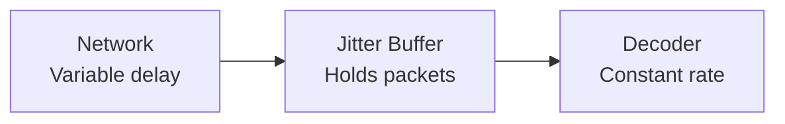
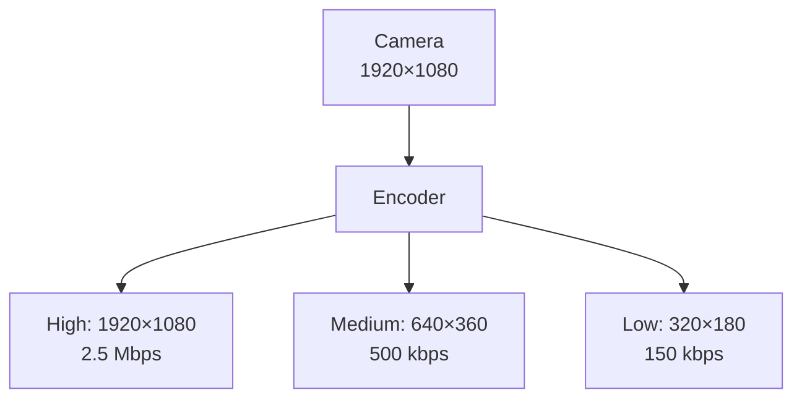
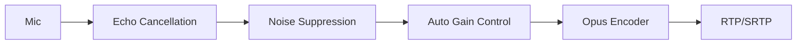
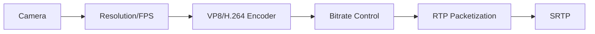
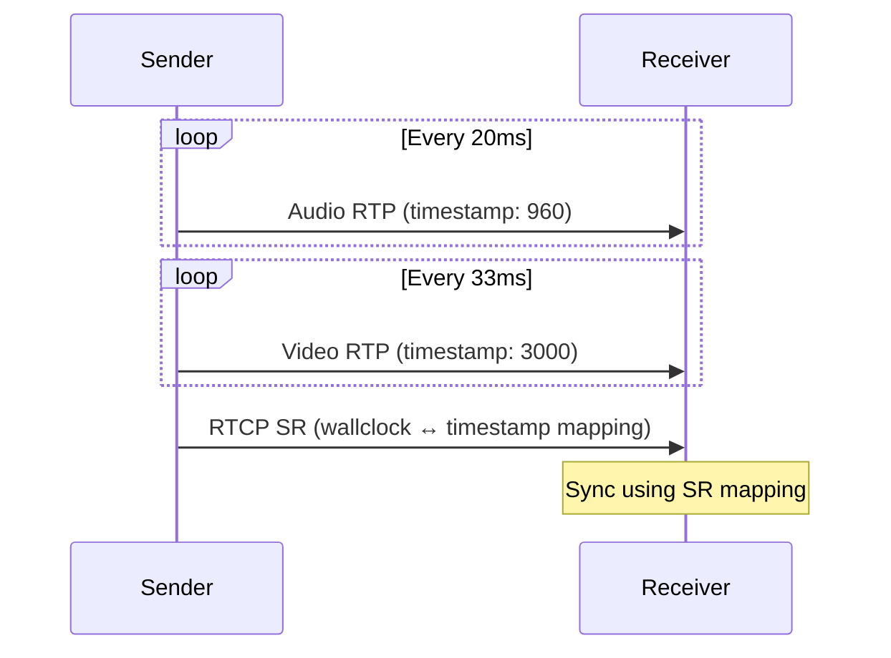

# 05 - Media Flow: From Microphone to Speaker

## The Media Pipeline: End-to-End

```mermaid
graph LR
    A[Microphone] --> B[Capture API]
    B --> C[Track]
    C --> D[Encoder<br/>Opus/H264]
    D --> E[RTP Packets]
    E --> F[SRTP<br/>Encryption]
    F --> G[UDP Socket]
    G --> H[Network]
    H --> I[Remote UDP]
    I --> J[SRTP Decrypt]
    J --> K[Jitter Buffer]
    K --> L[Decoder]
    L --> M[Track]
    M --> N[Audio Element]
    N --> O[Speaker]
```



This is what happens **every 20ms** for audio, **every 33ms** for video (at 30fps).

---

## Media Capture: getUserMedia

### Basic Capture

```javascript
const stream = await navigator.mediaDevices.getUserMedia({
  video: true,
  audio: true
});

// Stream contains tracks
stream.getTracks().forEach(track => {
  console.log(track.kind, track.label, track.enabled);
});
```

### Advanced Constraints

```javascript
const stream = await navigator.mediaDevices.getUserMedia({
  video: {
    width: { ideal: 1280 },
    height: { ideal: 720 },
    frameRate: { ideal: 30, max: 60 },
    facingMode: 'user' // or 'environment' for back camera
  },
  audio: {
    echoCancellation: true,
    noiseSuppression: true,
    autoGainControl: true,
    sampleRate: { ideal: 48000 }
  }
});
```

**What these do**:
- **echoCancellation**: Removes feedback (your voice from speaker → mic)
- **noiseSuppression**: AI-based background noise removal
- **autoGainControl**: Normalizes volume

**Always enable these for calls.**

### Enumerating Devices

```javascript
const devices = await navigator.mediaDevices.enumerateDevices();

const audioInputs = devices.filter(d => d.kind === 'audioinput');
const videoInputs = devices.filter(d => d.kind === 'videoinput');

// Let user choose
const deviceId = audioInputs[0].deviceId;
const stream = await navigator.mediaDevices.getUserMedia({
  audio: { deviceId: { exact: deviceId } }
});
```

### Screen Capture

```javascript
const screenStream = await navigator.mediaDevices.getDisplayMedia({
  video: {
    cursor: 'always', // or 'motion', 'never'
    displaySurface: 'monitor' // or 'window', 'browser'
  },
  audio: true // Capture system audio (Chrome 105+)
});
```

**User sees**: Browser's screen picker dialog (can't be bypassed for security).

---

## Media Tracks: The Core Unit

```javascript
const stream = await navigator.mediaDevices.getUserMedia({ video: true });
const videoTrack = stream.getVideoTracks()[0];

// Track properties
console.log(videoTrack.kind); // "video"
console.log(videoTrack.label); // "FaceTime HD Camera"
console.log(videoTrack.enabled); // true/false (mute without stopping)
console.log(videoTrack.readyState); // "live" or "ended"

// Mute (stops sending, keeps track alive)
videoTrack.enabled = false;

// Stop (releases camera, ends track)
videoTrack.stop();
```

### Track Events

```javascript
videoTrack.onended = () => {
  console.log('Track ended (user removed camera, browser closed, etc.)');
  // Update UI, notify remote peer
};

videoTrack.onmute = () => {
  console.log('Track muted (temporary issue)');
};

videoTrack.onunmute = () => {
  console.log('Track unmuted');
};
```

---

## Adding Tracks to PeerConnection

```javascript
const pc = new RTCPeerConnection(config);
const stream = await navigator.mediaDevices.getUserMedia({ 
  video: true, 
  audio: true 
});

// Add each track individually
stream.getTracks().forEach(track => {
  const sender = pc.addTrack(track, stream);
  console.log('Added track:', sender.track.kind);
});
```

**What addTrack returns**: `RTCRtpSender` object (controls encoding parameters).

---

## RTCRtpSender: The Outgoing Pipeline

```javascript
const sender = pc.getSenders().find(s => s.track?.kind === 'video');

// Get encoding parameters
const params = sender.getParameters();
console.log(params.encodings);

// Modify bitrate
params.encodings[0].maxBitrate = 500000; // 500 kbps
await sender.setParameters(params);
```

### Controlling Video Quality

```javascript
// Lower quality to save bandwidth
async function setVideoQuality(quality) {
  const sender = pc.getSenders().find(s => s.track?.kind === 'video');
  const params = sender.getParameters();
  
  switch(quality) {
    case 'low':
      params.encodings[0].maxBitrate = 200000; // 200 kbps
      params.encodings[0].scaleResolutionDownBy = 2; // Half resolution
      break;
    case 'medium':
      params.encodings[0].maxBitrate = 500000;
      params.encodings[0].scaleResolutionDownBy = 1;
      break;
    case 'high':
      params.encodings[0].maxBitrate = 2500000; // 2.5 Mbps
      params.encodings[0].scaleResolutionDownBy = 1;
      break;
  }
  
  await sender.setParameters(params);
}
```

**Use case**: Adaptive quality based on network conditions.

---

## RTCRtpReceiver: The Incoming Pipeline

```javascript
pc.ontrack = (event) => {
  const receiver = event.receiver;
  const track = event.track;
  
  console.log('Received:', track.kind);
  console.log('Track ID:', track.id);
  
  // Get receive stats
  receiver.getStats().then(stats => {
    stats.forEach(report => {
      if (report.type === 'inbound-rtp') {
        console.log('Packets received:', report.packetsReceived);
        console.log('Packets lost:', report.packetsLost);
        console.log('Jitter:', report.jitter);
      }
    });
  });
};
```

---

## Codecs: What You Need to Know

### Audio Codecs

| Codec | Bitrate | Latency | Quality | Notes |
|-------|---------|---------|---------|-------|
| **Opus** | 6-510 kbps | 20-40ms | Excellent | Default, best choice |
| **G.722** | 64 kbps | 20ms | Good | Legacy |
| **PCMU/PCMA** | 64 kbps | 20ms | Okay | Very old |

**Always use Opus.** It's the best codec for WebRTC.

### Video Codecs

| Codec | Bitrate | Quality | CPU | Browser Support |
|-------|---------|---------|-----|-----------------|
| **VP8** | 500-2500 kbps | Good | Low | All browsers |
| **VP9** | 300-1500 kbps | Better | High | Chrome, Firefox, Edge |
| **H.264** | 500-2500 kbps | Good | Low (HW accel) | All browsers |
| **AV1** | 200-1000 kbps | Best | Very high | Limited (2026) |

**Recommendations**:
- **Mobile**: H.264 (hardware acceleration)
- **Desktop**: VP8 or VP9
- **Screen share**: VP9 (better for static content)

### Codec Negotiation

```javascript
const offer = await pc.createOffer();

// SDP contains codec list (preference order)
// Example SDP line:
// m=video 9 UDP/TLS/RTP/SAVPF 96 97 98
// a=rtpmap:96 VP8/90000
// a=rtpmap:97 VP9/90000
// a=rtpmap:98 H264/90000
```

**Negotiation**: Both peers share codecs, pick the first match.

If Alice supports [VP8, VP9] and Bob supports [H.264, VP8], they use **VP8**.

### Forcing a Codec

```javascript
async function setPreferredCodec(pc, kind, mimeType) {
  const transceivers = pc.getTransceivers();
  const transceiver = transceivers.find(t => t.sender.track?.kind === kind);
  
  if (transceiver) {
    const codecs = RTCRtpReceiver.getCapabilities(kind).codecs;
    const preferredCodec = codecs.find(c => c.mimeType === mimeType);
    
    if (preferredCodec) {
      transceiver.setCodecPreferences([preferredCodec, ...codecs]);
    }
  }
}

// Force VP9 for video
await setPreferredCodec(pc, 'video', 'video/VP9');
```

---

## RTP: Real-time Transport Protocol

RTP is the protocol that carries media packets.

### RTP Packet Structure

```
|V|P|X|CC| M| PT |    Sequence Number   |
|          Timestamp                     |
|          SSRC (Synchronization Source)|
|          Payload (audio/video data)   |
```

**Key fields**:
- **Sequence Number**: Detect packet loss, reorder packets
- **Timestamp**: Synchronize audio/video
- **SSRC**: Identifies the stream
- **Payload**: Encoded media data

**You never touch this directly.** Browser handles it.

### SRTP: Secure RTP

All WebRTC media is encrypted via SRTP:
- **Encryption**: AES-128
- **Authentication**: HMAC-SHA1
- **Key exchange**: DTLS handshake

**Zero configuration needed.** It's always on.

---

## Jitter Buffer: The Smoothing Layer

Network packets don't arrive at constant intervals:

```
Sent:     [0ms]  [20ms]  [40ms]  [60ms]
Received: [0ms]  [25ms]  [38ms]  [70ms]
           ↑ jitter
```

**Jitter buffer** holds packets and plays them at constant rate:



**Trade-off**:
- **Small buffer** (20ms): Low latency, more packet loss impact
- **Large buffer** (200ms): Smooth playback, higher latency

Browser adapts automatically based on network conditions.

---

## Bandwidth Management

WebRTC adapts to network conditions using:

### 1. Congestion Control (GCC - Google Congestion Control)

Monitors:
- Packet loss
- Delay variation (jitter)
- Send/receive rate

Adjusts bitrate automatically:
```
Good network → Increase bitrate → Better quality
Bad network → Decrease bitrate → Avoid packet loss
```

**You don't control this directly.** Browser handles it.

### 2. Forward Error Correction (FEC)

Send redundant data to recover from packet loss:

```
Original: [A][B][C]
With FEC: [A][B][C][A⊕B][B⊕C]
```

If [B] is lost, reconstruct from [A⊕B].

**Cost**: ~10-20% extra bandwidth.

### 3. Retransmissions (RTX)

For important video frames (I-frames), retransmit if lost:

```
Packet lost → Receiver sends NACK → Sender retransmits
```

**Cost**: Adds ~20ms latency.

---

## Simulcast: The Quality Pyramid

Send multiple resolutions simultaneously:



**Receiver chooses** which layer to receive based on:
- Network bandwidth
- Screen size
- CPU capacity

### Enabling Simulcast

```javascript
const pc = new RTCPeerConnection(config);

// Add track with simulcast
const sender = pc.addTrack(videoTrack, stream);
const params = sender.getParameters();

params.encodings = [
  { rid: 'h', maxBitrate: 2500000 }, // High
  { rid: 'm', maxBitrate: 500000, scaleResolutionDownBy: 2 }, // Medium
  { rid: 'l', maxBitrate: 150000, scaleResolutionDownBy: 4 }  // Low
];

await sender.setParameters(params);
```

**Use case**: SFU-based group calls (covered in [09-sfu-deep-dive.md](09-sfu-deep-dive.md)).

---

## Audio Processing Pipeline



### Echo Cancellation

**Problem**: Speaker output → Microphone → Remote hears echo

**Solution**: Browser subtracts speaker signal from mic input.

```javascript
const stream = await navigator.mediaDevices.getUserMedia({
  audio: {
    echoCancellation: true, // Always enable for calls
    autoGainControl: true,
    noiseSuppression: true
  }
});
```

**When it fails**:
- Headphones not used → acoustic echo (hard to cancel)
- High volume → non-linear echo (clips, distorts)

**Fix**: Encourage headphones.

### Noise Suppression

Uses ML to distinguish voice from:
- Keyboard typing
- Background chatter
- Traffic noise

**Quality**: Good (Chrome/Edge use Krisp-like tech).

### Auto Gain Control (AGC)

Normalizes volume:
```
Quiet speaker → Boost gain
Loud speaker → Reduce gain
```

**Prevents** users from being too quiet or too loud.

---

## Video Processing Pipeline



### Key Frame (I-frame) vs Delta Frame (P-frame)

**Key frame**: Full image (can decode independently)
**Delta frame**: Only changes since last frame

```
I → P → P → P → I → P → P → P
    └─ References I
         └─ References P
              └─ References P
```

**If I-frame is lost**: All subsequent P-frames are useless.

**Browser sends I-frame**:
- At start
- Every 1-3 seconds
- When requested by receiver (PLI - Picture Loss Indication)

### Requesting Key Frame

```javascript
// Receiver detects corruption, requests fresh frame
const receiver = pc.getReceivers().find(r => r.track.kind === 'video');
// Browser automatically sends PLI when needed
```

**Manual control** (rare):
```javascript
const sender = pc.getSenders().find(s => s.track?.kind === 'video');
const params = sender.getParameters();
params.encodings[0].requestKeyFrame = true;
await sender.setParameters(params);
```

---

## Synchronization: Audio/Video Sync

**Problem**: Audio and video packets arrive at different times.

**Solution**: RTP timestamps + RTCP Sender Reports.



**Browser handles this**. You don't need to do anything.

**When it fails**: Audio/video drift (usually browser bug, report it).

---

## Common Issues and Fixes

### Issue 1: One-way Audio/Video

**Symptom**: Alice sees Bob, but Bob doesn't see Alice.

**Causes**:
1. Alice didn't add tracks before creating offer
2. Firewall blocking one direction
3. NAT mapping expired

**Fix**:
```javascript
// Ensure tracks added before offer
stream.getTracks().forEach(t => pc.addTrack(t, stream));
const offer = await pc.createOffer();
```

### Issue 2: Audio Echo

**Symptom**: Remote hears their own voice delayed.

**Causes**:
1. Echo cancellation disabled
2. Speakers too loud (non-linear echo)
3. No headphones

**Fix**:
```javascript
// Enable echo cancellation
audio: { echoCancellation: true }

// Recommend headphones in UI
```

### Issue 3: Video Pixelation/Freezing

**Symptom**: Blocky video or frozen frames.

**Causes**:
1. Low bandwidth
2. Packet loss
3. CPU overload (codec can't keep up)

**Fix**:
```javascript
// Monitor stats
const stats = await pc.getStats();
stats.forEach(report => {
  if (report.type === 'inbound-rtp' && report.kind === 'video') {
    const packetLoss = report.packetsLost / report.packetsReceived;
    if (packetLoss > 0.05) {
      console.warn('High packet loss:', packetLoss);
      // Alert user, suggest switching network
    }
  }
});
```

### Issue 4: High Latency

**Symptom**: 1-2 second delay between audio and video.

**Causes**:
1. Large jitter buffer
2. Poor network (lots of retransmissions)
3. Relay through distant TURN server

**Fix**:
- Use geographically close TURN servers
- Check RTT in stats (should be < 200ms)

---

## Performance Optimization

### 1. Lower Resolution for Mobile

```javascript
const isMobile = /iPhone|iPad|Android/i.test(navigator.userAgent);

const constraints = {
  video: isMobile ? 
    { width: 640, height: 480, frameRate: 15 } :
    { width: 1280, height: 720, frameRate: 30 }
};
```

### 2. Screen Share Optimization

```javascript
// For screen share: higher resolution, lower FPS
const screenStream = await navigator.mediaDevices.getDisplayMedia({
  video: {
    width: { ideal: 1920 },
    height: { ideal: 1080 },
    frameRate: { max: 10 } // Screen doesn't change fast
  }
});
```

### 3. Audio-Only Mode

```javascript
// Disable video to save bandwidth
const videoTrack = stream.getVideoTracks()[0];
videoTrack.enabled = false;

// Or stop it entirely
videoTrack.stop();
```

---

## What You Must Understand

| Concept | Why It Matters |
|---------|----------------|
| **Tracks are the unit** | Not streams |
| **Codecs determined in negotiation** | Can't change mid-call without renegotiation |
| **RTP carries media** | Encrypted via SRTP |
| **Jitter buffer trades latency for smoothness** | Browser adapts |
| **Simulcast for scalability** | SFU uses this |

---

## Next Steps

You now understand how media flows through WebRTC—from mic to speaker, camera to screen.

**Next**: [06-data-channels-file-transfer.md](06-data-channels-file-transfer.md) - Non-media data transfer over WebRTC.

Media channels carry video/audio. Data channels carry everything else (files, game state, chat).

---

## Quick Self-Check

You understand this chapter if you can:
- [ ] Capture media with advanced constraints
- [ ] Control video bitrate dynamically
- [ ] Explain the difference between enabled and stop
- [ ] Describe key frames vs delta frames
- [ ] Enable simulcast for multi-quality streaming
- [ ] Debug one-way media issues
- [ ] Monitor packet loss and jitter via stats

If you can optimize media quality based on network conditions, you're ready to explore data channels.
