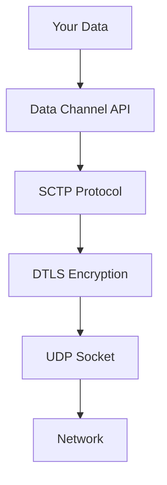
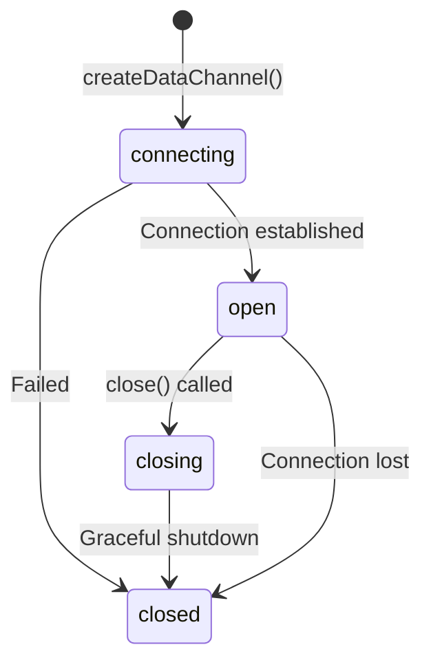

# 06 - Data Channels: Arbitrary Data Over UDP

## What Data Channels Are

Think of data channels as:
> **WebSocket over UDP, but peer-to-peer and encrypted**

```javascript
// WebSocket (Server-mediated, TCP)
const ws = new WebSocket('wss://server.com');
ws.send('hello');

// DataChannel (P2P, UDP, encrypted)
const dc = pc.createDataChannel('chat');
dc.send('hello');
```

**Key differences**:

| Feature | WebSocket | DataChannel |
|---------|-----------|-------------|
| **Transport** | TCP | UDP (via SCTP) |
| **Path** | Client ↔ Server | Peer ↔ Peer |
| **Latency** | 50-200ms | 10-50ms |
| **Reliability** | Always | Configurable |
| **Order** | Always | Configurable |
| **Encryption** | TLS (optional) | DTLS (always) |

---

## Why Data Channels Exist

For apps that need:
- **File transfer** (P2P, no server storage)
- **Game state** (low latency, can tolerate loss)
- **Screen annotations** (drawing, pointers)
- **Chat** (while on video call)
- **Telemetry** (mouse position, gaze tracking)

**Anti-pattern**: Sending video over data channel. Use media tracks instead.

---

## Creating a Data Channel

### Ordered + Reliable (WebSocket-like)

```javascript
const pc = new RTCPeerConnection(config);

// Alice creates channel
const dataChannel = pc.createDataChannel('chat', {
  ordered: true, // Deliver in order
  // maxRetransmits and maxPacketLifeTime omitted = reliable
});

dataChannel.onopen = () => {
  console.log('Data channel open');
  dataChannel.send('Hello from Alice!');
};

dataChannel.onmessage = (event) => {
  console.log('Received:', event.data);
};

dataChannel.onerror = (error) => {
  console.error('Data channel error:', error);
};

dataChannel.onclose = () => {
  console.log('Data channel closed');
};
```

### Unreliable + Unordered (UDP-like, for gaming)

```javascript
const gameChannel = pc.createDataChannel('game-state', {
  ordered: false, // Don't wait for lost packets
  maxRetransmits: 0 // No retransmissions
});

// Send at 60fps
setInterval(() => {
  const state = { x: player.x, y: player.y, angle: player.angle };
  gameChannel.send(JSON.stringify(state));
}, 16); // ~60fps
```

**Logic**: If packet 100 is lost, don't wait—packet 101 is already here and more recent.

### Partially Reliable (Max Retries)

```javascript
const semiReliableChannel = pc.createDataChannel('telemetry', {
  ordered: true,
  maxRetransmits: 3 // Retry up to 3 times, then give up
});
```

**Use case**: Important but not critical data (mouse positions, metadata).

### Time-bounded Reliability

```javascript
const timeChannel = pc.createDataChannel('cursor', {
  ordered: false,
  maxPacketLifeTime: 100 // Drop if not delivered in 100ms
});
```

**Use case**: Real-time data that becomes stale (cursor position at T+100ms is useless).

---

## Receiving Data Channels

### Bob's Side

```javascript
// Bob receives data channel from Alice
pc.ondatachannel = (event) => {
  const dataChannel = event.channel;
  console.log('Received channel:', dataChannel.label);
  
  dataChannel.onopen = () => {
    console.log('Channel ready');
    dataChannel.send('Hello from Bob!');
  };
  
  dataChannel.onmessage = (event) => {
    console.log('Received:', event.data);
  };
};
```

**Important**: Only the **creator** calls `createDataChannel()`. The receiver gets it via `ondatachannel`.

---

## SCTP: The Transport Layer

Data channels use **SCTP** (Stream Control Transmission Protocol) over DTLS over UDP.



**SCTP features**:
- **Multi-streaming**: Multiple channels in one connection
- **Ordered/Unordered** delivery
- **Reliable/Unreliable** delivery
- **Congestion control**: Like TCP

**You don't configure SCTP directly.** Data channel options map to SCTP parameters.

---

## Data Channel States



```javascript
dataChannel.onopen = () => {
  console.log('State:', dataChannel.readyState); // "open"
};

// States: "connecting", "open", "closing", "closed"
```

**Can only send when `readyState === 'open'`.**

---

## Sending Data: String vs Binary

### Sending Strings (JSON)

```javascript
const message = { type: 'chat', text: 'Hello!', timestamp: Date.now() };
dataChannel.send(JSON.stringify(message));
```

### Sending Binary (ArrayBuffer)

```javascript
const buffer = new ArrayBuffer(1024);
const view = new Uint8Array(buffer);
// Fill buffer...
dataChannel.send(buffer);
```

### Sending Binary (Blob)

```javascript
const blob = new Blob(['Hello'], { type: 'text/plain' });
dataChannel.send(blob);
```

**Receiving** is automatic:

```javascript
dataChannel.onmessage = (event) => {
  if (typeof event.data === 'string') {
    const message = JSON.parse(event.data);
    console.log('String:', message);
  } else {
    console.log('Binary:', event.data); // ArrayBuffer or Blob
  }
};
```

**Set binary type**:

```javascript
dataChannel.binaryType = 'arraybuffer'; // or 'blob' (default)
```

---

## Flow Control: The Buffering Problem

### The Problem

```javascript
// Bad: Blocks browser if sending too fast
for (let i = 0; i < 1000000; i++) {
  dataChannel.send('spam'); // Fills buffer
}
```

**What happens**: `bufferedAmount` grows, memory fills, browser slows down.

### The Solution: Check Buffer

```javascript
function sendWithFlowControl(dataChannel, data) {
  if (dataChannel.bufferedAmount > 16 * 1024 * 1024) { // 16MB threshold
    console.warn('Buffer full, waiting...');
    setTimeout(() => sendWithFlowControl(dataChannel, data), 100);
  } else {
    dataChannel.send(data);
  }
}
```

### Using bufferedamountlow Event

```javascript
dataChannel.bufferedAmountLowThreshold = 8 * 1024 * 1024; // 8MB

dataChannel.onbufferedamountlow = () => {
  console.log('Buffer drained, safe to send more');
  sendNextChunk();
};
```

---

## File Transfer: The Complete Solution

### Chunking Strategy

Files are too large to send in one message (max ~256KB depending on browser). Need chunking:

```javascript
const CHUNK_SIZE = 16 * 1024; // 16KB chunks

async function sendFile(dataChannel, file) {
  // Send metadata first
  const metadata = {
    type: 'file-start',
    name: file.name,
    size: file.size,
    mimeType: file.type
  };
  dataChannel.send(JSON.stringify(metadata));
  
  // Read and send chunks
  let offset = 0;
  const reader = new FileReader();
  
  reader.onload = (event) => {
    dataChannel.send(event.target.result); // ArrayBuffer
    
    offset += CHUNK_SIZE;
    
    if (offset < file.size) {
      // Send progress update
      const progress = {
        type: 'progress',
        transferred: offset,
        total: file.size
      };
      dataChannel.send(JSON.stringify(progress));
      
      readNextChunk();
    } else {
      // Send completion message
      dataChannel.send(JSON.stringify({ type: 'file-end' }));
    }
  };
  
  function readNextChunk() {
    const slice = file.slice(offset, offset + CHUNK_SIZE);
    reader.readAsArrayBuffer(slice);
  }
  
  readNextChunk();
}
```

### Receiving File

```javascript
let receivedChunks = [];
let fileMetadata = null;

dataChannel.binaryType = 'arraybuffer';

dataChannel.onmessage = (event) => {
  if (typeof event.data === 'string') {
    const message = JSON.parse(event.data);
    
    switch(message.type) {
      case 'file-start':
        fileMetadata = message;
        receivedChunks = [];
        console.log('Receiving file:', message.name);
        break;
        
      case 'progress':
        const percent = (message.transferred / message.total * 100).toFixed(1);
        console.log('Progress:', percent + '%');
        break;
        
      case 'file-end':
        const blob = new Blob(receivedChunks, { 
          type: fileMetadata.mimeType 
        });
        
        // Download file
        const url = URL.createObjectURL(blob);
        const a = document.createElement('a');
        a.href = url;
        a.download = fileMetadata.name;
        a.click();
        URL.revokeObjectURL(url);
        
        console.log('File received!');
        break;
    }
  } else {
    // Binary data = chunk
    receivedChunks.push(event.data);
  }
};
```

### Flow Control for File Transfer

```javascript
async function sendFileWithFlowControl(dataChannel, file) {
  const CHUNK_SIZE = 16 * 1024;
  let offset = 0;
  
  function sendChunk() {
    return new Promise((resolve) => {
      const slice = file.slice(offset, offset + CHUNK_SIZE);
      const reader = new FileReader();
      
      reader.onload = (event) => {
        dataChannel.send(event.target.result);
        offset += CHUNK_SIZE;
        resolve();
      };
      
      reader.readAsArrayBuffer(slice);
    });
  }
  
  async function sendLoop() {
    while (offset < file.size) {
      // Wait if buffer too full
      while (dataChannel.bufferedAmount > 16 * 1024 * 1024) {
        await new Promise(resolve => setTimeout(resolve, 100));
      }
      
      await sendChunk();
    }
  }
  
  await sendLoop();
  dataChannel.send(JSON.stringify({ type: 'file-end' }));
}
```

---

## Message Size Limits

| Browser | Max Message Size |
|---------|-----------------|
| Chrome | 256 KB |
| Firefox | 256 KB |
| Safari | 256 KB |

**If you send larger**: Browser throws error or silently drops.

**Solution**: Always chunk large data.

---

## Multiple Data Channels

You can create multiple channels for different purposes:

```javascript
const chatChannel = pc.createDataChannel('chat', { 
  ordered: true 
});

const gameChannel = pc.createDataChannel('game-state', { 
  ordered: false, 
  maxRetransmits: 0 
});

const fileChannel = pc.createDataChannel('file-transfer', { 
  ordered: true,
  maxPacketLifeTime: 10000 // 10s timeout
});
```

**They share the same SCTP connection** (efficient).

---

## Data Channel vs Signaling Channel

Common confusion: When to use which?

| Use Case | Channel | Why |
|----------|---------|-----|
| Session setup | Signaling | Before peer connection exists |
| Exchange SDP/ICE | Signaling | Needed to establish data channel |
| Chat during call | Data Channel | Low latency, P2P |
| File transfer | Data Channel | No server bandwidth cost |
| Renegotiation | Signaling | Reliable, always available |
| Game state | Data Channel | Low latency, can tolerate loss |

**Rule of thumb**: If it's time-sensitive and peers are connected, use data channel.

---

## Security Considerations

### 1. Data Channels Are Always Encrypted

Like media, data channels use DTLS:
- **Encryption**: AES-128
- **Authentication**: SHA-256

**You can't disable this.** It's end-to-end encrypted.

### 2. Validate Received Data

```javascript
dataChannel.onmessage = (event) => {
  // Bad: Trust data blindly
  const obj = JSON.parse(event.data);
  document.body.innerHTML = obj.html; // XSS vulnerability
  
  // Good: Validate
  try {
    const obj = JSON.parse(event.data);
    if (obj.type === 'chat' && typeof obj.text === 'string') {
      displaySafeMessage(obj.text);
    }
  } catch (e) {
    console.error('Invalid message');
  }
};
```

### 3. Rate Limiting

```javascript
const rateLimiter = {
  timestamps: [],
  limit: 100, // Max 100 messages per second
  check() {
    const now = Date.now();
    this.timestamps = this.timestamps.filter(t => now - t < 1000);
    
    if (this.timestamps.length >= this.limit) {
      return false; // Rate limit exceeded
    }
    
    this.timestamps.push(now);
    return true;
  }
};

dataChannel.onmessage = (event) => {
  if (!rateLimiter.check()) {
    console.warn('Rate limit exceeded');
    return;
  }
  
  handleMessage(event.data);
};
```

---

## Performance: Data Channel vs WebSocket

### Latency Comparison

```
WebSocket:
  Client → Server: 50ms
  Server → Client: 50ms
  Total: 100ms

DataChannel (P2P):
  Client → Client: 20ms
  Total: 20ms
  
DataChannel (via TURN):
  Client → TURN → Client: 60ms
  Total: 60ms
```

**Data channel wins when direct P2P works.**

### Throughput Comparison

Both can handle:
- **WebSocket (TCP)**: ~5 Gbps (limited by TCP head-of-line blocking)
- **DataChannel (SCTP/UDP)**: ~10 Gbps (less blocking)

For file transfer, data channel is often faster.

---

## Common Patterns

### Pattern 1: Request/Response

```javascript
const pendingRequests = new Map();

function sendRequest(dataChannel, request) {
  const id = crypto.randomUUID();
  
  return new Promise((resolve, reject) => {
    pendingRequests.set(id, { resolve, reject });
    
    dataChannel.send(JSON.stringify({ id, ...request }));
    
    setTimeout(() => {
      if (pendingRequests.has(id)) {
        pendingRequests.delete(id);
        reject(new Error('Request timeout'));
      }
    }, 5000);
  });
}

dataChannel.onmessage = (event) => {
  const message = JSON.parse(event.data);
  
  if (message.responseId && pendingRequests.has(message.responseId)) {
    const { resolve } = pendingRequests.get(message.responseId);
    pendingRequests.delete(message.responseId);
    resolve(message.data);
  }
};
```

### Pattern 2: Multiplexing (Sub-channels)

```javascript
// One physical channel, multiple logical channels
const channel = pc.createDataChannel('multiplex');

function send(subchannel, data) {
  channel.send(JSON.stringify({ subchannel, data }));
}

channel.onmessage = (event) => {
  const { subchannel, data } = JSON.parse(event.data);
  
  switch(subchannel) {
    case 'chat':
      handleChat(data);
      break;
    case 'file':
      handleFile(data);
      break;
    case 'telemetry':
      handleTelemetry(data);
      break;
  }
};
```

### Pattern 3: Streaming Data

```javascript
// Stream large dataset incrementally
async function streamData(dataChannel, dataArray) {
  for (const item of dataArray) {
    while (dataChannel.bufferedAmount > 1024 * 1024) {
      await new Promise(resolve => setTimeout(resolve, 10));
    }
    
    dataChannel.send(JSON.stringify(item));
  }
}
```

---

## Debugging Data Channels

### Chrome DevTools

1. Open `chrome://webrtc-internals`
2. Find your peer connection
3. Look for SCTP section:
   - Messages sent/received
   - Buffer size
   - Channel state

### Logging

```javascript
dataChannel.onerror = (error) => {
  console.error('Data channel error:', {
    readyState: dataChannel.readyState,
    bufferedAmount: dataChannel.bufferedAmount,
    error
  });
};

dataChannel.onclose = () => {
  console.log('Data channel closed:', {
    reason: 'unknown', // Not exposed by API
    messagesReceived: messageCount
  });
};
```

---

## What You Must Understand

| Concept | Why It Matters |
|---------|----------------|
| **Data channels = WebSocket over UDP** | Low latency, P2P |
| **Ordered/Unordered, Reliable/Unreliable** | Different modes for different use cases |
| **Flow control essential** | Avoid overwhelming buffer |
| **Chunk large files** | Max message size ~256KB |
| **SCTP over DTLS** | Encrypted, congestion-controlled |

---

## Next Steps

You now understand data channels—the mechanism for non-media P2P communication.

**Next**: [07-building-1-1-call.md](07-building-1-1-call.md) - Putting it all together into a production 1-on-1 call app.

You've learned the pieces (signaling, ICE, peer connection, media, data). Now we assemble them into a real system.

---

## Quick Self-Check

You understand this chapter if you can:
- [ ] Create ordered/reliable vs unordered/unreliable data channels
- [ ] Implement file transfer with chunking and flow control
- [ ] Handle binary and string messages correctly
- [ ] Explain SCTP's role in data channels
- [ ] Decide when to use data channel vs signaling
- [ ] Monitor buffer size to avoid blocking
- [ ] Secure data channel messages against XSS/injection

If you can build a P2P file-sharing app, you're ready to build complete calling systems.
