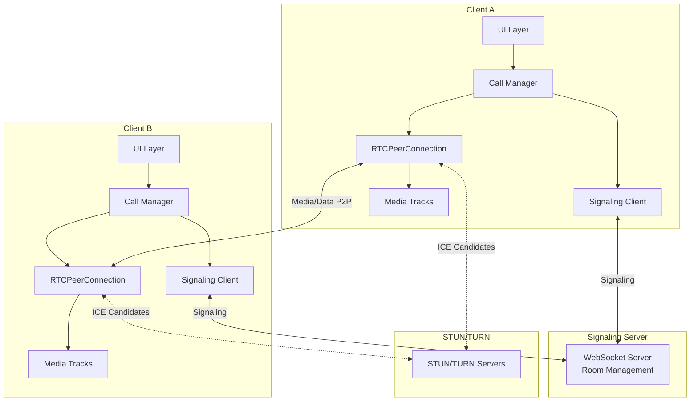

# 07 - Building a 1-on-1 Call: Production-Ready Implementation

## The Complete Architecture



---

## Project Structure

```
/client
  /src
    /call
      CallManager.js          # Orchestrates everything
      SignalingClient.js      # WebSocket wrapper
      ConnectionStats.js      # Health monitoring
    /media
      MediaDevices.js         # Camera/mic management
      StreamProcessor.js      # Track handling
    /ui
      CallUI.js               # UI components
    index.js                  # Entry point
    
/server
  signaling-server.js        # WebSocket server
  turn-server-config.js      # TURN credentials
  
/config
  webrtc-config.js           # ICE servers
```

---

## Step 1: Configuration

### webrtc-config.js

```javascript
export const WEBRTC_CONFIG = {
  iceServers: [
    { urls: 'stun:stun.l.google.com:19302' },
    { urls: 'stun:stun1.l.google.com:19302' },
    {
      urls: [
        'turn:turn.example.com:3478?transport=udp',
        'turn:turn.example.com:3478?transport=tcp',
        'turns:turn.example.com:5349?transport=tcp'
      ],
      username: '', // Generated dynamically per-session
      credential: ''
    }
  ],
  iceTransportPolicy: 'all',
  bundlePolicy: 'max-bundle',
  rtcpMuxPolicy: 'require',
  iceCandidatePoolSize: 10
};

export const MEDIA_CONSTRAINTS = {
  video: {
    width: { ideal: 1280, max: 1920 },
    height: { ideal: 720, max: 1080 },
    frameRate: { ideal: 30, max: 60 }
  },
  audio: {
    echoCancellation: true,
    noiseSuppression: true,
    autoGainControl: true
  }
};
```

---

## Step 2: Signaling Client

### SignalingClient.js

```javascript
export class SignalingClient {
  constructor(serverUrl) {
    this.serverUrl = serverUrl;
    this.ws = null;
    this.handlers = new Map();
    this.reconnectAttempts = 0;
    this.maxReconnectAttempts = 5;
  }
  
  connect() {
    return new Promise((resolve, reject) => {
      this.ws = new WebSocket(this.serverUrl);
      
      this.ws.onopen = () => {
        console.log('[Signaling] Connected');
        this.reconnectAttempts = 0;
        resolve();
      };
      
      this.ws.onmessage = (event) => {
        const message = JSON.parse(event.data);
        const handler = this.handlers.get(message.type);
        if (handler) handler(message.payload);
      };
      
      this.ws.onerror = (error) => {
        console.error('[Signaling] Error:', error);
        reject(error);
      };
      
      this.ws.onclose = () => {
        console.log('[Signaling] Disconnected');
        this.reconnect();
      };
    });
  }
  
  reconnect() {
    if (this.reconnectAttempts >= this.maxReconnectAttempts) {
      console.error('[Signaling] Max reconnection attempts reached');
      this.emit('connection-failed');
      return;
    }
    
    const delay = Math.min(1000 * Math.pow(2, this.reconnectAttempts), 30000);
    console.log(`[Signaling] Reconnecting in ${delay}ms...`);
    
    setTimeout(() => {
      this.reconnectAttempts++;
      this.connect().catch(() => {});
    }, delay);
  }
  
  on(type, handler) {
    this.handlers.set(type, handler);
  }
  
  emit(type, payload = {}) {
    const handler = this.handlers.get(type);
    if (handler) handler(payload);
  }
  
  send(type, payload) {
    if (this.ws?.readyState === WebSocket.OPEN) {
      this.ws.send(JSON.stringify({ type, payload }));
    } else {
      console.error('[Signaling] Cannot send, not connected');
    }
  }
  
  join(roomId, userId) {
    this.send('join', { roomId, userId });
  }
  
  leave() {
    this.send('leave');
  }
  
  sendOffer(peerId, sdp) {
    this.send('offer', { to: peerId, sdp });
  }
  
  sendAnswer(peerId, sdp) {
    this.send('answer', { to: peerId, sdp });
  }
  
  sendIceCandidate(peerId, candidate) {
    this.send('ice-candidate', { to: peerId, candidate });
  }
  
  disconnect() {
    if (this.ws) {
      this.ws.onclose = null; // Prevent reconnection
      this.ws.close();
      this.ws = null;
    }
  }
}
```

---

## Step 3: Media Device Manager

### MediaDevices.js

```javascript
export class MediaDeviceManager {
  constructor() {
    this.localStream = null;
    this.devices = { audio: [], video: [] };
  }
  
  async initialize() {
    await this.enumerateDevices();
    
    // Listen for device changes
    navigator.mediaDevices.ondevicechange = () => {
      this.enumerateDevices();
    };
  }
  
  async enumerateDevices() {
    const devices = await navigator.mediaDevices.enumerateDevices();
    this.devices.audio = devices.filter(d => d.kind === 'audioinput');
    this.devices.video = devices.filter(d => d.kind === 'videoinput');
    return this.devices;
  }
  
  async startLocalStream(constraints = MEDIA_CONSTRAINTS) {
    try {
      this.localStream = await navigator.mediaDevices.getUserMedia(constraints);
      return this.localStream;
    } catch (error) {
      console.error('[Media] Failed to get user media:', error);
      throw this.handleMediaError(error);
    }
  }
  
  async switchCamera(deviceId) {
    if (!this.localStream) return;
    
    const videoTrack = this.localStream.getVideoTracks()[0];
    videoTrack.stop();
    
    try {
      const stream = await navigator.mediaDevices.getUserMedia({
        video: { deviceId: { exact: deviceId } }
      });
      
      const newTrack = stream.getVideoTracks()[0];
      this.localStream.removeTrack(videoTrack);
      this.localStream.addTrack(newTrack);
      
      return newTrack;
    } catch (error) {
      console.error('[Media] Failed to switch camera:', error);
      throw error;
    }
  }
  
  async startScreenShare() {
    try {
      const stream = await navigator.mediaDevices.getDisplayMedia({
        video: {
          cursor: 'always',
          displaySurface: 'monitor'
        },
        audio: true
      });
      
      // Handle user clicking "Stop sharing"
      stream.getVideoTracks()[0].onended = () => {
        this.stopScreenShare();
      };
      
      return stream;
    } catch (error) {
      console.error('[Media] Failed to start screen share:', error);
      throw error;
    }
  }
  
  stopScreenShare() {
    // Implementation depends on your architecture
    // Usually triggers track replacement back to camera
  }
  
  toggleAudio(enabled) {
    if (this.localStream) {
      this.localStream.getAudioTracks().forEach(track => {
        track.enabled = enabled;
      });
    }
  }
  
  toggleVideo(enabled) {
    if (this.localStream) {
      this.localStream.getVideoTracks().forEach(track => {
        track.enabled = enabled;
      });
    }
  }
  
  stopLocalStream() {
    if (this.localStream) {
      this.localStream.getTracks().forEach(track => track.stop());
      this.localStream = null;
    }
  }
  
  handleMediaError(error) {
    const errorMessages = {
      NotFoundError: 'Camera or microphone not found',
      NotAllowedError: 'Permission denied to access camera/microphone',
      NotReadableError: 'Camera/microphone already in use',
      OverconstrainedError: 'Constraints cannot be satisfied',
      TypeError: 'Invalid constraints'
    };
    
    return new Error(errorMessages[error.name] || error.message);
  }
}
```

---

## Step 4: Call Manager (The Core)

### CallManager.js

```javascript
export class CallManager {
  constructor(signaling, mediaManager, config) {
    this.signaling = signaling;
    this.mediaManager = mediaManager;
    this.config = config;
    
    this.pc = null;
    this.remoteStream = new MediaStream();
    this.state = 'idle'; // idle, calling, ringing, connected, disconnected
    this.remotePeerId = null;
    
    this.setupSignalingHandlers();
  }
  
  setupSignalingHandlers() {
    this.signaling.on('peer-joined', (payload) => {
      this.remotePeerId = payload.peerId;
      this.emit('peer-joined', payload);
    });
    
    this.signaling.on('offer', async (payload) => {
      await this.handleOffer(payload);
    });
    
    this.signaling.on('answer', async (payload) => {
      await this.handleAnswer(payload);
    });
    
    this.signaling.on('ice-candidate', async (payload) => {
      await this.handleIceCandidate(payload);
    });
    
    this.signaling.on('peer-left', () => {
      this.handlePeerLeft();
    });
    
    this.signaling.on('hangup', () => {
      this.hangup();
    });
  }
  
  async startCall(roomId, userId) {
    try {
      this.state = 'calling';
      
      // Get local media
      await this.mediaManager.startLocalStream();
      
      // Join room
      await this.signaling.join(roomId, userId);
      
      // Create peer connection
      this.createPeerConnection();
      
      // Add local tracks
      this.mediaManager.localStream.getTracks().forEach(track => {
        this.pc.addTrack(track, this.mediaManager.localStream);
      });
      
      this.emit('call-started');
    } catch (error) {
      this.state = 'idle';
      this.emit('call-failed', { error });
      throw error;
    }
  }
  
  async answerCall() {
    try {
      this.state = 'connected';
      
      // Get local media
      await this.mediaManager.startLocalStream();
      
      // Add tracks to existing peer connection
      this.mediaManager.localStream.getTracks().forEach(track => {
        this.pc.addTrack(track, this.mediaManager.localStream);
      });
      
      this.emit('call-answered');
    } catch (error) {
      this.emit('call-failed', { error });
      throw error;
    }
  }
  
  createPeerConnection() {
    this.pc = new RTCPeerConnection(this.config);
    
    // ICE candidate handler
    this.pc.onicecandidate = (event) => {
      if (event.candidate) {
        this.signaling.sendIceCandidate(this.remotePeerId, event.candidate);
      }
    };
    
    // ICE connection state
    this.pc.oniceconnectionstatechange = () => {
      console.log('[PC] ICE connection state:', this.pc.iceConnectionState);
      
      switch (this.pc.iceConnectionState) {
        case 'connected':
        case 'completed':
          this.state = 'connected';
          this.emit('connected');
          break;
          
        case 'disconnected':
          this.emit('disconnected');
          this.attemptReconnection();
          break;
          
        case 'failed':
          this.emit('connection-failed');
          this.hangup();
          break;
      }
    };
    
    // Connection state
    this.pc.onconnectionstatechange = () => {
      console.log('[PC] Connection state:', this.pc.connectionState);
      this.emit('connection-state-changed', { 
        state: this.pc.connectionState 
      });
    };
    
    // Track handler (receive remote media)
    this.pc.ontrack = (event) => {
      console.log('[PC] Received track:', event.track.kind);
      event.streams[0].getTracks().forEach(track => {
        this.remoteStream.addTrack(track);
      });
      this.emit('remote-stream', { stream: this.remoteStream });
    };
    
    // Data channel (optional)
    this.pc. ondatachannel = (event) => {
      this.handleDataChannel(event.channel);
    };
  }
  
  async handleOffer(payload) {
    this.state = 'ringing';
    this.remotePeerId = payload.from;
    
    // Create peer connection if not exists
    if (!this.pc) {
      this.createPeerConnection();
    }
    
    try {
      await this.pc.setRemoteDescription(new RTCSessionDescription(payload.sdp));
      this.emit('incoming-call', { peerId: payload.from });
    } catch (error) {
      console.error('[PC] Failed to handle offer:', error);
      this.emit('call-failed', { error });
    }
  }
  
  async handleAnswer(payload) {
    try {
      await this.pc.setRemoteDescription(new RTCSessionDescription(payload.sdp));
    } catch (error) {
      console.error('[PC] Failed to handle answer:', error);
    }
  }
  
  async handleIceCandidate(payload) {
    try {
      if (payload.candidate) {
        await this.pc.addIceCandidate(new RTCIceCandidate(payload.candidate));
      }
    } catch (error) {
      console.error('[PC] Failed to add ICE candidate:', error);
    }
  }
  
  async initiateCall() {
    try {
      const offer = await this.pc.createOffer();
      await this.pc.setLocalDescription(offer);
      this.signaling.sendOffer(this.remotePeerId, offer);
    } catch (error) {
      console.error('[PC] Failed to create offer:', error);
      throw error;
    }
  }
  
  async acceptCall() {
    try {
      const answer = await this.pc.createAnswer();
      await this.pc.setLocalDescription(answer);
      this.signaling.sendAnswer(this.remotePeerId, answer);
      this.state = 'connected';
    } catch (error) {
      console.error('[PC] Failed to create answer:', error);
      throw error;
    }
  }
  
  async attemptReconnection() {
    console.log('[PC] Attempting ICE restart...');
    
    setTimeout(async () => {
      if (this.pc.iceConnectionState === 'disconnected') {
        try {
          const offer = await this.pc.createOffer({ iceRestart: true });
          await this.pc.setLocalDescription(offer);
          this.signaling.sendOffer(this.remotePeerId, offer);
        } catch (error) {
          console.error('[PC] ICE restart failed:', error);
        }
      }
    }, 5000);
  }
  
  async replaceTrack(newTrack, kind) {
    const sender = this.pc.getSenders().find(s => s.track?.kind === kind);
    if (sender) {
      await sender.replaceTrack(newTrack);
    }
  }
  
  hangup() {
    console.log('[Call] Hanging up');
    
    this.signaling.send('hangup', { to: this.remotePeerId });
    this.cleanup();
    this.emit('call-ended');
  }
  
  handlePeerLeft() {
    console.log('[Call] Peer left');
    this.cleanup();
    this.emit('peer-left');
  }
  
  cleanup() {
    if (this.pc) {
      this.pc.close();
      this.pc = null;
    }
    
    this.mediaManager.stopLocalStream();
    this.remoteStream = new MediaStream();
    this.state = 'idle';
    this.remotePeerId = null;
  }
  
  // Event emitter pattern (simplified)
  emit(event, data) {
    if (this.handlers?.[event]) {
      this.handlers[event](data);
    }
  }
  
  on(event, handler) {
    this.handlers = this.handlers || {};
    this.handlers[event] = handler;
  }
}
```

---

## Step 5: Server Implementation

### signaling-server.js

```javascript
const WebSocket = require('ws');
const http = require('http');

const server = http.createServer();
const wss = new WebSocket.Server({ server });

const rooms = new Map(); // roomId -> Set<{ws, userId, peerId}>

wss.on('connection', (ws) => {
  let currentRoom = null;
  let userId = null;
  let peerId = generatePeerId();
  
  ws.on('message', (data) => {
    try {
      const message = JSON.parse(data);
      handleMessage(ws, message);
    } catch (error) {
      console.error('Invalid message:', error);
    }
  });
  
  ws.on('close', () => {
    if (currentRoom) {
      leaveRoom(currentRoom, ws);
    }
  });
  
  function handleMessage(ws, message) {
    switch (message.type) {
      case 'join':
        currentRoom = message.payload.roomId;
        userId = message.payload.userId;
        joinRoom(currentRoom, ws, userId, peerId);
        break;
        
      case 'leave':
        if (currentRoom) {
          leaveRoom(currentRoom, ws);
        }
        break;
        
      case 'offer':
      case 'answer':
      case 'ice-candidate':
      case 'hangup':
        forwardToPeer(currentRoom, message.payload.to, {
          type: message.type,
          payload: {
            from: peerId,
            ...message.payload
          }
        });
        break;
    }
  }
  
  function joinRoom(roomId, ws, userId, peerId) {
    if (!rooms.has(roomId)) {
      rooms.set(roomId, new Set());
    }
    
    const room = rooms.get(roomId);
    
    // Notify existing peers
    room.forEach(peer => {
      peer.ws.send(JSON.stringify({
        type: 'peer-joined',
        payload: { peerId, userId }
      }));
      
      // Notify new peer about existing peers
      ws.send(JSON.stringify({
        type: 'peer-joined',
        payload: { peerId: peer.peerId, userId: peer.userId }
      }));
    });
    
    room.add({ ws, userId, peerId });
    console.log(`User ${userId} joined room ${roomId}`);
  }
  
  function leaveRoom(roomId, ws) {
    const room = rooms.get(roomId);
    if (!room) return;
    
    const peer = Array.from(room).find(p => p.ws === ws);
    if (!peer) return;
    
    room.delete(peer);
    
    // Notify remaining peers
    room.forEach(p => {
      p.ws.send(JSON.stringify({
        type: 'peer-left',
        payload: { peerId: peer.peerId }
      }));
    });
    
    if (room.size === 0) {
      rooms.delete(roomId);
    }
    
    console.log(`User ${peer.userId} left room ${roomId}`);
  }
  
  function forwardToPeer(roomId, targetPeerId, message) {
    const room = rooms.get(roomId);
    if (!room) return;
    
    const peer = Array.from(room).find(p => p.peerId === targetPeerId);
    if (peer && peer.ws.readyState === WebSocket.OPEN) {
      peer.ws.send(JSON.stringify(message));
    }
  }
});

function generatePeerId() {
  return Math.random().toString(36).substr(2, 9);
}

server.listen(8080, () => {
  console.log('Signaling server running on port 8080');
});
```

---

##! Step 6: UI Integration

### index.js (Client Entry)

```javascript
import { SignalingClient } from './call/SignalingClient.js';
import { MediaDeviceManager } from './media/MediaDevices.js';
import { CallManager } from './call/CallManager.js';
import { WEBRTC_CONFIG } from './config/webrtc-config.js';

const signaling = new SignalingClient('ws://localhost:8080');
const mediaManager = new MediaDeviceManager();
const callManager = new CallManager(signaling, mediaManager, WEBRTC_CONFIG);

// UI event listeners
document.getElementById('start-call').onclick = async () => {
  const roomId = document.getElementById('room-id').value;
  const userId = document.getElementById('user-id').value;
  
  await callManager.startCall(roomId, userId);
};

// Call manager event handlers
callManager.on('call-started', () => {
  console.log('Call started');
  document.getElementById('local-video').srcObject = mediaManager.localStream;
});

callManager.on('incoming-call', async ({ peerId }) => {
  const accept = confirm(`Incoming call from ${peerId}. Accept?`);
  
  if (accept) {
    await callManager.answerCall();
    await callManager.acceptCall();
  } else {
    callManager.hangup();
  }
});

callManager.on('remote-stream', ({ stream }) => {
  document.getElementById('remote-video').srcObject = stream;
});

callManager.on('connected', () => {
  console.log('Call connected');
  showCallUI();
});

callManager.on('call-ended', () => {
  console.log('Call ended');
  showIdleUI();
});

// Initialize
await signaling.connect();
await mediaManager.initialize();
```

---

## Production Checklist

### Must-Haves

- [ ] **TURN server** configured with authentication
- [ ] **Error handling** for all media/network failures
- [ ] **Reconnection logic** for both signaling and peer connection
- [ ] **Mobile support** (lower resolution, handle backgrounding)
- [ ] **Permission handling** (graceful degradation if camera denied)
- [ ] **Network quality monitoring** (stats API)
- [ ] **Graceful hangup** (cleanup resources properly)

### Nice-to-Haves

- [ ] **Echo cancellation UI** toggle
- [ ] **Device selection** dropdown
- [ ] **Screen share** button
- [ ] **Call statistics** display (bitrate, RTT, packet loss)
- [ ] **Recording** functionality
- [ ] **Noise suppression** toggle

---

## Common Issues and Solutions

### Issue: Call connects but no audio/video

**Cause**: Permission denied, tracks not added to peer connection

**Fix**:
```javascript
// Check permissions
const perms = await navigator.permissions.query({ name: 'camera' });
console.log('Camera permission:', perms.state);

// Verify tracks added
console.log('Senders:', pc.getSenders().map(s => s.track?.kind));
```

### Issue: Connection fails in 10-20% of cases

**Cause**: No TURN server or missing TCP/TLS fallback

**Fix**: Add TURN over TCP and TLS

### Issue: One-way audio/video

**Cause**: Firewall blocking one direction

**Fix**: Ensure both peers send/receive tracks, check firewall rules

---

## Next Steps

You now have a complete 1-on-1 call implementation!

**Next**: [08-group-calls-architecture.md](08-group-calls-architecture.md) - Scaling to multiple participants.

1-on-1 is peer-to-peer. Group calls require different architecture (mesh, MCU, or SFU).

---

## Quick Self-Check

- [ ] Can implement full call flow from join to hangup
- [ ] Handle signaling reconnection without dropping call
- [ ] Implement ICE restart for network changes
- [ ] Monitor connection health with stats
- [ ] Handle all failure modes gracefully
- [ ] Support mobile devices
