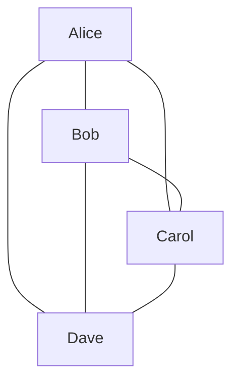
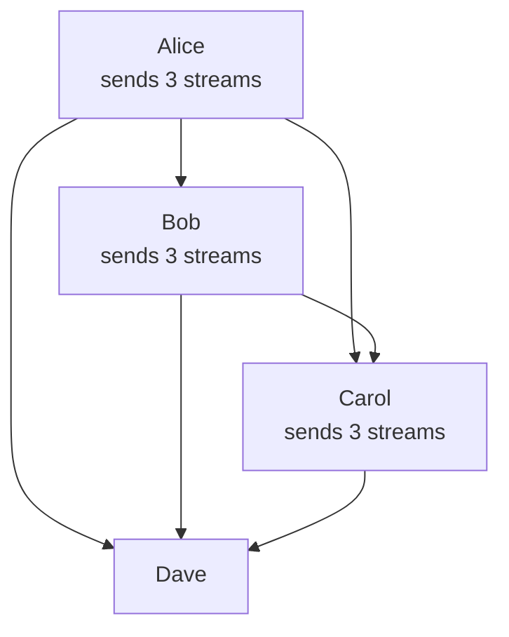
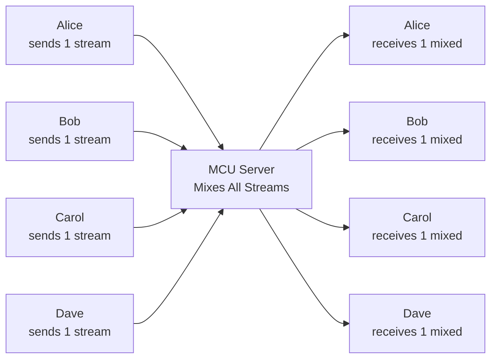
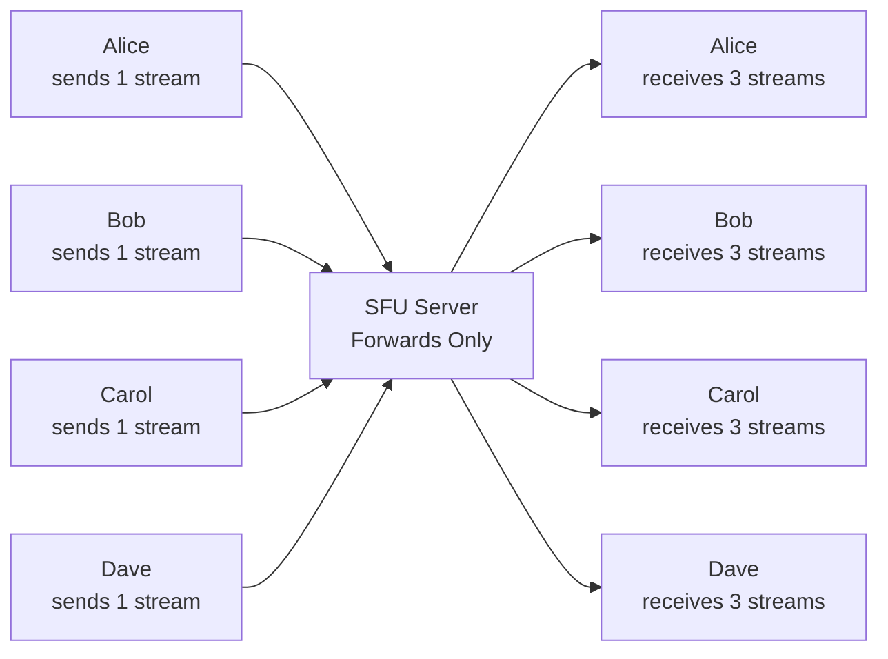

# 08 - Group Calls Architecture: The N² Problem

## The Scaling Problem

1-on-1 calls are simple: Alice ↔ Bob (2 peers, 1 connection).

What about 4 people?



**That's 6 connections!** Formula: `N × (N-1) / 2`

| Participants | Connections | Upload Streams per Person |
|--------------|-------------|---------------------------|
| 2 | 1 | 1 |
| 4 | 6 | 3 |
| 6 | 15 | 5 |
| 10 | 45 | 9 |
| 20 | 190 | 19 |

**Problem**: Each person uploads N-1 video streams. This explodes quickly.

---

## Three Architectures

### 1. Mesh (Peer-to-Peer)

Everyone connects to everyone:



**Pros**:
- No server infrastructure
- Lowest latency (direct P2P)
- End-to-end encrypted

**Cons**:
- Upload bandwidth = (N-1) × bitrate
- CPU encoding N-1 streams
- Max ~4-6 participants

**When to use**: Small meetings (2-4 people), privacy-focused apps

**Bandwidth**: 4 people × 1 Mbps = **3 Mbps upload required per person**

### 2. MCU (Multipoint Control Unit)

Server mixes all streams into one:



**Pros**:
- Constant bandwidth per user (1 up, 1 down)
- Works on low-end devices
- Can scale to 100+ participants

**Cons**:
- Server CPU intensive (decode + mix + encode)
- Latency increases (processing delay)
- NOT end-to-end encrypted (server sees plaintext)
- Layout fixed by server

**When to use**: Large webinars, legacy systems

**Bandwidth**: 1 Mbps upload, 1 Mbps download (constant)

**Cost**: Very expensive (CPU for transcoding)

### 3. SFU (Selective Forwarding Unit)

Server forwards streams without transcoding:



**Pros**:
- Upload constant: 1 stream
- Download: N-1 streams (but server routes efficiently)
- Low server CPU (just forwarding)
- Stays end-to-end encrypted
- Clients control layout

**Cons**:
- Download bandwidth = (N-1) × bitrate
- Client decodes N-1 streams (CPU)
- More complex than mesh

**When to use**: Production group calls (Zoom, Meet, Discord)

**Bandwidth**: 1 Mbps upload, (N-1) Mbps download

---

## The Bandwidth Math

### Mesh

```
4 participants, 1 Mbps per stream:

Alice: Upload 3 Mbps, Download 3 Mbps
Bob: Upload 3 Mbps, Download 3 Mbps
Carol: Upload 3 Mbps, Download 3 Mbps
Dave: Upload 3 Mbps, Download 3 Mbps

Total: 24 Mbps aggregate (6 connections × 2 directions × 2 Mbps)
```

**Fails at**: ~5 participants (upload bottleneck)

### MCU

```
4 participants, 1 Mbps per stream:

Alice: Upload 1 Mbps, Download 1 Mbps
Bob: Upload 1 Mbps, Download 1 Mbps
Carol: Upload 1 Mbps, Download 1 Mbps
Dave: Upload 1 Mbps, Download 1 Mbps

Server: 4 Mbps inbound, 4 Mbps outbound
```

**Server CPU**: Must decode 4 streams, mix, encode 4 times → **Very expensive**

### SFU

```
4 participants, 1 Mbps per stream:

Alice: Upload 1 Mbps, Download 3 Mbps
Bob: Upload 1 Mbps, Download 3 Mbps
Carol: Upload 1 Mbps, Download 3 Mbps
Dave: Upload 1 Mbps, Download 3 Mbps

Server: 4 Mbps inbound, 12 Mbps outbound (forwarding only)
```

**Server CPU**: Minimal (just packet forwarding)

**Scales to**: 20+ participants

---

## SFU: The Modern Choice

**Why SFU dominates**:
1. **Encryption preserved**: Server never decrypts
2. **Low server CPU**: Just forwarding (cheap to scale)
3. **Client flexibility**: Each client can choose layout, quality
4. **Simulcast support**: Send multiple resolutions, server routes best one

**Trade-off**: Download bandwidth grows with participants.

**Solutions**:
- **Simulcast**: Receive low-quality from most, high-quality from active speaker
- **Pagination**: Show only first N participants
- **Audio-only mode**: Disable video for bandwidth-constrained users

---

## Implementing Mesh (Simple)

### Client Code

```javascript
class MeshCall {
  constructor(signaling, roomId) {
    this.signaling = signaling;
    this.roomId = roomId;
    this.peers = new Map(); // peerId -> RTCPeerConnection
  }
  
  async join(localStream) {
    this.localStream = localStream;
    await this.signaling.join(this.roomId);
    
    this.signaling.on('peer-joined', ({ peerId }) => {
      this.connectToPeer(peerId);
    });
    
    this.signaling.on('peer-left', ({ peerId }) => {
      this.disconnectPeer(peerId);
    });
  }
  
  async connectToPeer(peerId) {
    const pc = new RTCPeerConnection(config);
    this.peers.set(peerId, pc);
    
    // Add local tracks
    this.localStream.getTracks().forEach(track => {
      pc.addTrack(track, this.localStream);
    });
    
    // Handle remote tracks
    pc.ontrack = (event) => {
      this.emit('remote-stream', { peerId, stream: event.streams[0] });
    };
    
    // ICE
    pc.onicecandidate = (event) => {
      if (event.candidate) {
        this.signaling.sendIceCandidate(peerId, event.candidate);
      }
    };
    
    // Create offer
    const offer = await pc.createOffer();
    await pc.setLocalDescription(offer);
    this.signaling.sendOffer(peerId, offer);
  }
  
  disconnectPeer(peerId) {
    const pc = this.peers.get(peerId);
    if (pc) {
      pc.close();
      this.peers.delete(peerId);
      this.emit('peer-disconnected', { peerId });
    }
  }
}
```

**Limitation**: Works for 3-5 people max.

---

## Implementing SFU (Client Side)

### Client sends ONE stream to SFU

```javascript
class SFUCall {
  constructor(signaling, sfuUrl) {
    this.signaling = signaling;
    this.pc = null;
    this.remotePeers = new Map(); // peerId -> MediaStream
  }
  
  async join(roomId, localStream) {
    this.pc = new RTCPeerConnection(config);
    
    // Send local stream to SFU
    localStream.getTracks().forEach(track => {
      this.pc.addTrack(track, localStream);
    });
    
    // Receive N-1 remote streams from SFU
    this.pc.ontrack = (event) => {
      const peerId = event.streams[0].id; // SFU sets stream ID = peerId
      this.remotePeers.set(peerId, event.streams[0]);
      this.emit('remote-stream', { peerId, stream: event.streams[0] });
    };
    
    // ICE to SFU
    this.pc.onicecandidate = (event) => {
      if (event.candidate) {
        this.signaling.send('ice-candidate', { candidate: event.candidate });
      }
    };
    
    // Create offer
    const offer = await this.pc.createOffer();
    await this.pc.setLocalDescription(offer);
    this.signaling.send('join', { roomId, sdp: offer });
    
    // Wait for answer from SFU
    this.signaling.on('answer', async (data) => {
      await this.pc.setRemoteDescription(data.sdp);
    });
  }
}
```

**Server side**: Covered in [09-sfu-deep-dive.md](09-sfu-deep-dive.md).

---

## Hybrid: Start Mesh, Upgrade to SFU

```javascript
class AdaptiveCall {
  constructor() {
    this.mode = 'mesh';
    this.maxMeshPeers = 4;
  }
  
  onPeerJoined(peerId) {
    if (this.peers.size >= this.maxMeshPeers && this.mode === 'mesh') {
      console.log('Switching to SFU mode...');
      this.migrateToSFU();
    } else {
      this.connectToPeer(peerId);
    }
  }
  
  async migrateToSFU() {
    this.mode = 'sfu';
    
    // Close all P2P connections
    this.peers.forEach(pc => pc.close());
    this.peers.clear();
    
    // Connect to SFU
    await this.connectToSFU();
    
    this.emit('mode-changed', { mode: 'sfu' });
  }
}
```

**Use case**: Start fast (mesh), upgrade when needed (SFU).

---

## Simulcast with SFU

Send multiple resolutions simultaneously:

```javascript
// Client: Send simulcast
const sender = pc.getSenders().find(s => s.track?.kind === 'video');
const params = sender.getParameters();

params.encodings = [
  { rid: 'h', maxBitrate: 2500000 }, // 1920×1080
  { rid: 'm', maxBitrate: 500000, scaleResolutionDownBy: 2 }, // 960×540
  { rid: 'l', maxBitrate: 150000, scaleResolutionDownBy: 4 }  // 480×270
];

await sender.setParameters(params);
```

**SFU forwards**:
- High quality to active speaker viewer
- Medium quality to grid viewers
- Low quality to mobile users

**Result**: Bandwidth optimized per recipient.

---

## Layout Strategies

### Grid Layout

```
┌─────────┬─────────┐
│  Alice  │   Bob   │
├─────────┼─────────┤
│  Carol  │  Dave   │
└─────────┴─────────┘
```

**Implementation**: CSS Grid, each peer in a cell

**Limitation**: 4×4 grid = 16 videos max (browser can handle)

### Active Speaker Layout

```
┌───────────────────┐
│                   │
│   Active Speaker  │
│   (Large)         │
│                   │
├──────┬──────┬─────┤
│Alice │ Bob  │Carol│
└──────┴──────┴─────┘
```

**Logic**: Detect active speaker via audio level, enlarge their video

### Pagination

```
Page 1: Alice, Bob, Carol, Dave [Next →]
Page 2: Eve, Frank, Grace, Henry [Next →]
```

**Implementation**: Only subscribe to visible peers from SFU

**Saves bandwidth**: Don't download videos for off-screen users

---

## Active Speaker Detection

```javascript
class ActiveSpeakerDetector {
  constructor(audioTrack) {
    this.audioContext = new AudioContext();
    this.analyser = this.audioContext.createAnalyser();
    
    const source = this.audioContext.createMediaStreamSource(
      new MediaStream([audioTrack])
    );
    source.connect(this.analyser);
    
    this.analyser.fftSize = 256;
    this.dataArray = new Uint8Array(this.analyser.frequencyBinCount);
  }
  
  getVolume() {
    this.analyser.getByteFrequencyData(this.dataArray);
    
    const sum = this.dataArray.reduce((a, b) => a + b, 0);
    return sum / this.dataArray.length;
  }
  
  startMonitoring(callback) {
    setInterval(() => {
      const volume = this.getVolume();
      if (volume > 50) { // Threshold
        callback({ volume, speaking: true });
      }
    }, 100);
  }
}
```

**Use cases**:
- Highlight active speaker
- Switch active speaker layout
- Show speaking indicator

---

## Bandwidth Optimization Strategies

### 1. Lower Quality for Non-Speakers

```javascript
// When not speaking, send low quality
function adjustQuality(isSpeaking) {
  const sender = pc.getSenders().find(s => s.track?.kind === 'video');
  const params = sender.getParameters();
  
  if (isSpeaking) {
    params.encodings[0].maxBitrate = 2500000; // High
  } else {
    params.encodings[0].maxBitrate = 300000; // Low
  }
  
  sender.setParameters(params);
}
```

### 2. Audio-Only Mode

```javascript
function enableAudioOnlyMode() {
  // Stop receiving video
  pc.getReceivers().forEach(receiver => {
    if (receiver.track.kind === 'video') {
      receiver.track.enabled = false;
    }
  });
  
  // Stop sending video
  pc.getSenders().forEach(sender => {
    if (sender.track?.kind === 'video') {
      sender.track.enabled = false;
    }
  });
}
```

### 3. Pagination (Selective Subscribe)

```javascript
// Only subscribe to visible participants
function updateVisiblePeers(visiblePeerIds) {
  signaling.send('subscribe', { peers: visiblePeerIds });
  // SFU only forwards video for these peers
}
```

---

## Decision Matrix

| Scenario | Best Choice | Why |
|----------|-------------|-----|
| 2 people | Mesh (P2P) | Lowest latency, no server |
| 3-5 people | Mesh or SFU | Mesh cheaper, SFU more reliable |
| 6-20 people | SFU | Only scalable option |
| 20-100 people | SFU + pagination | Limit videos shown/downloaded  |
| 100-1000 people | SFU + webinar mode | Only speaker sends video |
| 1000+ people | MCU or Streaming | Not real-time WebRTC anymore |

---

## Cost Comparison

### Mesh (P2P)
- **Server cost**: $10-50/month (signaling only)
- **Bandwidth**: Users pay (upload × N)
- **Best for**: Startups,small teams

### SFU
- **Server cost**: $100-1000/month (depends on traffic)
- **Bandwidth**: ~0.5× mesh (server relays)
- **Best for**: Production apps

### MCU
- **Server cost**: $1000-10000/month (CPU intensive)
- **Bandwidth**: Lowest (1 up, 1 down per user)
- **Best for**: Enterprise, legacy

---

## What You Must Understand

| Concept | Why It Matters |
|---------|----------------|
| **Mesh explodes at N²** | Can't scale past 4-6 people |
| **SFU is the modern standard** | Balances cost, quality, scale |
| **MCU for very large scale** | But expensive and adds latency |
| **Simulcast critical for SFU** | Different quality per recipient |
| **Pagination saves bandwidth** | Don't download off-screen videos |

---

## Next Steps

You now understand group call architectures and trade-offs.

**Next**: [09-sfu-deep-dive.md](09-sfu-deep-dive.md) - Building and operating an SFU server.

SFU is the heart of modern group calls. We'll implement one and understand its internals.

---

## Quick Self-Check

- [ ] Explain why mesh fails at 6+ people
- [ ] Calculate bandwidth for mesh vs SFU
- [ ] Describe MCU vs SFU trade-offs
- [ ] Implement simulcast for quality tiers
- [ ] Detect active speaker from audio levels
- [ ] Decide which architecture for given scale
- [ ] Optimize bandwidth with pagination/quality

If you can architect a 20-person video call, you're ready for SFU implementation.
