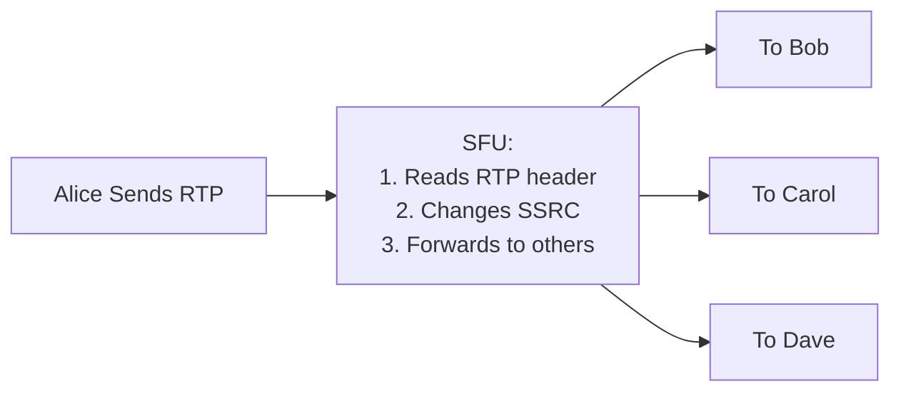
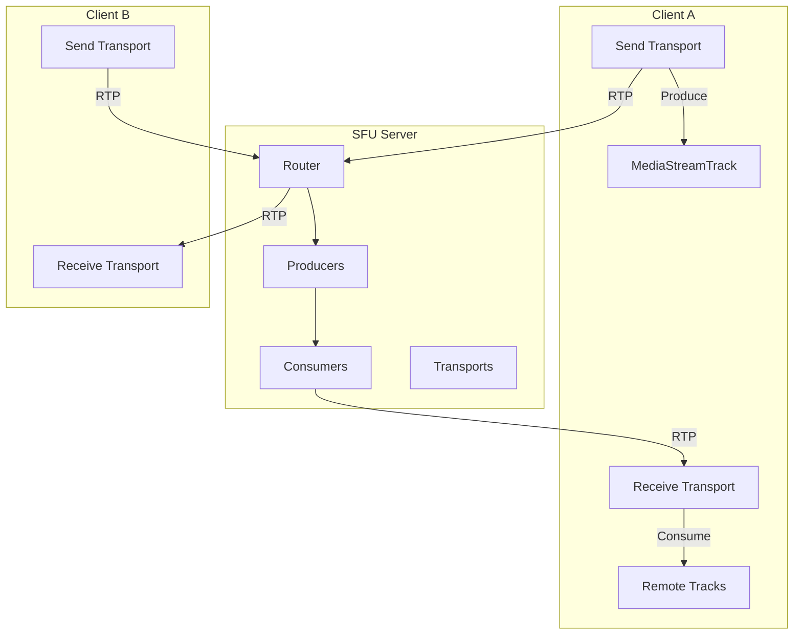
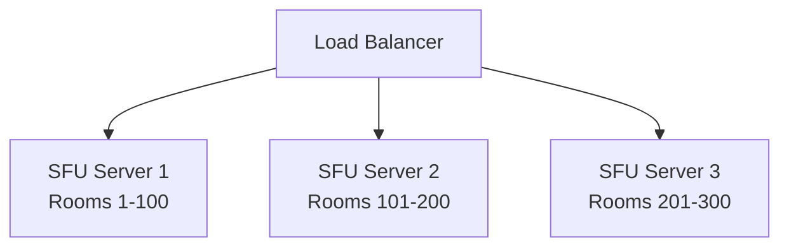
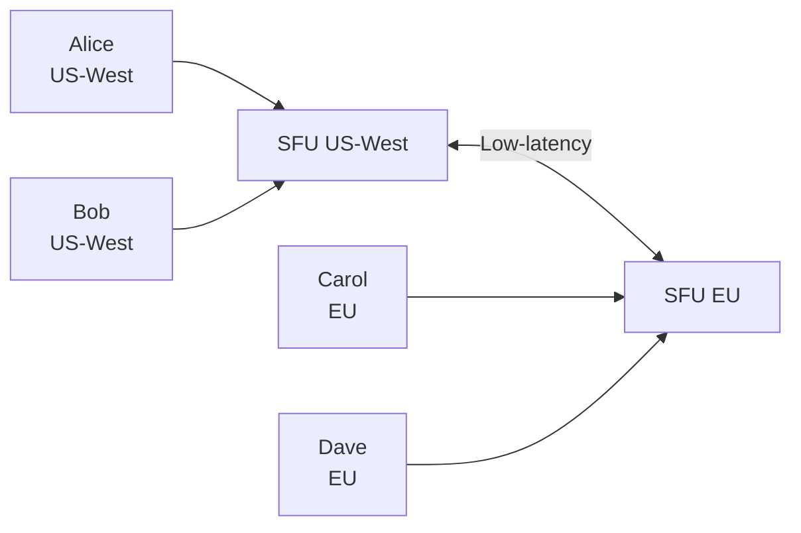

# 09 - SFU Deep Dive: Building the Router

## What an SFU Actually Does

**Selective Forwarding Unit** = Smart packet router



**Key insight**: SFU never decodes media. It reads RTP headers, rewrites them, and forwards.

---

## SFU vs MCU Internals

### MCU (Complex)

```
Incoming: Decode VP8 → Raw frames
Processing: Composite layout, mix audio
Outgoing: Encode VP8 → Send
```

**CPU**: ~1 full core per participant

### SFU (Simple)

```
Incoming: Parse RTP header
Processing: Change SSRC, select layer (simulcast)
Outgoing: Forward packet
```

**CPU**: Negligible (packet forwarding)

---

## Core SFU Operations

### 1. SSRC Rewriting

**Problem**: Each sender has an SSRC (Synchronization Source). If SFU forwards as-is, receivers see all streams as from SFU.

**Solution**: Rewrite SSRC per sender

```
Alice sends: SSRC=12345
SFU forwards to Bob: SSRC=11111 (Alice's assigned SSRC)
SFU forwards to Carol: SSRC=11111
```

### 2. Simulcast Layer Selection

**Client sends**:
```
Stream: High (1920×1080, 2.5 Mbps)
Stream: Medium (960×540, 500 kbps)
Stream: Low (480×270, 150 kbps)
```

**SFU decides** per recipient:
```
Active speaker viewer → High
Grid viewer → Medium
Mobile user → Low
```

### 3. Bandwidth Estimation

SFU monitors:
- Packet loss per recipient
- RTT (round-trip time)
- Send rate vs receive rate

**Adapts** layer selection based on network conditions.

---

## Building a Simple SFU (Node.js + mediasoup)

### Why mediasoup?

- Production-ready SFU library
- Used by major apps (Jitsi, Discord-like systems)
- Efficient C++ core, Node.js API

### Installation

```bash
npm install mediasoup
```

### Basic SFU Server

```javascript
const mediasoup = require('mediasoup');

let worker, router;

async function createWorker() {
  worker = await mediasoup.createWorker({
    logLevel: 'warn',
    rtcMinPort: 40000,
    rtcMaxPort: 49999
  });
  
  worker.on('died', () => {
    console.error('mediasoup worker died, exiting...');
    process.exit(1);
  });
  
  return worker;
}

async function createRouter() {
  router = await worker.createRouter({
    mediaCodecs: [
      {
        kind: 'audio',
        mimeType: 'audio/opus',
        clockRate: 48000,
        channels: 2
      },
      {
        kind: 'video',
        mimeType: 'video/VP8',
        clockRate: 90000,
        parameters: {}
      },
      {
        kind: 'video',
        mimeType: 'video/H264',
        clockRate: 90000,
        parameters: {
          'packetization-mode': 1,
          'profile-level-id': '42e01f'
        }
      }
    ]
  });
  
  return router;
}

// Initialize
await createWorker();
await createRouter();
```

### Creating WebRTC Transport

```javascript
async function createWebRtcTransport() {
  const transport = await router.createWebRtcTransport({
    listenIps: [
      { ip: '0.0.0.0', announcedIp: 'YOUR_PUBLIC_IP' }
    ],
    enableUdp: true,
    enableTcp: true,
    preferUdp: true
  });
  
  return {
    id: transport.id,
    iceParameters: transport.iceParameters,
    iceCandidates: transport.iceCandidates,
    dtlsParameters: transport.dtlsParameters
  };
}
```

### Client → SFU: Produce (Send Media)

```javascript
// Server side
async function handleProduce(transport, kind, rtpParameters) {
  const producer = await transport.produce({
    kind,
    rtpParameters
  });
  
  // Store producer
  producers.set(producer.id, producer);
  
  // Notify other clients
  broadcastNewProducer(producer.id);
  
  return { id: producer.id };
}

// Client side
async function publishMedia(track) {
  const params = {
    track,
    encodings: [
      { rid: 'r0', maxBitrate: 100000 },   // Low
      { rid: 'r1', maxBitrate: 300000 },   // Medium
      { rid: 'r2', maxBitrate: 900000 }    // High
    ],
    codecOptions: {
      videoGoogleStartBitrate: 1000
    }
  };
  
  const producer = await sendTransport.produce(params);
  return producer;
}
```

### SFU → Client: Consume (Receive Media)

```javascript
// Server side
async function handleConsume(transport, producerId, rtpCapabilities) {
  // Can this client consume this producer?
  if (!router.canConsume({ producerId, rtpCapabilities })) {
    return { error: 'Cannot consume' };
  }
  
  const consumer = await transport.consume({
    producerId,
    rtpCapabilities,
    paused: false
  });
  
  return {
    id: consumer.id,
    producerId,
    kind: consumer.kind,
    rtpParameters: consumer.rtpParameters
  };
}

// Client side
async function subscribeToProducer(producerId) {
  const { rtpParameters } = await signaling.request('consume', { 
    producerId,
    rtpCapabilities
  });
  
  const consumer = await recvTransport.consume({
    id: consumerId,
    producerId,
    kind,
    rtpParameters
  });
  
  return consumer.track; // MediaStreamTrack
}
```

---

## SFU Architecture Components



**Key objects**:
- **Router**: Media routing engine
- **Transport**: WebRTC transport (ICE + DTLS)
- **Producer**: Incoming media stream from client
- **Consumer**: Outgoing media stream to client

---

## Simulcast Handling

### Client Sends 3 Layers

```javascript
// Client
const encodings = [
  { rid: 'high', maxBitrate: 2500000 },
  { rid: 'medium', maxBitrate: 500000, scaleResolutionDownBy: 2 },
  { rid: 'low', maxBitrate: 150000, scaleResolutionDownBy: 4 }
];
```

### SFU Selects Layer Per Consumer

```javascript
// Server: Adapt layer based on bandwidth
consumer.on('score', (score) => {
  // score.score ranges 0-10 (10 = perfect)
  if (score.score < 5) {
    consumer.setPreferredLayers({ spatialLayer: 0 }); // Low
  } else if (score.score < 8) {
    consumer.setPreferredLayers({ spatialLayer: 1 }); // Medium
  } else {
    consumer.setPreferredLayers({ spatialLayer: 2 }); // High
  }
});
```

**Result**: Each recipient gets optimal quality for their network.

---

## Bandwidth Management

### REMB (Receiver Estimated Maximum Bitrate)

Receiver tells sender: "I can handle X kbps"

```javascript
// mediasoup handles this automatically
consumer.on('producerScore', ({ score }) => {
  // Low score = congestion
  if (score < 5) {
    // Downgrade layer or request keyframe
  }
});
```

### Transport-CC (Transport-Wide Congestion Control)

Google's congestion control algorithm:
1. Monitor packet arrival times
2. Detect increasing delay (congestion)
3. Reduce sending rate

**mediasoup enables this by default.**

---

## Room Management

```javascript
class Room {
  constructor(roomId, router) {
    this.id = roomId;
    this.router = router;
    this.peers = new Map(); // peerId -> Peer
  }
  
  addPeer(peerId) {
    const peer = new Peer(peerId, this.router);
    this.peers.set(peerId, peer);
    
    // Notify existing peers
    this.peers.forEach((p, id) => {
      if (id !== peerId) {
        p.notifyNewPeer(peerId);
      }
    });
    
    return peer;
  }
  
  removePeer(peerId) {
    const peer = this.peers.get(peerId);
    if (peer) {
      peer.close();
      this.peers.delete(peerId);
      
      // Notify remaining peers
      this.peers.forEach(p => p.notifyPeerLeft(peerId));
    }
  }
  
  close() {
    this.peers.forEach(peer => peer.close());
    this.peers.clear();
  }
}

class Peer {
  constructor(id, router) {
    this.id = id;
    this.router = router;
    this.transports = new Map();
    this.producers = new Map();
    this.consumers = new Map();
  }
  
  async createTransport(direction) {
    const transport = await this.router.createWebRtcTransport({...});
    this.transports.set(transport.id, transport);
    return transport;
  }
  
  close() {
    this.transports.forEach(t => t.close());
    this.producers.forEach(p => p.close());
    this.consumers.forEach(c => c.close());
  }
}
```

---

## Scaling Strategies

### 1. Vertical Scaling (Single Server)

```
Limits:
- 100-300 participants per server (depends on CPU/bandwidth)
- 1 Gbps network = ~100 participants × 1 Mbps each
```

**When to use**: MVP, small deployments

### 2. Horizontal Scaling (Multiple SFUs)



**Strategy**: Route by room ID (consistent hashing)

**Problem**: Can't split a single room across SFUs easily

### 3. Cascading SFUs (Multi-Region)



**Benefit**: Participants connect to nearest SFU, SFUs exchange media

**Complexity**: Cross-SFU routing logic

---

## Production Checklist

### Performance

- [ ] **CPU monitoring**: Alert if > 80%
- [ ] **Bandwidth monitoring**: Know your limits
- [ ] **Worker crashes**: Restart automatically
- [ ] **Memory leaks**: Monitor and fix
- [ ] **Port exhaustion**: Sufficient port range (40000-49999)

### Reliability

- [ ] **Health checks**: Ping SFU, restart if unhealthy
- [ ] **Graceful shutdown**: Migrate users before restart
- [ ] **Redundancy**: Multiple SFU servers
- [ ] **TURN fallback**: For users behind restrictive NAT

### Security

- [ ] **Authentication**: Verify users before allowing produce/consume
- [ ] **Room isolation**: Users can't access other rooms
- [ ] **Rate limiting**: Prevent DoS (max producers per user)
- [ ] **TLS**: Secure signaling channel

---

## Debugging SFU Issues

### Issue: High Packet Loss

**Symptoms**: Video freezing, glitchy audio

**Causes**:
1. Server bandwidth saturated
2. Client upload limited
3. Network congestion

**Debug**:
```javascript
producer.on('score', (score) => {
  console.log('Producer score:', score); // Low score = problems
});

consumer.on('score', (score) => {
  console.log('Consumer score:', score);
});
```

**Fix**: Downgrade layer, reduce participants

### Issue: High Latency

**Symptoms**: 1-2 second delay

**Causes**:
1. Geographic distance (SFU far from users)
2. Poor routing (network path)
3. SFU overloaded

**Fix**: Regional SFUs, better network provider

### Issue: CPU Spike

**Symptoms**: Server CPU at 100%

**Causes**:
1. Too many participants
2. Simulcast not working (encoding all layers)
3. Memory leak

**Debug**:
```bash
# Monitor CPU per worker
top -p $(pgrep mediasoup)
```

**Fix**: Limit participants per server, add more workers

---

## Advanced: Recorder Integration

```javascript
async function startRecording(producer) {
  const recorder = await router.createPlainTransport({
    listenIp: '127.0.0.1',
    rtcpMux: false,
    comedia: false
  });
  
  // Connect to FFmpeg
  const consumer = await recorder.consume({
    producerId: producer.id,
    rtpCapabilities: router.rtpCapabilities,
    paused: false
  });
  
  // FFmpeg command
  // ffmpeg -protocol_whitelist file,udp,rtp -i sdp.file -c copy output.webm
}
```

**Use case**: Record calls for compliance, replay

---

## Alternatives to mediasoup

| SFU | Language | Pros | Cons |
|-----|----------|------|------|
| **mediasoup** | Node.js/C++ | Production-ready, performant | Complex API |
| **Janus** | C | Lightweight, plugins | Manual config |
| **Jitsi Videobridge** | Java | Full stack (includes signaling) | Heavy |
| **LiveKit** | Go | Modern, batteries-included | Newer (less battle-tested) |
| **ion-sfu** | Go | Simple, fast | Less features |

**Recommendation**: Start with mediasoup or LiveKit.

---

## What You Must Understand

| Concept | Why It Matters |
|---------|----------------|
| **SFU forwards, doesn't transcode** | Low CPU, scalable |
| **SSRC rewriting per sender** | Recipients identify streams |
| **Simulcast layer selection** | Adaptive quality per user |
| **Transport = ICE + DTLS** | One per direction (send/recv) |
| **Producer/Consumer model** | Server-side media routing |

---

## Next Steps

You now understand SFU internals and can build/operate media servers.

**Next**: [10-scaling-and-prod-gotchas.md](10-scaling-and-prod-gotchas.md) - Real-world deployment challenges.

SFU is the engine. Scaling is the operational challenge of running it at production scale.

---

## Quick Self-Check

- [ ] Explain SFU vs MCU in detail
- [ ] Implement basic SFU with mediasoup
- [ ] Handle simulcast layer selection
- [ ] Monitor producer/consumer scores
- [ ] Design room management system
- [ ] Scale SFU horizontally
- [ ] Debug packet loss and latency issues

If you can build a 20-person group call with an SFU, you're production-ready.
