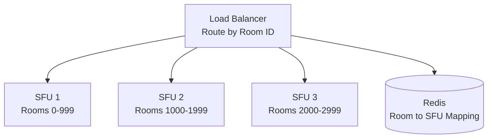

# 10 - Scaling and Production Gotchas

## The Reality of Production WebRTC

Building a demo is easy. Running it at scale with real users reveals painful truths:

- **Mobile networks are hostile**: Packet loss, jitter, background disconnections
- **Users have potato computers**: Old laptops can't decode 4 video streams
- **Firewalls are aggressive**: Corporate networks block UDP
- **The internet is slow**: 3G still exists in 2026
- **Browsers have bugs**: Different behavior across Chrome/Firefox/Safari

This chapter covers battle-tested solutions.

---

## The TURN Bandwidth Problem

Remember: 10-20% of users need TURN relay.

### The Math

```
1000 concurrent users
20% need TURN = 200 users
1 Mbps per user bidirectional = 2 Mbps × 200
Total: 400 Mbps = 175 GB/hour
```

**AWS bandwidth pricing**: $0.09/GB after first TB
```
175 GB/hour × 720 hours/month = 126 TB/month
126,000 GB × $0.09 = $11,340/month
```

**For TURN relay alone.**

### Solutions

#### 1. Optimize TURN Usage

```javascript
// Only use TURN as last resort
const config = {
  iceServers: [
    { urls: 'stun:stun.example.com' },
    { 
      urls: 'turn:turn.example.com',
      username: user,
      credential: pass
    }
  ],
  iceTransportPolicy: 'all' // Try P2P first
};
```

Don't use `iceTransportPolicy: 'relay'` unless privacy-focused app.

#### 2. Coturn on Cheap VPS

```bash
# $5/month VPS can handle 50-100 TURN users
apt-get install coturn

# /etc/turnserver.conf
listening-port=3478
tls-listening-port=5349
fingerprint
lt-cred-mech
realm=example.com
static-auth-secret=yourSecret
max-bps=500000  # Limit bandwidth per user
```

**Cost**: $50/month for 10 VPS = 1000 TURN users

#### 3. Regional TURN Servers

```javascript
function getClosestTURN(userLocation) {
  const turnServers = {
    'us-west': 'turn:us-west.example.com',
    'us-east': 'turn:us-east.example.com',
    'eu': 'turn:eu.example.com',
    'asia': 'turn:asia.example.com'
  };
  
  return turnServers[userLocation] || turnServers['us-east'];
}
```

**Benefit**: Lower latency, better routing

---

## Mobile Network Issues

### Problem 1: Background Disconnection (iOS)

iOS aggressively suspends WebSocket connections when app backgrounds.

**Symptoms**: Call continues (WebRTC P2P), but can't renegotiate

**Solution**: Reconnect signaling on foreground

```javascript
document.addEventListener('visibilitychange', async () => {
  if (document.visibilityState === 'visible') {
    if (signaling.isDisconnected()) {
      await signaling.reconnect();
      // Re-sync state with server
    }
  }
});
```

### Problem 2: Network Switching (WiFi ↔ 4G)

User walks outside, phone switches networks. ICE connection breaks.

**Solution**: ICE restart

```javascript
pc.oniceconnectionstatechange = async () => {
  if (pc.iceConnectionState === 'disconnected') {
    // Wait 5s for recovery
    setTimeout(async () => {
      if (pc.iceConnectionState !== 'connected') {
        await restartICE();
      }
    }, 5000);
  }
};

async function restartICE() {
  const offer = await pc.createOffer({ iceRestart: true });
  await pc.setLocalDescription(offer);
  signaling.send('renegotiate', { sdp: offer });
}
```

### Problem 3: Low Bandwidth (3G)

User on slow network can't receive multiple HD streams.

**Solution**: Adaptive quality

```javascript
async function monitorBandwidth() {
  const stats = await pc.getStats();
  
  stats.forEach(report => {
    if (report.type === 'inbound-rtp' && report.kind === 'video') {
      const packetsLost = report.packetsLost || 0;
      const packetsReceived = report.packetsReceived || 1;
      const lossRate = packetsLost / (packetsLost + packetsReceived);
      
      if (lossRate > 0.05) {
        // High packet loss, reduce quality
        requestLowerQuality();
      }
    }
  });
}

setInterval(monitorBandwidth, 5000);
```

---

## CPU Overload (Client Side)

### Problem: Decoding N Videos Melts Laptop

4 HD video streams = 100% CPU on older laptops.

**Solution 1**: Limit simultaneous videos

```javascript
const MAX_VIDEOS = navigator.hardwareConcurrency >= 8 ? 9 : 4;

function updateVisibleVideos(participants) {
  // Show only first N participants
  const visible = participants.slice(0, MAX_VIDEOS);
  
  // Request video only for visible
  visible.forEach(p => subscribeVideo(p.id));
  
  // Audio-only for rest
  const audioOnly = participants.slice(MAX_VIDEOS);
  audioOnly.forEach(p => subscribeAudioOnly(p.id));
}
```

**Solution 2**: Hardware acceleration

```javascript
// Prefer hardware-accelerated codec (H.264)
const config = {
  video: {
    codec: {
      mimeType: 'video/H264',
      sdpFmtpLine: 'profile-level-id=42e01f'  // Baseline profile
    }
  }
};
```

H.264 has hardware decoders on most devices → 10x lower CPU than VP8.

---

## Firewall Traversal

### Problem: Corporate Firewall Blocks UDP

10-25% of corporate users behind firewall that blocks all UDP.

**Solution**: TURN over TCP/TLS

```javascript
const config = {
  iceServers: [
    { urls: 'stun:stun.example.com:3478' },
    {
      urls: [
        'turn:turn.example.com:3478?transport=udp',  // Try UDP first
        'turn:turn.example.com:3478?transport=tcp',  // Fallback to TCP
        'turns:turn.example.com:5349?transport=tcp'  // TLS on port 443
      ],
      username: user,
      credential: pass
    }
  ]
};
```

**Port 443 (HTTPS)**: Rarely blocked, looks like HTTPS traffic to DPI firewalls.

---

## SFU Scaling Limits

### Single Server Limits

```
Bottleneck: Network bandwidth
1 Gbps server = ~1000 Mbps usable
10 participants × 1 Mbps each × 10 = 100 Mbps per room
1000 Mbps / 100 Mbps = 10 concurrent rooms max
```

**CPU (mediasoup)**: ~10-20% per 100 participants (if no transcoding)

### Horizontal Scaling Strategy



**Route logic**:
```javascript
function getSFUForRoom(roomId) {
  // Check Redis for existing mapping
  let sfuId = await redis.get(`room:${roomId}:sfu`);
  
  if (!sfuId) {
    // Assign to least-loaded SFU
    sfuId = await getLeastLoadedSFU();
    await redis.set(`room:${roomId}:sfu`, sfuId);
  }
  
  return sfuServers[sfuId];
}
```

---

## Database Bottlenecks

### Problem: Signaling State in Database

Storing every ICE candidate in PostgreSQL = database meltdown.

**Bad**:
```javascript
// Every ICE candidate hits database
socket.on('ice-candidate', (data) => {
  await db.query('INSERT INTO ice_candidates ...', data);
});
```

**Good**:
```javascript
// In-memory during call, persist only metadata
const roomState = new Map(); // In-memory

socket.on('ice-candidate', (data) => {
  // Forward directly, don't persist
  forwardToPeer(data.to, data.candidate);
});
```

**Only persist**:
- Call metadata (start time, participants, duration)
- Recording URLs
- Analytics events

---

## Browser Quirks

### Safari: Aggressive Track Cleanup

Safari stops tracks when tab backgrounds.

**Solution**:
```javascript
// Detect Safari
const isSafari = /^((?!chrome|android).)*safari/i.test(navigator.userAgent);

if (isSafari) {
  // Keep tracks alive
  document.addEventListener('visibilitychange', () => {
    if (document.hidden) {
      // Create silent audio context to keep connection alive
      const ctx = new AudioContext();
      const oscillator = ctx.createOscillator();
      oscillator.connect(ctx.destination);
      oscillator.start();
    }
  });
}
```

### Firefox: Different Simulcast Format

Firefox uses different RID (restriction identifier) format.

**Solution**: Detect and adapt
```javascript
const isFirefox = navigator.userAgent.includes('Firefox');

const encodings = isFirefox ? [
  { rid: 'h', maxBitrate: 2500000 },
  { rid: 'm', maxBitrate: 500000 },
  { rid: 'l', maxBitrate: 150000 }
] : [
  { rid: '2', maxBitrate: 2500000 },  // Chrome format
  { rid: '1', maxBitrate: 500000 },
  { rid: '0', maxBitrate: 150000 }
];
```

### Edge: VP9 Issues

Edge (Chromium) sometimes has VP9 codec bugs.

**Solution**: Force VP8 for Edge
```javascript
const isEdge = navigator.userAgent.includes('Edg/');

if (isEdge) {
  // Prefer VP8
  await setPreferredCodec(pc, 'video', 'video/VP8');
}
```

---

## Reliability Patterns

### 1. Health Checks

```javascript
// Client pings server every 30s
setInterval(() => {
  const start = Date.now();
  
  signaling.ping().then(() => {
    const rtt = Date.now() - start;
    if (rtt > 5000) {
      console.warn('High signaling latency:', rtt);
      showNetworkWarning();
    }
  }).catch(() => {
    console.error('Signaling unresponsive');
    attemptReconnect();
  });
}, 30000);
```

### 2. Exponential Backoff

```javascript
async function reconnectWithBackoff() {
  let attemptpt = 0;
  const maxAttempts = 10;
  
  while (attempt < maxAttempts) {
    const delay = Math.min(1000 * Math.pow(2, attempt), 30000);
    console.log(`Reconnecting in ${delay}ms...`);
    
    await sleep(delay);
    
    try {
      await signaling.connect();
      console.log('Reconnected!');
      return;
    } catch (error) {
      attempt++;
    }
  }
  
  console.error('Failed to reconnect after', maxAttempts, 'attempts');
  showFatalError();
}
```

### 3. Circuit Breaker

```javascript
class CircuitBreaker {
  constructor(threshold = 5) {
    this.failures = 0;
    this.threshold = threshold;
    this.state = 'closed'; // closed, open, half-open
  }
  
  async call(fn) {
    if (this.state === 'open') {
      throw new Error('Circuit breaker open');
    }
    
    try {
      const result = await fn();
      this.onSuccess();
      return result;
    } catch (error) {
      this.onFailure();
      throw error;
    }
  }
  
  onSuccess() {
    this.failures = 0;
    this.state = 'closed';
  }
  
  onFailure() {
    this.failures++;
    if (this.failures >= this.threshold) {
      this.state = 'open';
      setTimeout(() => {
        this.state = 'half-open';
        this.failures = 0;
      }, 30000); // Try again after 30s
    }
  }
}

// Usage
const breaker = new CircuitBreaker();

async function callSFU() {
  return breaker.call(() => sfu.createTransport());
}
```

---

## Monitoring Must-Haves

### Metrics to Track

```javascript
const metrics = {
  // Call quality
  packetLoss: 0,      // %
  jitter: 0,          // ms
  rtt: 0,             // ms
  bitrate: 0,         // kbps
  
  // Connection
  iceState: 'new',
  connectionState: 'new',
  
  // Resource
  cpuUsage: 0,        // % (if available)
  memoryUsage: 0,     // MB
  
  // User experience
  callDuration: 0,    // seconds
  freezeCount: 0,     // Number of video freezes
  reconnectCount: 0   // Number of reconnections
};

// Send to analytics
setInterval(() => {
  analytics.track('webrtc_metrics', metrics);
}, 10000); // Every 10s
```

### Alerts to Set

- **Ice Connection Failed**: Alert if >5% of calls fail to connect
- **High Packet Loss**: Alert if >10% packet loss
- **High RTT**: Alert if >300ms
- **Reconnection Spikes**: Alert if reconnections >10% of calls
- **TURN Usage Spike**: Alert if TURN usage >30% (expensive!)

---

## Cost Optimization

### 1. Codec Choice

```
VP8:  1 Mbps for 720p (software encoder)
H.264: 1 Mbps for 720p (hardware encoder) → Lower CPU
VP9:  600 kbps for 720p → 40% bandwidth savings!

VP9 = Lower bandwidth = Lower TURN costs
```

**Enable VP9** if users have modern devices.

### 2. Audio-Only Fallback

```javascript
if (slowNetwork || lowBattery) {
  // Disable video, audio-only
  enableAudioOnlyMode();
  // Saves 90% of bandwidth
}
```

### 3. Limit Recording

Recording everything = massive storage costs.

**Strategy**: Record on-demand only
```javascript
// Only record if user clicks "Record"
function startRecording() {
  signaling.send('start-recording', { roomId });
  // Server starts recording to S3
}
```

---

## Common Production Failures

| Failure | Symptom | Fix |
|---------|---------|-----|
| **Port exhaustion** | New connections fail | Increase ephemeral port range |
| **Memory leak** | Server OOM after hours | Profile and fix leaks |
| **Certificate expired** | TURN/TLS fails | Automate renewal (certbot) |
| **NAT timeout** | Disconnect after 30s idle | Send keepalive packets |
| **Clock skew** | Authentication fails | Use NTP, sync clocks |
| **DNS issues** | Can't resolve STUN/TURN | Use IP addresses as fallback |

---

## Graceful Degradation

```javascript
async function startCall(quality) {
  try {
    return await startVideoCall(quality);
  } catch (error) {
    console.warn('Video failed, trying audio-only:', error);
    try {
      return await startAudioCall();
    } catch (error) {
      console.error('Audio failed, trying text-only:', error);
      return startTextChat();
    }
  }
}
```

**Philosophy**: Something is better than nothing.

---

## What You Must Understand

| Concept | Why It Matters |
|---------|----------------|
| **TURN is expensive** | 20% of users × $11k/month |
| **Mobile networks are chaotic** | ICE restart essential |
| **CPU limits client-side** | Can't decode 20 HD streams |
| **Firewalls block UDP** | Need TCP/TLS fallback |
| **Browsers behave differently** | Test on all platforms |

---

## Next Steps

You now understand real-world scaling challenges and solutions.

**Next**: [11-debugging-and-observability.md](11-debugging-and-observability.md) - Tools and techniques for debugging WebRTC.

When things break in production, you need visibility. Next chapter covers diagnostic tools.

---

## Quick Self-Check

- [ ] Calculate TURN bandwidth costs for your scale
- [ ] Implement ICE restart on network change
- [ ] Detect and adapt to slow networks
- [ ] Handle browser-specific quirks
- [ ] Set up monitoring and alerts
- [ ] Optimize codec choice for cost
- [ ] Implement graceful degradation

If you can keep a system running at 1000 concurrent users, you're production-ready.
