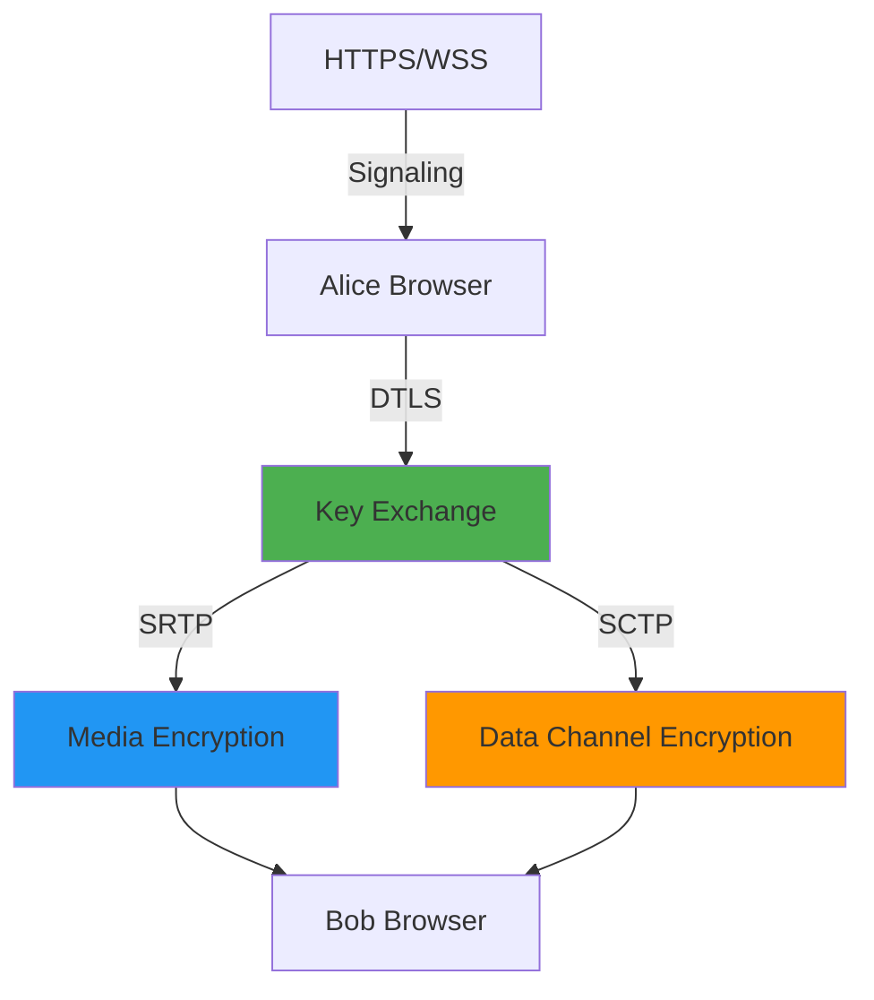

# 12 - Security and Privacy

## WebRTC Security Model: Encrypted by Default

**Good news**: WebRTC is secure by design. All media and data are encrypted.

**Bad news**: The signaling server can see metadata and become a MITM.

---

## Encryption Layers



| Layer | Protocol | What It Protects |
|-------|----------|------------------|
| **Signaling** | HTTPS/WSS | SDP exchange | 
| **Key exchange** | DTLS | Symmetric keys |
| **Media** | SRTP | Audio/video packets |
| **Data channels** | SCTP over DTLS | Data messages |

---

## DTLS: Establishing Trust

### What is DTLS?

**TLS for UDP** - establishes encryption keys before RTP flows.

```
Alice                               Bob
  |--- ClientHello (supported ciphers) ---->|
  |<--- ServerHello (chosen cipher) --------|
  |<--- Certificate (Bob's fingerprint) ----|
  |--- Certificate (Alice's fingerprint) -->|
  |--- Finished (key exchange done) -------->|
  |<--- Finished (ready for SRTP) ----------|
```

### Fingerprint in SDP

When Alice creates an offer:

```
a=fingerprint:sha-256 82:D9:3C:... (Alice's cert)
```

When Bob receives this via signaling:
- Bob's browser checks if Alice's DTLS certificate matches this fingerprint
- If match: connection proceeds
- If mismatch: **connection fails** (MITM attempt?)

**Key insight**: The fingerprint is sent via your signaling server (HTTPS). If an attacker controls your signaling server, they can replace fingerprints and perform MITM.

---

## SRTP: Media Encryption

### How It Works

```
RTP packet:
  [Header | Payload (unencrypted audio/video)]

SRTP packet:
  [Header | Encrypted Payload | Auth Tag]
```

**Encryption**: AES (typically AES-128 or AES-256)  
**Authentication**: HMAC-SHA1 or HMAC-SHA256

**Keys derived from DTLS handshake** - never transmitted separately.

### Verification

```javascript
// Check if SRTP is active
const stats = await pc.getStats();

stats.forEach(report => {
  if (report.type === 'transport') {
    console.log('DTLS state:', report.dtlsState); // Should be 'connected'
    console.log('SRTP cipher:', report.srtpCipher); // e.g., 'AES_CM_128_HMAC_SHA1_80'
  }
});
```

**If SRTP cipher is present and DTLS is connected, your media is encrypted.**

---

## Signaling Server: The Weak Link

### What the Signaling Server Sees

```
{
  "type": "offer",
  "from": "alice@example.com",
  "to": "bob@example.com",
  "sdp": "v=0\no=- ... m=audio ..."
}
```

**Metadata visible**:
- Who is calling whom
- When the call starts/ends
- IP addresses (in SDP)
- Media types (audio, video, data channel)

**Metadata NOT visible**:
- Actual audio/video content (SRTP encrypted)
- Data channel messages (SCTP encrypted)

### MITM Attack Scenario

1. Alice sends offer with fingerprint `A123` to signaling server
2. **Attacker** (controls signaling server) replaces fingerprint with `EVIL`
3. Bob receives fingerprint `EVIL` instead of `A123`
4. Bob connects to attacker's peer connection
5. Attacker decrypts Bob's media, re-encrypts to Alice
6. **Result**: Attacker sees everything

**Mitigation**: Out-of-band fingerprint verification (see below)

---

## Defending Against MITM

### Option 1: Out-of-Band Fingerprint Verification

```javascript
async function createSecureOffer() {
  const offer = await pc.createOffer();
  await pc.setLocalDescription(offer);
  
  // Extract fingerprint from SDP
  const lines = offer.sdp.split('\n');
  const fingerprintLine = lines.find(l => l.startsWith('a=fingerprint:'));
  const fingerprint = fingerprintLine.split('fingerprint:')[1].trim();
  
  // Display to user
  alert(`Verify this fingerprint with peer:\n${fingerprint}`);
  
  return offer;
}
```

**User flow**:
1. Alice and Bob read their fingerprints on screen
2. Alice calls Bob on the phone: "My fingerprint is 82:D9:3C..."
3. Bob verifies it matches what he received via signaling
4. If match: proceed with call

**Used by**: WhatsApp (shows security code), Signal.

### Option 2: End-to-End Encryption (E2EE)

**Encrypt SDP before sending to signaling server**:

```javascript
// Alice encrypts SDP with shared secret
async function createE2EOffer(sharedSecret) {
  const offer = await pc.createOffer();
  await pc.setLocalDescription(offer);
  
  // Encrypt SDP
  const encryptedSDP = await encryptData(offer.sdp, sharedSecret);
  
  return {
    type: 'offer',
    encryptedSDP
  };
}

// Bob decrypts SDP
async function receiveE2EOffer(encryptedOffer, sharedSecret) {
  const sdp = await decryptData(encryptedOffer.encryptedSDP, sharedSecret);
  
  await pc.setRemoteDescription({
    type: 'offer',
    sdp
  });
}
```

**Shared secret**: Generated from password, QR code, or public key exchange.

**Result**: Signaling server sees encrypted blobs, cannot tamper with fingerprints.

### Option 3: Certificate Pinning

If you control both clients (mobile apps):

```javascript
// Embed expected certificate in app
const EXPECTED_CERT = '82:D9:3C:...';

pc.onconnectionstatechange = async () => {
  if (pc.connectionState === 'connected') {
    const stats = await pc.getStats();
    
    stats.forEach(report => {
      if (report.type === 'certificate' && report.fingerprint !== EXPECTED_CERT) {
        throw new Error('Certificate mismatch - MITM detected!');
      }
    });
  }
};
```

**Limitation**: Only works if you know peer's certificate in advance.

---

## TURN Server Security

### Authentication

**Never use open TURN servers** - anyone can use them, incur costs on you.

**Use credentials**:

```javascript
{
  urls: 'turn:turn.example.com:3478',
  username: 'alice-1234567890',
  credential: 'temporaryPassword123'
}
```

### Time-Limited Credentials

**Don't hardcode passwords** - generate short-lived credentials on your backend:

```javascript
// Backend (Node.js)
const crypto = require('crypto');

function generateTURNCredentials(username, ttl = 3600) {
  const unixTimestamp = Math.floor(Date.now() / 1000) + ttl;
  const turnUsername = `${unixTimestamp}:${username}`;
  
  const hmac = crypto.createHmac('sha1', TURN_SECRET);
  hmac.update(turnUsername);
  const turnPassword = hmac.digest('base64');
  
  return {
    urls: 'turn:turn.example.com:3478',
    username: turnUsername,
    credential: turnPassword
  };
}

// API endpoint
app.get('/api/turn-credentials', (req, res) => {
  const credentials = generateTURNCredentials(req.user.id);
  res.json({ iceServers: [credentials] });
});
```

**Client**:

```javascript
const response = await fetch('/api/turn-credentials');
const { iceServers } = await response.json();

const pc = new RTCPeerConnection({ iceServers });
```

**Benefits**:
- Credentials expire after 1 hour
- Can't be reused by attackers
- Scoped to specific user

---

## IP Address Leakage

### The Problem

**WebRTC exposes local and public IP addresses** via ICE candidates.

```javascript
pc.onicecandidate = (event) => {
  if (event.candidate) {
    console.log('Candidate:', event.candidate.candidate);
    // Exposes: 192.168.1.45, 203.0.113.50
  }
};
```

**Privacy concern**: VPN users may leak real IP.

### Mitigation: ICE Transports Policy

```javascript
const pc = new RTCPeerConnection({
  iceTransportPolicy: 'relay' // Only use TURN, no direct connection
});
```

**Options**:
- `all` (default): Use all candidate types (host, srflx, relay)
- `relay`: Only use TURN relay candidates

**Trade-off**: Relay-only forces TURN usage = higher latency + cost.

### Browser Privacy Settings

**Chrome**: `chrome://flags/#enable-webrtc-hide-local-ips-with-mdns`  
- Uses mDNS names like `abc123.local` instead of `192.168.1.45`

**Firefox**: `media.peerconnection.ice.default_address_only = true`  
- Only exposes default route interface

---

## Content Security Policy (CSP)

**Prevent malicious scripts from accessing camera/mic**:

```html
<meta http-equiv="Content-Security-Policy" 
      content="default-src 'self'; 
               media-src 'self'; 
               connect-src 'self' wss://signal.example.com">
```

**Blocks**:
- Third-party scripts from calling `getUserMedia`
- Connections to unknown WebSocket servers

---

## Permission Model

### getUserMedia Prompts

```javascript
try {
  const stream = await navigator.mediaDevices.getUserMedia({
    video: true,
    audio: true
  });
} catch (err) {
  if (err.name === 'NotAllowedError') {
    // User denied permission
  } else if (err.name === 'NotFoundError') {
    // No camera/mic found
  }
}
```

**User must explicitly grant permission** - good for privacy.

### Persistent Permissions

- **HTTPS required**: `getUserMedia` blocked on HTTP (except localhost)
- **Per-origin**: Permission for `example.com` doesn't apply to `evil.com`
- **Revokable**: User can revoke in browser settings

**Indicator**: Browser shows camera/mic icon when active.

---

## Data Channel Security

### Encrypted by Default

```javascript
const dc = pc.createDataChannel('file-transfer');

// Automatically encrypted via SCTP over DTLS
dc.send('sensitive data'); // Encrypted in transit
```

**No additional encryption needed** - DTLS handles it.

### Trust Boundary

**Data channels are peer-to-peer** - no server sees messages.

**But**: If SFU forwards data channels (rare), SFU can decrypt them.

**Solution**: Application-level encryption for sensitive data:

```javascript
async function sendEncrypted(dc, data, key) {
  const encrypted = await encrypt(data, key);
  dc.send(encrypted);
}
```

---

## Threat Model Summary

| Threat | Mitigation |
|--------|-----------|
| **Eavesdropping on media** | SRTP (automatic) |
| **MITM via signaling server** | Fingerprint verification, E2EE SDP |
| **IP address leakage** | `iceTransportPolicy: 'relay'`, mDNS |
| **Unauthorized TURN usage** | Time-limited credentials |
| **Malicious scripts accessing camera** | CSP, HTTPS-only |
| **SFU seeing decrypted media** | Insertable Streams (advanced) |

---

## Insertable Streams: Advanced E2EE

**Problem**: SFU needs to decrypt media to forward it (breaks E2EE).

**Solution**: Encrypt media BEFORE sending to SFU, decrypt AFTER receiving.

```javascript
// Sender: Encrypt frames before sending
const sender = pc.getSenders()[0];
const streams = sender.createEncodedStreams();

streams.readable
  .pipeThrough(new TransformStream({
    transform(encodedFrame, controller) {
      // Encrypt frame with shared key
      const encrypted = encryptFrame(encodedFrame, key);
      controller.enqueue(encrypted);
    }
  }))
  .pipeTo(streams.writable);

// Receiver: Decrypt frames after receiving
const receiver = pc.getReceivers()[0];
const streams = receiver.createEncodedStreams();

streams.readable
  .pipeThrough(new TransformStream({
    transform(encodedFrame, controller) {
      // Decrypt frame with shared key
      const decrypted = decryptFrame(encodedFrame, key);
      controller.enqueue(decrypted);
    }
  }))
  .pipeTo(streams.writable);
```

**Result**: SFU forwards encrypted frames without decrypting.

**Used by**: Google Meet, Zoom (optional E2EE), Signal.

**Browser support**: Chrome/Edge (full), Firefox (partial), Safari (no support as of 2024).

---

## Compliance Considerations

### GDPR / Data Privacy

**User consent required** for:
- Camera/mic access
- Recording calls
- Storing call metadata

**Inform users**:
- Who can see their media (peers only, or SFU?)
- If calls are recorded
- How long data is stored

### HIPAA (Healthcare)

**Requirements**:
- End-to-end encryption (insertable streams)
- Audit logs of who accessed what
- Secure disposal of recordings

**WebRTC compliant if**:
- Signaling server doesn't see plaintext SDP
- Media never touches unencrypted servers

### Recording Compliance

**Always indicate when recording**:

```javascript
// Start recording
mediaRecorder.start();

// Show indicator
document.getElementById('recording-indicator').style.display = 'block';

// Notify peers via signaling
signalingClient.send({
  type: 'recording-started',
  userId: currentUser.id
});
```

**Legal requirements vary** - some regions require explicit consent, others just notification.

---

## What You Must Understand

| Concept | Why It Matters |
|---------|----------------|
| **DTLS + SRTP = encrypted** | Media is secure by default |
| **Signaling server sees metadata** | Can become MITM |
| **Fingerprint verification** | Defends against MITM |
| **Time-limited TURN credentials** | Prevents abuse |
| **IP leakage** | Privacy concern for VPN users |
| **Insertable Streams** | True E2EE even with SFU |

---

## Real-World Security Checklist

- [ ] Use HTTPS for signaling server
- [ ] Generate time-limited TURN credentials (don't hardcode)
- [ ] Implement fingerprint verification for high-security use cases
- [ ] Set CSP headers to restrict `getUserMedia`
- [ ] Show camera/mic indicators when active
- [ ] Use `iceTransportPolicy: 'relay'` if IP privacy required
- [ ] Encrypt recordings at rest
- [ ] Log access to recordings (audit trail)
- [ ] Notify users when recording starts
- [ ] Use Insertable Streams for E2EE (if supported)

---

## Next Steps

You now understand WebRTC's security model and how to defend against common threats.

**Next**: [13-common-mistakes.md](13-common-mistakes.md) - Avoid these rookie errors.

Security is non-negotiable. Get it wrong, and you'll leak data or enable attackers.

---

## Quick Self-Check

- [ ] Explain DTLS, SRTP, and their role
- [ ] Describe MITM attack via signaling server
- [ ] Implement fingerprint verification
- [ ] Generate time-limited TURN credentials
- [ ] Understand IP leakage and mitigations
- [ ] Know when to use Insertable Streams
- [ ] Comply with recording regulations

If you can explain to a PM why your signaling server is a trust boundary, you're ready.
